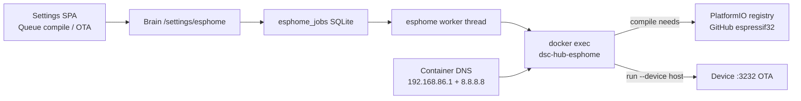
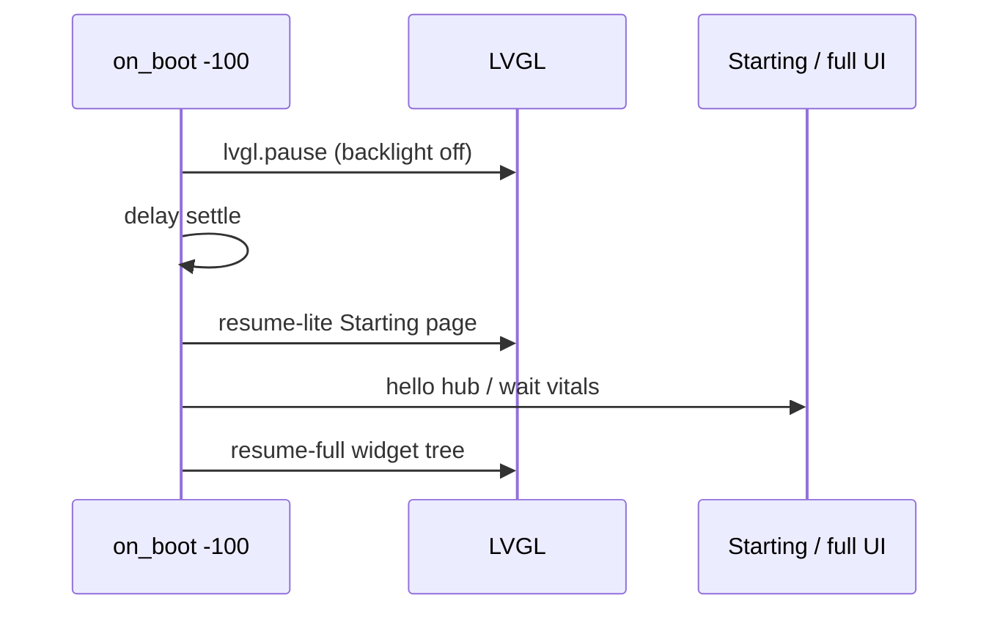

# ESPHome compile / OTA on Pi

**In one line:** Fleet OTA is operator-queued via brain → `docker exec dsc-hub-esphome esphome compile|run`. Compile needs outbound DNS/HTTPS from the Pi ESPHome container to PlatformIO/GitHub. Tip `18849da` pins container DNS and unblocks Control under ESPHome **2025.12**. Tip `19b5c4b` fixes brain compose API-key env casing so encrypt-poll survives recreate.

Verified tips: `331b91f` (DNS block note) → `18849da` (compose DNS pin + Control LVGL path + kit probe1/2) → `19b5c4b` / `05e8471` (API-key casing; Climate Mode / probe rename ops closed). Job path: `brain/dsc_brain/esphome_jobs.py`. Compose: `services/dsc-hub/docker-compose.yml` → service `dsc-hub-esphome`.

## Intent

Operators flash hub / DSC-Probe / Control from Settings without SSH. The worker is intentional (one compile at a time) and never auto-flashes.

## Architecture



| Piece | Code / container |
|-------|------------------|
| Queue | `esphome_jobs.queue_job` — actions `compile` \| `ota` |
| Worker | `start_esphome_worker` → `docker exec dsc-hub-esphome esphome …` |
| YAML map | seat `pot1`→`DSC-Probe1.yaml`, `hub`→`dsc-hub.yaml`, `control`→`dsc-control.yaml`, … |
| DNS | Compose `dns: [192.168.86.1, 8.8.8.8]` on `dsc-hub-esphome` (bridge had **NO EXTERNAL NAMESERVERS**) |
| Constraint | **One compile** queued/running at a time on Pi |

## Status (2026-08-29)

| Item | State |
|------|--------|
| PlatformIO/GitHub DNS | **Pinned** in compose (`18849da`) — recreate `dsc-hub-esphome` after pull |
| Live OTA train | **hub, pot1, pot2, control @ 7.0.0.0** (FOLLOWUPS closed ops) |
| pot3 / pot4 | **Retired from kit** (planned OOS) — skip default flash seats |
| Control YAML | ESPHome **2025.12** LVGL / codegen fixes (see below) |
| Brain encrypt keys | Compose must map `DSC_POTN_API_KEY` **uppercase** (`19b5c4b`) |

## Symptom → fix (DNS)

**Before pin:** compile failed resolving / fetching **PlatformIO espressif32** from **GitHub** (“NO EXTERNAL NAMESERVERS” on bridge).

**After tip `18849da`:**

```yaml
# services/dsc-hub/docker-compose.yml — dsc-hub-esphome
dns:
  - 192.168.86.1   # Nest / house uplink resolver (lab)
  - 8.8.8.8        # public fallback
```

Retest after `compose up -d dsc-hub-esphome`:

```bash
docker exec dsc-hub-esphome getent hosts github.com
docker exec dsc-hub-esphome esphome compile DSC-Probe2.yaml
```

If DNS still fails (wrong Nest IP on another site), override compose DNS to that site’s uplink resolver — do not invent offline PlatformIO mirrors without a verified lab procedure.

## Workarounds (if pin is not enough)

1. **Confirm eth0 uplink** — house DNS must reach GitHub/PlatformIO from the container.
2. **Compile on studio LAN** — build from `firmware/v4/` on a host with GitHub access; OTA upload when `:3232` is up.
3. **USB flash** — bootloader-sensitive Control recoveries or seats with refused OTA.
4. Fallback SoftAP hub recover: `services/dsc-hub/pi/flash-hub-fallback-remote.sh` (assumes **already compiled** firmware in the container).

## Control panel — ESPHome 2025.12 OTA path

Verified against `firmware/v4/dsc-control-common.yaml` tip `18849da`. Pi image trains on **ESPHome 2025.12.x**; older Control YAML failed codegen / LVGL APIs.

| Change | Why |
|--------|-----|
| Drop config `lvgl: paused:` | 2025.12 removed it; priority-800 `lvgl.pause` caused circular deps |
| `on_boot` `lvgl.pause:` at priority **-100** | Same boot settle (backlight off → Starting → hello → full UI) |
| Heap log on `panel_free_block.on_value` | `free.on_value` → `panel_free_block` was a **codegen circular dependency** |
| Drop `lv_indev_set_scroll_{limit,throw}` | Removed from 2025.12 LVGL bindings |
| Hold-to-lock: `on_long_press` / `on_long_press_repeat` | Replaces `on_pressing` |
| Touchscreen map uses `touchscreen_id` + long-press timings | Required for long-press events |
| `lv_color_to32` | Replaces `lv_color_to_u32` |



**Pitfall:** Do not reintroduce top-level `paused: true` or `free`→`block` cross `on_value` on the same debug platform — compile will fail again under 2025.12.

## Brain compose — API key casing (`19b5c4b`)

`esphome_client` / `control_ops` / `appliance_driver` look up `os.environ["DSC_{SEAT}_API_KEY"]` with **uppercase** seat (`DSC_POT1_API_KEY`, …).

Compose **must** map:

```yaml
DSC_POT1_API_KEY: ${DSC_POT1_API_KEY:-}
DSC_POT2_API_KEY: ${DSC_POT2_API_KEY:-}
# … pot3/4 + appliances same pattern
```

**Pitfall:** lowercase `dsc_potN_API_KEY` in compose never matches `.env` or ingest lookup — pot1/2 go offline after recreate with empty encrypt keys. Secret **file keys** in ESPHome secrets stay `dsc_potN_api_key` (unchanged by probe rename).

## Kit flash train

Live kit = **hub + probe1 + probe2 + control** (+ Sonoffs as needed). Defaults in `flash-fleet-700.ps1` / `flash-fleet-remote.sh` **omit pot3/pot4** (`SEATS=hub pot2 pot1 heater heatmat humidifier dehumidifier control`). Header comments on the shell script may still mention pot3/4 historically — trust the default `SEATS` string.

**Order:** hub (providers) → pot2 canary → pot1 → control. Skip pot3/pot4 (out of kit; YAML kept for bench).

Checklist: [`../qa/PROBE-RENAME-CLEANUP.md`](../qa/PROBE-RENAME-CLEANUP.md) · Climate co-flash: [`../qa/PANEL-HUB-COFLASH-CHECKLIST.md`](../qa/PANEL-HUB-COFLASH-CHECKLIST.md).

## Secrets

OTA / API / SoftAP secret **keys** remain `dsc_potN_*` and hub/control names — unchanged by the probe rename. Values live in Notion **API Keys & Credentials** and gitignored `secrets.yaml` — never paste into Wiki or PRs.

## Related

- [`PROBE-PLANT-MODEL.md`](../brain/PROBE-PLANT-MODEL.md) · [`SOFT-CAL.md`](SOFT-CAL.md)
- [`DSC-HUB-DOCKER.md`](DSC-HUB-DOCKER.md) · [`../FOLLOWUPS.md`](../FOLLOWUPS.md)
- Firmware panel notes: [`../../firmware/v4/README.md`](../../firmware/v4/README.md)
