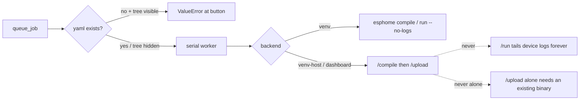

# ESPHome toolchain (v8, ESPHome-only)

DSC-HUB builds every device from `firmware/v4/`. There is no Home Assistant in
the build or update path: the running per-device ESPHome version comes from the
native API, "latest" comes from PyPI, and updates are `pip`/`esphome` in a Pi
venv.

## Pieces

| Piece | Where |
|---|---|
| Version pin | `esphome: min_version: "2026.6.5"` in `dsc-hub-v4_0.yaml`, `dsc-control-common.yaml`, `dsc-pot-common.yaml`, `dsc-sonoff-common.yaml`. Builds on older ESPHome fail fast. |
| Toolchain venv | `/opt/dsc-esphome-venv` — provisioned by `dsc-esphome-venv-setup.service` (→ `services/dsc-hub/pi/dsc-esphome-venv-setup.sh`), floored to `2026.6.5`. Separate from the brain venv. Updated from the container via `dsc-esphome-update.path` → `pi/dsc-esphome-host.sh`. |
| Dashboard | `dsc-esphome-dashboard.service` runs `esphome dashboard` on `0.0.0.0:6052`. Reachable at `http://dsc-brain.local:6052` (hostname `dsc-brain` + avahi). |
| Job runner | `brain/dsc_brain/esphome_jobs.py` — serialised, one at a time. Local CLI: `compile` / `run --no-logs`. Dashboard: **`/compile` then `/upload`** for OTA (not `/run`, not upload-only). `SEAT_YAML` maps seats → yaml (`potN` → `dsc-potN.yaml`, dehumidifier → `dsc-de-humidifier.yaml`); `queue_job` refuses when the project dir is visible and the file is missing. |
| Status / update API | `GET /settings/esphome/toolchain`, `POST /settings/esphome/toolchain/update`, `POST /settings/esphome/toolchain/rollback`, `GET|POST /settings/esphome/rollout?mode=all|canary|rest` (`brain/dsc_brain/esphome_toolchain.py`). |
| Settings UI | Settings › **Devices** › **Firmware** (`#/settings/devices#firmware`): installed / latest_supported / pinned-min, build backend + disk free, **Update ESPHome**, **Roll back**, secrets / helper / disk / held-back chips, per-seat drift, **Open ESPHome Dashboard**, canary → release-the-rest rollout. |

Settings keys (`brain/dsc_brain/settings.py`): `esphome_bin`, `esphome_project_dir`,
`esphome_dashboard_url` (browser link), `esphome_dashboard_api` (brain→dashboard),
`esphome_fleet_ota_prompt`, `last_built_esphome`, `esphome_rollout_canary`,
`esphome_compose_file` + `esphome_compose_update_cmd` (legacy container self-update,
`{file}` placeholder — removed with that backend).

## Update ESPHome to latest

1. Settings › **Devices** › **Firmware**. The card shows **installed** vs
   **latest_supported** (newest PyPI release below the dashboard ceiling; only
   when Ethernet/DNS work) vs the **pinned min**. PyPI's absolute newest may be
   higher and shown as *Newer ESPHome held back*.
2. **Update ESPHome →** the mechanism follows `build_backend()` (table below):
   host helper on the shipping kit, `pip` on a bare-venv brain, compose bump on
   the legacy container. Refused if a compile/OTA job is queued/running, if
   offline, if the target is below the pinned `min_version`, at/past the
   2026.8 dashboard boundary (unless `device_builder: true`), or under 1.5 GiB free.
   **Roll back to X** appears once a change is on record (see Roll back).
3. When the venv version moves, the card offers **Canary <probe> first** or
   **Reflash whole fleet**; after the canary rejoins, **Release the rest (hub last)**.
   Nothing flashes until you confirm (`esphome_fleet_ota_prompt`).

## Bump the pinned `min_version`

Do this deliberately, not on every ESPHome release:

1. Update the venv (`Update ESPHome`, or `sudo -u dsc /opt/dsc-esphome-venv/bin/pip install -U esphome`).
2. `cd firmware/v4 && /opt/dsc-esphome-venv/bin/esphome config …` → exit 0 for
   hub / control / a pot / a sonoff **and** a real
   `esphome compile` per family. Live gate lesson: `config` misses lambda C++
   (panel `lv_color_eq` / LVGL 9; hub `StringRef` / `.str()` on ESPHome 2026.x).
3. Run the firmware QA rig (`scripts/run_sim_gates.sh`) → 0 violations.
4. Bump `min_version:` in the four `esphome:` blocks + `PIN=` in
   `dsc-esphome-venv-setup.sh` + `PINNED_MIN_VERSION` in `esphome_toolchain.py`,
   add a `CHANGELOG.md` line.
5. Reflash the fleet (Settings → **Reflash fleet**, or the `pi/flash-fleet-remote.sh`
   fallback).

## Build backend — how the brain reaches ESPHome

`services/dsc-hub/docker-compose.yml` runs the brain in `dsc-hub-brain`
(`python:3.12-slim`): no `esphome` binary, no `firmware/v4`, no Docker socket, no
systemd. So on the shipping kit the brain **never shells `esphome`** — it drives the
host **ESPHome dashboard** (`dsc-esphome-dashboard.service`, venv at
`/opt/dsc-esphome-venv`, port 6052) over HTTP/WebSocket for compile + OTA, and
hands **toolchain updates** to a host helper through files in the ops dir the
container already bind-mounts.

`esphome_toolchain.build_backend()` picks automatically:

| Result | When | compile / OTA | Update ESPHome |
|---|---|---|---|
| `venv` | `esphome_bin` resolves to a real file / PATH entry (host or bare-venv brain) | `subprocess` in `firmware/v4` (`compile` / `run --no-logs`), streamed, real exit code | `pip install -U esphome` in that venv, restart the dashboard unit |
| `venv-host` | no local CLI; `<ops>/esphome-host/capabilities.json` exists **and** the answering dash is not the legacy container — **the shipping topology**. Dashboard may be **down** (`dashboard_up: false`); update/rollback still work | dashboard WebSocket: compile = `/compile`; OTA = `/compile` → `/upload` (`{"type":"spawn","configuration":<yaml>}`, stream `{"event":"line"}`, finish on `{"event":"exit","code":N}`) | write `<ops>/esphome-host/request.json`; `dsc-esphome-update.path` fires `dsc-esphome-update.service` → `dsc-esphome-host.sh update` (disk guard, `pip install esphome==<target>` as `dsc`, `systemctl restart dsc-esphome-dashboard`, `result.json`); the brain tails `progress.log` into the job row |
| `dashboard` | a dashboard answers but no helper file: the legacy `dsc-hub-esphome` container (`dashboard_legacy: true`), or a host unit deployed before the helper | same WebSocket path | legacy: compose image-tag bump + redeploy (or the exact steps when no `docker`); host-without-helper: refused with `sudo systemctl enable --now dsc-esphome-update.path` |
| `none` | nothing reachable | job fails clean; `pi/flash-fleet-remote.sh` is the manual path | refused |

### Job runner pitfalls (live gate)

- **OTA path:** `_run_job_via_dashboard` always compiles first, then uploads. `/upload`
  alone fails `FileNotFoundError` on a seat never built on this Pi. `/run` attaches
  to the device log and never exits — the job stays `running` until the deadline
  and blocks the serial queue (dehumidifier, 2026-09-07).
- **Seat yaml map:** `SEAT_YAML` — probes stay `dsc-potN.yaml` (not `DSC-ProbeN.yaml`);
  dehumidifier is `dsc-de-humidifier.yaml`. Exact duplicate seat+action while
  queued/running is refused; other seats may queue behind a running job (fleet
  rollout).
- **Reaper:** `start_esphome_worker` → `_reap_stale_running` fails any row still
  `running` from a previous brain process so queue / rollout / toolchain-update
  guards are not stuck after a restart/redeploy mid-flash.
- **Deploy idle restart:** `pi/deploy-brain-remote.sh` skips
  `systemctl restart dsc-esphome-dashboard` when `pgrep -f 'esphome (run|compile|upload)'`
  matches — restarting mid-job made queued OTAs fail *Connection refused*.

### Host helper protocol (`<ops>/esphome-host/`, default `/var/lib/dsc-hub/ops/esphome-host/`)

| File | Direction | Content |
|---|---|---|
| `capabilities.json` | host → brain | `{"helper":true,"esphome_version","project_dir","secrets_present","disk_free_bytes","min_free_bytes","written_at"}` — written by `dsc-esphome-venv-setup.sh`, by the dashboard wrapper on every start, and after every update |
| `request.json` | brain → host | `{"job_id","action":"update" or "rollback","target":"x.y.z"}` (atomic rename) |
| `progress.log` | host → brain | streamed pip output |
| `result.json` | host → brain | `{"job_id","ok","from","to","exit_code","message","log_tail"}`; the brain deletes it after consuming |

Helper hardening (from the live gate): the request is renamed to `.request.done` as
the first step (a leftover `request.json` makes the `.path` unit re-fire the oneshot
in a loop); pip's log tail is decoded with `errors=replace` (progress bars are not
UTF-8); the EXIT trap writes a failure `result.json` if the script dies before its
own; the helper dir is `dsc:dsc 0775` so the dashboard wrapper (runs as `dsc`) can
refresh capabilities; and pip is refused up front when `pypi.org` does not resolve
on the **host** — the Pi's `dhcpcd` wrote an empty `/etc/resolv.conf` while Docker
containers resolved through their own pinned servers.

**Host DNS (v2):** `static domain_name_servers` alone was **not** enough — dhcpcd
still emptied `resolv.conf` on the next renewal (mid fleet-reflash: hub/probe builds
failed resolving github.com). `pi/bring-up-eth0.sh` now adds `nohook resolv.conf` to
`dhcpcd.conf` and installs a static `/etc/resolv.conf` (site `192.168.86.1` +
`8.8.8.8` / `1.1.1.1`, matching Docker's pin). Site-specific first nameserver is a
known residual for other networks (FOLLOWUPS P2).

Status fields the Settings card reads: `build_backend`, `dashboard_legacy`,
`dashboard_up`, `host_helper`, `secrets_present`, `disk_free_gb` / `disk_free_ok` (update
refused under 1.5 GiB), `latest` / `latest_supported` / `latest_blocked_reason`,
`rollback_target`, `canary`.

Settings keys: `esphome_dashboard_api` (brain→dashboard; empty = the
`DSC_ESPHOME_DASHBOARD_API` env compose sets = `http://host.docker.internal:6052`,
the host unit over the bridge with a `host-gateway` extra_host) is separate from
`esphome_dashboard_url` (the browser link, default `http://dsc-brain.local:6052`).
`_dash_get()` still falls back to the legacy container name during a cutover.
`DSC_ESPHOME_HOST_DIR` overrides the handshake dir on the brain side;
`DSC_ESPHOME_OPS_DIR` / `DSC_ESPHOME_PROJECT_DIR` in `/etc/dsc-hub/esphome.env` on
the host side.

### Ceiling: ESPHome 2026.8 removed the built-in dashboard

ESPHome **2026.8** dropped `esphome dashboard` — the very process the brain drives
on `:6052` — in favour of the separate `esphome-device-builder` package. Its API is
**not** drop-in: one multiplexed WebSocket at `/ws` with named commands
(`config/version`, `devices/list`, `firmware/compile`, `firmware/upload`,
`firmware/follow_job`), no `/version`, `/devices`, `/compile`, `/upload`. On
2026-09-06 a live bump to 2026.8.2 took the dashboard down (crash-loop:
*"The built-in dashboard has been removed from ESPHome"*); the brain rolled the
venv back to 2026.6.5 through the host helper.

So until a Device Builder adapter exists (tracked), the toolchain is capped:
`esphome_toolchain.DASHBOARD_REMOVED_FROM = "2026.8.0"`. `latest()` reports both
PyPI's newest (`latest`) and the newest non-yanked release below the boundary
(`latest_supported`, e.g. 2026.7.4); **Update ESPHome** targets the latter and
refuses any explicit target at or past the boundary unless the host helper
reports `device_builder: true`. The card shows *Newer ESPHome held back* with the
reason. When the dashboard is down but the helper is present the backend stays
`venv-host` (`dashboard_up: false`) so **Roll back** still works — which is exactly
when it is needed.

### Roll back

`POST /settings/esphome/toolchain/rollback` (Settings → **Roll back to X**) reinstalls
the prior version from `esphome_toolchain_jobs`: newest row that is either
`status=done`, **or** any job whose `to_version` matches what is currently
installed (a failed update that still moved the venv — live 2026-09-06 dashboard
restart failure). Same guard rails; downgrade allowed. Never offered below the
pinned `min_version`, and never onto a release at/past `DASHBOARD_REMOVED_FROM`
unless the helper reports `device_builder: true`.

### Fleet rollout — canary first

After a toolchain change the card offers **Canary <probe> first** (default `pot2`,
else the first in-service probe) and **Reflash whole fleet**. `POST
/settings/esphome/rollout?mode=canary` flashes only the canary; the card then shows
its job state and, once the probe reports the new ESPHome version, **Release the
rest (N, hub last)** → `?mode=rest`. `last_built_esphome` is only stamped when the
rest (or the whole fleet) is queued, so the prompt persists through the canary
phase. The canary record is discarded if the toolchain moves again.

### Secrets on kits

The bake owns the keys: `image/bake-on-linux.sh` requires (or generates)
`firmware/v4/secrets.yaml` on the bake host, `bake-firmware.sh` compiles the kit
`.bin` files from it, and the same file ships in the image at
`/opt/dsc-hub/firmware/v4/secrets.yaml` (`0600 dsc:dsc`, never git). One bake =
one kit = one key set, so later on-Pi OTA builds agree with the baked binaries.
The card shows **No firmware secrets** when the helper reports it missing.

### Units on the Pi

| Unit | Role |
|---|---|
| `dsc-esphome-venv-setup.service` | one-shot: create `/opt/dsc-esphome-venv`, install `esphome==<pin>`, publish capabilities |
| `dsc-esphome-dashboard.service` | `esphome dashboard <firmware/v4>` on `0.0.0.0:6052` via `pi/dsc-esphome-dashboard-run.sh` (refreshes capabilities on every start) |
| `dsc-esphome-update.path` + `.service` | watch `request.json` → `pi/dsc-esphome-host.sh update` |

All three are installed/enabled by `pi/deploy-brain-remote.sh` (remote layout,
`/opt/dsc-hub-repo/firmware/v4`), `image/bake-on-linux.sh` + `install-from-payload.sh`,
`image/bake-sd-image.sh` and `image/stage-dsc/01-dsc-hub.sh` (SD layout,
`/opt/dsc-hub/firmware/v4`). The `esphome` compose service is behind
`profiles: ["legacy-esphome"]` (rollback only) and is removed once the Pi gate
passes on both layouts (decided 2026-09-06).

### Manual fallbacks (no Docker)

`pi/flash-fleet-remote.sh [pass] [seats…]` — host venv, hosts from the brain
inventory, default order `pot2 pot1 heater heatmat humidifier dehumidifier control hub`
(canary first, hub last). `flash-hub-fallback-remote.sh`,
`flash-sonoff-fallback-remote.sh`, `flash-sonoff-lan-remote.sh` use the same venv.

### Validated

* 2026-09-06 against the live Pi dashboard (pre-helper): `GET :6052/version`,
  `/devices` (47 configs), `esphome config dsc-hub.yaml` valid on 2026.8.x, a
  `2099.1.0` pin correctly rejected, `/compile` and `/upload` confirmed as WebSocket
  endpoints.
* 2026-09-06/07 **remote-deploy layout Pi gate — GREEN with fixes** (fleet to
  **8.0.0.0 / 2026.6.5**): canary → release-the-rest via `/compile`→`/upload`;
  dashboard ceiling + rollback; DNS v2; compile-then-upload (not `/run`); deploy
  idle-restart; LVGL 9 + hub `StringRef` compile fixes. Full write-up:
  `docs/FOLLOWUPS.md` § *ESPHome Pi gate*.
* **SD-image layout gate still pending** (same units bake path; not yet soak-proven
  on a fresh SD). Legacy compose profile `legacy-esphome` stays for rollback until
  that gate closes.
