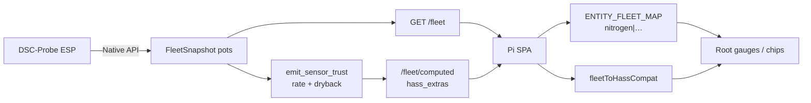

# Fleet soil metrics — NPK, dryback, moisture rate

**In one line:** ESP probes publish raw soil channels; the Pi brain **produces** dryback + moisture-rate; SPA maps all of them under full keys (`nitrogen|phosphorus|potassium`) and only shows dials when a finite value exists.

Tip **`07bf25f`** landed producers + map alignment. Tip **`8b70d5f`** notes Pi redeploy still **blocked** (SSH/HTTP timeout mid-restart) — SPA bundle `index-CNKKWCfT.js` + `sensor_trust.py` await recover on `.48`.

## Intent

Root and Live used to show empty NPK chips and permanent dryback/rate dials even when the Pi bus had no metric. Pass A honesty requires:

| Metric | Source of truth | UI when missing |
|--------|-----------------|-----------------|
| Moisture / soil °C / EC / pH | Probe Native API → fleet `potN.values` | Held reading or stale mark |
| N / P / K | Probe optical/EC-derived → fleet keys **`nitrogen` / `phosphorus` / `potassium`** | Value + **from EC** label, or omit — never lying `—` |
| Moisture rate (`%/h`) | Brain history slope (6h) via `emit_sensor_trust` | Chip **Rate · no channel** |
| Dryback `%` | Brain peak-today → now (rate > 0.5 → 0) | Omit gauge / **Dryback · no channel** |

Do **not** invent lab NPK, height, chem, or PPFD.

## Data path



### Brain producers (`sensor_trust.py`)

Called from `dash_computed.build_computed_hass_states` → exposed on `GET /fleet/computed` as `hass_extras` (and merged into `/fleet` payload when the tick includes computed extras).

For each in-service pot that is **not** a probe-station role:

1. **`moisture_rate`** — linear slope of `moisture_pct` history over the last 6h (`%/h`). Entity: `sensor.dsc_probe{N}_soil_moisture_rate`. Also written onto `pot.values["moisture_rate"]`.
2. **`dryback_pct`** — `(peak_today − now) / peak × 100`. If rate > `0.5` %/h, dryback is forced to `0` (wetting). Entity: `sensor.dsc_probe{N}_dryback_pct`. Also `pot.values["dryback_pct"]`.

Probe stations skip rate/dryback (no plant moisture story). Stuck/untrusted binaries still use the same rate path.

### NPK keys (not short `n|p|k`)

ESPHome / `fleet_state` / `esphome_client` use:

- `soil_nitrogen` → fleet `nitrogen`
- `soil_phosphorus` → fleet `phosphorus`
- `soil_potassium` → fleet `potassium`

SPA `ENTITY_FLEET_MAP` and `fleetFromHass` / `fleetToHassCompat` must use those **full** names. Short `n|p|k` remains a read-side fallback in compat only.

### SPA merge

`main.tsx` (PiApp) merges `computed.hass_extras` into `fleet.hass_states` before `FleetProvider`, so held readings and Root cards see dryback/rate/NPK even when raw `/fleet` seats omit them.

`fleetEntityAvailable` for derived metrics returns true only when the seat is online **and** `fleetMetricPresent` — avoids empty dials pretending a live channel.

## Operator checks

```bash
# After brain container has tip code
curl -sS http://192.168.86.48:8787/fleet/computed | jq '.hass_extras | keys[]' | grep -E 'dryback|moisture_rate|nitrogen'
curl -sS http://192.168.86.48:8787/fleet | jq '.pots.pot1.values | {nitrogen,phosphorus,potassium,dryback_pct,moisture_rate}'
```

Root (`#/live/root`): Probe 1–2 only; NPK chips say **from EC** when shown; Rate/Dryback show values or **no channel**.

## Redeploy gate (tip `8b70d5f`)

| Piece | Status |
|-------|--------|
| Repo code (`07bf25f`) | On `master` |
| SPA on Pi `index-CNKKWCfT.js` | **Blocked** — SSH/HTTP timed out mid-restart |
| Brain `sensor_trust.py` in container | **Blocked** — same; hot-patch or image-build when `.48` recovers |

Recover path (studio LAN): sync spa-dist → `studio-deploy.ps1` / hot-patch per [`.cursor/skills/dsc-spa-pi-verify`](../../.cursor/skills/dsc-spa-pi-verify/SKILL.md) · [`DSC-HUB-DOCKER.md`](DSC-HUB-DOCKER.md). Prefer full brain pick-up so producers land with the SPA.

## Constraints

- History must exist for rate/dryback (cold boot → no channel until samples accumulate).
- Kit Live uses `KIT_PROBE_NUMBERS` `[1,2]`; entity maps still cover probes 3–4 for Device restore only.
- SoftCal offsets do **not** create independent NPK assays — UI labels **from EC**.

## Related

- Kit / chrome: [`../brain/KIT-SOT-SPA.md`](../brain/KIT-SOT-SPA.md) · [`../brain/WEBUI.md`](../brain/WEBUI.md)
- Design: [`../superpowers/specs/2026-08-29-professional-spa-ui-design.md`](../superpowers/specs/2026-08-29-professional-spa-ui-design.md)
- FOLLOWUPS: `2026-08-29 — Encode + NPK producers + commit`
