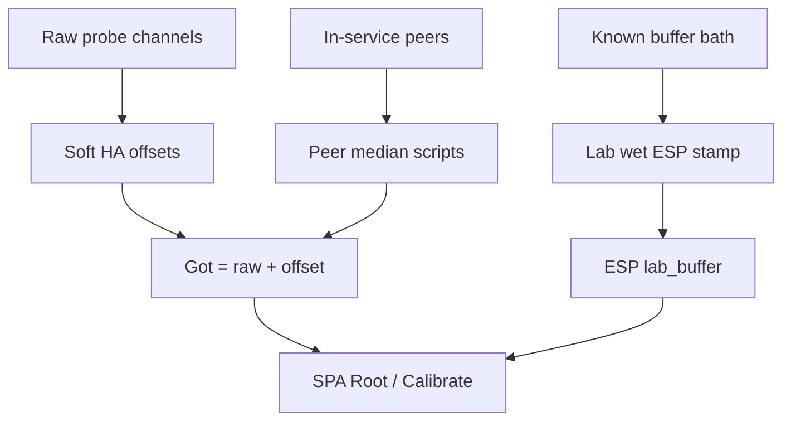

# Soil calibration layers (soft · peer · lab wet)

Three different honesty layers on **Fleet → Calibrate → Soil**. Do not substitute one for another.

| Layer | What it writes | Truth claim |
|-------|----------------|-------------|
| **Soft calibrate** | HA `input_number.dsc_potN_offset_*` (Got = raw + offset) | Quick drift vs known tap pH / optional EC — **not** ESP lab stamp |
| **Peer median** | Peer-baseline scripts / fleet offsets | Relative alignment across in-service pots — **not** absolute lab |
| **Lab wet (N-016)** | Hub `script.dsc_potN_lab_wet_cal` → ESP lab_buffer mark | One channel vs documented buffer solution |

---

## Soft calibrate (tap water → after water)

**Intent:** Seat selected probes in tap water, average ~15s of raw readings, enter the real tap pH (optional EC µS/cm), write soft HA offsets, then optionally capture again after watering for verify / refine.

**UI:** [`SoftCalWizard.tsx`](../../homeassistant/custom_components/dsc_hub/frontend/src/components/SoftCalWizard.tsx) · math [`softCalibrate.ts`](../../homeassistant/custom_components/dsc_hub/frontend/src/lib/softCalibrate.ts)

### Procedure

1. **Fleet → Calibrate → Soil** — Soft calibrate card.
2. Select pots (1–4; at least one). Put those probes in a glass of tap water.
3. Enter **real tap pH** (3–10). Optional: tap EC µS/cm.
4. **Soft Calibrate** — samples 15× ~1s across moisture, soil temp, EC, pH, NPK.
5. Confirm **Apply soft offsets** → writes:
   - `input_number.dsc_potN_offset_ph` (clamped ±3, 0.05 steps)
   - `input_number.dsc_potN_offset_moisture` (target **100%** in water, clamped ±40, 0.5 steps)
   - `input_number.dsc_potN_offset_ec_us` when `|ΔEC| ≥ 1` (clamped ±2000, 10 µS steps)
6. Seat probes in watered pots → switch to **after-water** phase → Soft Calibrate again (averages always; offsets only if known pH entered).

### Constraints

- Soft ≠ lab ESP stamp ≠ peer median. DecisionLayer copy states this on apply.
- NPK is **sampled for display** only — no soft HA offset helpers for N/P/K.
- Offset write uses `callService("input_number", "set_value", …)` via the fleet bus (HA-backed Got stack). Pi-native Got without HA templates is still deferred ([`FOLLOWUPS.md`](../FOLLOWUPS.md)).
- High σ on pH during capture shows a warn chip (`σ pH > 0.15`) — re-seat / settle before trusting the average.

---

## Peer median

Aligns in-service pots to the fleet median (capture / push scripts on the same Calibrate page). Fast for relative drift — not lab truth. Probe stations and OOS pots stay out of peer-MAD trust.

---

## Lab wet calibration (N-016)

Peer median aligns pots relative to each other; **lab wet** stamps one channel against a known buffer solution.

### Procedure

1. Mark the pot **out of grow service** if it is a probe station — use Settings inventory, not ad-hoc YAML.
2. Remove the soil probe; rinse with distilled water.
3. Immerse in a documented buffer (typical mid-range moisture reference for your probe family).
4. On Pi SPA → **Fleet → Calibrate → Soil**, run **Lab wet calibration wizard** with pot id and buffer %.
5. Script `script.dsc_potN_lab_wet_cal` runs on the hub; ESP stores a lab_buffer mark until Reset.
6. Re-seat probe in the **idle home pot** for safety; verify reading is within expected tolerance on Root Zone.

### Honesty

- Peer median **does not** substitute for lab wet.
- Until lab wet, treat Got moisture as fleet-relative (plus any soft offsets), not absolute lab truth.
- pot3 (F-003) and probe stations follow inventory `in_service` gates — do not calibrate OOS hardware as if live.

---

## Related

- [`CalibratePage.tsx`](../../homeassistant/custom_components/dsc_hub/frontend/src/pages/CalibratePage.tsx) — SoftCalWizard + soil test + peer/lab cards
- [`docs/FOLLOWUPS.md`](../FOLLOWUPS.md) — soft cal + N-016 tracking
- Soft ≠ probe home unassign ≠ plant retire (three inventory layers) — see 2026-08-28 probe unassign follow-ups
