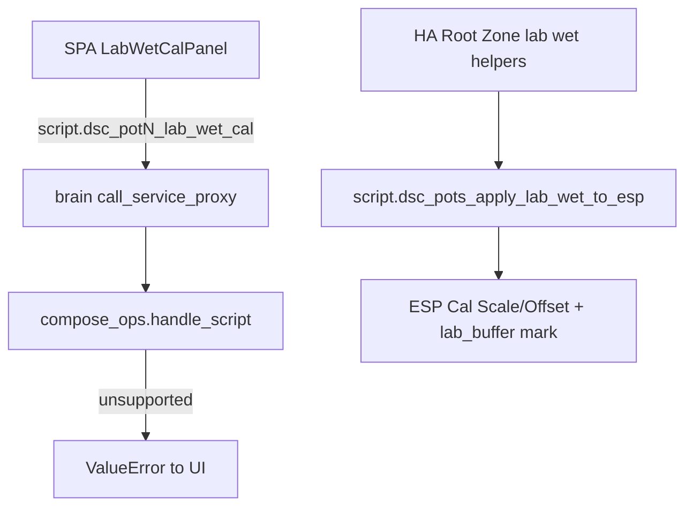

# Lab wet calibration (N-016) — ops

Peer median aligns pots **relative to each other**. Lab wet stamps a channel against a **known buffer** so Got can be treated as absolute until the next Reset.

## Two paths (do not mix blindly)

| Path | Where | Script / UI | Status |
|------|-------|-------------|--------|
| **HA two-point (durable)** | Lab HA + pot FW raw entities | `script.dsc_pots_apply_lab_wet_to_esp` + helpers in `dsc_v4_sensor_cal.yaml` | **SoT procedure** — [`docs/LAB-WET-CAL.md`](../LAB-WET-CAL.md) |
| **Pi SPA wizard (7.3 UI)** | Fleet → Calibrate → Soil | Calls `script.dsc_pot{N}_lab_wet_cal` with `buffer_pct` | **UI shipped; backend incomplete** — see honesty |

## Pi SPA wizard (what exists)

`CalibratePage` → `LabWetCalPanel`:

1. Rinse probe; soak in documented moisture buffer (%).
2. Select pot `1–4` and buffer %.
3. Confirm → `callService("script", "turn_on", { entity_id: script.dsc_potN_lab_wet_cal, variables: { buffer_pct } })`.

On Pi (`VITE_DSC_PI=1`) that goes through brain `POST /control/service` → `compose_ops.handle_script`.

### Honesty gap (verified against tip `73143f3`)

- `handle_script` does **not** implement `script.dsc_potN_lab_wet_cal` (raises `unsupported script`).
- No `dsc_pot*_lab_wet_cal` definition exists under `homeassistant/packages/` or `brain/`.
- Peer scripts used on the same Calibrate card (`dsc_pots_capture_peer_baseline`, `dsc_pots_push_peer_offsets_to_esp`) are likewise HA-package scripts — not in `compose_ops`.

Until a Pi-native lab-wet handler lands, treat the SPA wizard as a **placeholder UX**. For a real buffer stamp use the **HA two-point** procedure (or ESP number entities / Mark Soil Cal Lab Buffer on pot FW 5.1.6+) while packages remain available in the lab scaffold.



## Recommended operator order

1. Zero / push peer offsets first (or enable Force on HA path) — never stack peer + lab blindly.
2. Run **two-point** lab wet per [`docs/LAB-WET-CAL.md`](../LAB-WET-CAL.md) for ph / ec / moisture.
3. Mark pot inventory honestly (`in_service`); probe stations (pot2/pot4) follow soil-probe workflow — do not treat OOS hardware as live.
4. After lab wet, verify Got ≈ buffer; dual-stack warn should stay off.

## Math (two-point)

```
scale  = (exp_hi − exp_lo) / (meas_hi − meas_lo)
offset = exp_lo − scale × meas_lo
calibrated = raw × scale + offset
```

## Related

- UI: `frontend/src/pages/CalibratePage.tsx`
- HA package: `homeassistant/packages/dsc_v4_sensor_cal.yaml`
- Closure note: [`docs/qa/AUDIT-CLOSURE-7.3.md`](../qa/AUDIT-CLOSURE-7.3.md)
- Follow-ups: document residual backend gap in [`docs/FOLLOWUPS.md`](../FOLLOWUPS.md)
