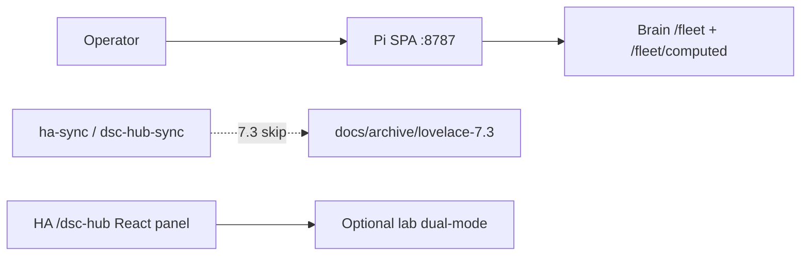

# Lovelace YAML retirement (7.3)

**In one line:** Pi SPA `:8787` is the only product operator surface; Lovelace `/dsc-hub-pro` YAML is archived and no longer synced. Tip `73143f3` **removed** `homeassistant/dashboards/` from the working tree.

## What changed

| Path | Behavior |
|------|----------|
| `scripts/ha-sync.sh` | Skips dashboard YAML + modules (logs skip reason) |
| `dsc-hub-sync` add-on | Same skip — does not stage `dashboards/` |
| `homeassistant/configuration.snippet.yaml` | `lovelace.dashboards` entries commented |
| Archive | [`docs/archive/lovelace-7.3/`](../archive/lovelace-7.3/) — **canonical backup** |
| Working tree | `homeassistant/dashboards/` **deleted** (7.3 polish) — do not recreate for product |

Parity matrix (view → React route): [`docs/qa/LOVELACE-PARITY-7.3.md`](../qa/LOVELACE-PARITY-7.3.md).

## Operator workflow

1. Deploy / use Pi SPA (`studio-deploy.ps1` or compose) — Overview default `#/live/overview`.
2. Do **not** expect `ha-sync` to refresh `/dsc-hub-pro` views after 7.3.
3. HA custom panel `/dsc-hub` may still load the React panel JS for lab — that is not Lovelace YAML.
4. Catalog / Build-a-Plant research: Grow → Research / Compose on SPA (no `LegacyCardHost` IIFE on Pi).

## Disaster restore (manual only)

1. Copy YAML from `docs/archive/lovelace-7.3/` (or git history of `homeassistant/dashboards/` before tip `73143f3`) onto HA `config/dashboards/`.
2. Re-enable `lovelace.dashboards` in a local snippet (do not re-enable product sync by default).
3. Restore dashboard copy block from git history of `ha-sync.sh` / `dsc-hub-sync.sh` **only** for that emergency.
4. Prefer returning to Pi SPA ASAP — restore is DR, not a second SoT.

## Pitfalls

1. Searching the repo for `homeassistant/dashboards/*.yaml` after tip `73143f3` — use the archive or git history.
2. Confusing HA sidebar “DSC-HUB” React panel with archived Lovelace Pro YAML.
3. Resource cache-bust races on Lovelace (`F-010`) — irrelevant for Pi SPA; still relevant if you resurrect HA cards.

## Related

- Closure: [`docs/qa/AUDIT-CLOSURE-7.3.md`](../qa/AUDIT-CLOSURE-7.3.md)
- Twin engines: [`docs/brain/TWIN-R3F.md`](../brain/TWIN-R3F.md)
- HA lab rules: [`docs/HA-SCAFFOLD.md`](../HA-SCAFFOLD.md)
