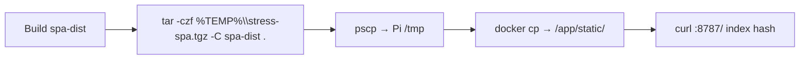

# Pi SPA / brain hotpatch (Windows)

**In one line:** Push a rebuilt spa-dist (and optionally brain package) into the live `dsc-hub-brain` container with **PuTTY `pscp`/`plink`**, not OpenSSH `scp`.

**Tip (v7.4.0 signed off):** `32836fe` · spa-dist **`index-K2_ziUnM.js`** · rule [`.cursor/rules/dsc-pi-hotpatch.mdc`](../../.cursor/rules/dsc-pi-hotpatch.mdc)
**Prior (Post-mega D-C-A-B):** `f029702` · `index-CXq-NptO.js`  
**Prior Mega Pass:** `a307dc7` · `index-DlMHgtYz.js`  
**Scripts:** `.audit/stress-spa-only-hotpatch.ps1` · `.audit/stress-roster-hotpatch.ps1` · `.audit/wave1-spa-hotpatch.ps1`  
**Host:** lab Pi (`dsc@…`, container `dsc-hub-brain`, static `/app/static/`)

## Intent

After SPA or brain changes, verify on the live kit without a full image rebuild. Agent shells on Windows often hang on OpenSSH `scp` password prompts — PuTTY batch tools with an explicit hostkey avoid that.

## When to use which script

| Script | Ships | Restart brain? |
|--------|-------|----------------|
| `stress-spa-only-hotpatch.ps1` | spa-dist tarball → `/app/static/` | No |
| `stress-roster-hotpatch.ps1` | SPA + brain tarball | Yes (script restarts container) |

## SPA-only flow



1. Build frontend so `homeassistant/custom_components/dsc_hub/frontend/spa-dist/index.html` references the new `assets/index-*.js`.
2. `tar -czf %TEMP%\stress-spa.tgz -C <spa-dist> .`
3. Run the spa-only hotpatch script (or equivalent `pscp` + remote `docker cp`).
4. Verify both local and served hashes match:

```bash
# On Pi (or via plink)
grep -oE 'assets/index-[^"]+\.js' /path/to/spa-dist/index.html | head -1
curl -sf http://127.0.0.1:8787/ | grep -oE 'assets/index-[^"]+\.js' | head -1
```

Tip `32836fe` (v7.4.0 signed off) expects spa-dist **`index-K2_ziUnM.js`** (plus `twin-three-BjdbWAdH.js` · `tune-fleet-C9fzhOX5.js` · `calibrate-BqnIG9Rc.js`). Prior Post-mega `f029702` was `index-CXq-NptO.js`. Prior Mega Pass tip `a307dc7` was `index-DlMHgtYz.js`.

## Constraints

- Use **`pscp`/`plink` `-batch -hostkey …`**. Do not rely on interactive OpenSSH `scp`.
- If PowerShell execution policy blocks `-File`, invoke `pscp`/`plink` directly.
- **Never commit** live Pi passwords, sudo phrases, or API keys into docs, FOLLOWUPS tip blurbs, Notion Wiki, or PR bodies. Keep lab credentials in the Notion **API Keys & Credentials** DB (and gitignored local env) — rotate if a shared script ever embedded them.
- Do not invent height/chem/PPFD/NPK in verification notes.

## Related

- Roster / kit / module map: [`../brain/ROSTER-STOCK.md`](../brain/ROSTER-STOCK.md) · [`../brain/KIT-SCOPE.md`](../brain/KIT-SCOPE.md) · [`../brain/SPA-MODULE-MAP.md`](../brain/SPA-MODULE-MAP.md)
- Post-mega closure: [`../qa/AUDIT-CLOSURE-2026-09-D-C-A-B.md`](../qa/AUDIT-CLOSURE-2026-09-D-C-A-B.md)
- R3F canvas sizing: [`../brain/R3F-CANVAS.md`](../brain/R3F-CANVAS.md)
- Cursor rule: `.cursor/rules/dsc-pi-hotpatch.mdc`
- FOLLOWUPS § *2026-09-01 — Post-mega D → C → A → B*
