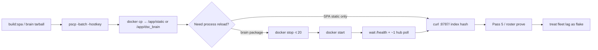

# Pi SPA / brain hotpatch (Windows)

**In one line:** Push a rebuilt spa-dist (and optionally brain package) into the live `dsc-hub-brain` container with **PuTTY `pscp`/`plink`**, then reload with **`docker stop -t 20` + `start`** — never bare `restart` or `kill` on this Pi.

**Tip:** `ee636f9` · spa-dist **`index-BoyhWWR_.js`** (+ `calibrate-CYRum8WF.js` · `tune-fleet-BPdxWQzJ.js` · `twin-three-BjdbWAdH.js`)  
**Rule:** [`.cursor/rules/dsc-pi-hotpatch.mdc`](../../.cursor/rules/dsc-pi-hotpatch.mdc) · AGENTS hotpatch bullet  
**Prior tip:** `6ce9ea5` (Pass 4 SDD archive) · Pass 5 gate `d07cbd9` / `f2ac21f`  
**Host:** lab Pi (`dsc@…`, container `dsc-hub-brain`, static `/app/static/`)

## Intent

Verify SPA/brain changes on the live kit without a full image rebuild. Agent shells on Windows hang on OpenSSH `scp` password prompts — PuTTY batch tools with an explicit hostkey avoid that. Pass 5 proved that **container lifecycle choice is part of honesty**: a hung Docker daemon looks like a gate failure and can force an operator power-cycle mid-prove.

## Architecture



Hub Native API poll sleeps **~5s** between hub reconnect/poll cycles (`esphome_client`). After `POST /control/service`, `hass_extras` on `/fleet/computed` can lag **~1 poll (~5–10s)** — wait/re-fetch before asserting Hold off or Twin state.

## Container lifecycle (Pass 5 habit)

| Action | Use when | Do not |
|--------|----------|--------|
| **`docker stop -t 20` + `docker start`** | Brain package reload after `docker cp` | — |
| SPA `docker cp` only | Static assets already match tip hash | Restart for SPA-only |
| Zigbee MQTT resume script | Wet→Problem prove after Pi recovery | Kill brain mid-prove |
| `docker restart` | — | Hung this Pi historically |
| `docker kill` | — | Pass 5 Task 5 hung the host (power-cycle) |

Always wrap remote docker with host `timeout`. If SSH/`/health` die mid-command: **operator power-cycle** — do not keep issuing kill/restart.

Safe pattern (password via operator env / Notion credentials — never paste into docs):

```bash
sudo timeout 20 docker stop -t 20 dsc-hub-brain
sudo timeout 30 docker start dsc-hub-brain
# wait for /health, then one more /fleet/computed before Hold/Twin asserts
```

## Scripts

| Script | Ships | Reload |
|--------|-------|--------|
| `.audit/stress-spa-only-hotpatch.ps1` | spa-dist → `/app/static/` | No |
| `.audit/stress-roster-hotpatch.ps1` | SPA + brain tarball | Yes — prefer stop+start (older `stress-roster-hp.sh` still says `restart`; avoid that habit) |
| `.audit/space-energy-pi-closure.ps1` | SPA + brain + force-tick | Yes |
| `.audit/live-ux-pass5-prove.ps1` | GATE prove (energy 400, Hold, Twin, Zigbee) | Prefer **no** reload if SPA already `index-BoyhWWR_.js` |
| `.audit/live-ux-pass5-task5-zigbee-resume.ps1` | Wet→Problem MQTT | **No docker kill** |

## SPA-only flow

1. Build frontend so `homeassistant/custom_components/dsc_hub/frontend/spa-dist/index.html` references the new `assets/index-*.js`.
2. `tar -czf %TEMP%\stress-spa.tgz -C <spa-dist> .`
3. Run spa-only hotpatch (`pscp` + remote `docker cp`).
4. Verify local vs served hashes:

```bash
grep -oE 'assets/index-[^"]+\.js' spa-dist/index.html | head -1
curl -sf http://127.0.0.1:8787/ | grep -oE 'assets/index-[^"]+\.js' | head -1
```

Tip `ee636f9` expects **`index-BoyhWWR_.js`** (unchanged since Pass 5 gate).

## Prove flakes (not gate failures)

Encoded in `.cursor/rules/dsc-pi-hotpatch.mdc` and Pass 5 FOLLOWUPS gate section — do **not** reopen Live UX as regressions without new dishonesty evidence.

| Residual | Treat as |
|----------|----------|
| **Hold / Twin fleet lag** | After `POST /control/service`, wait/re-fetch `/fleet/computed` (~5–10s) before asserting Hold off or Twin |
| **Twin fleet mirror vs command** | HTTP turn_on/brightness may succeed while fleet shows `off` without GPIO5 PWM — software accept path green; optical N/A |
| **SF1000 / Twin Actual sub-0.1H** | Brief gate cycles can show ~0.05H Actual while lamp OFF — rounding/stress artifact |
| **Historical `sf1000_on` gap** | No backfill — DutyStrip honesty improves going forward |
| **`policy_state` after brain restart** | Clears until MQTT occupancy — dry-pub re-seed before Problem/Clear asserts |

## Constraints

- Use **`pscp`/`plink` `-batch -hostkey …`**. Do not rely on interactive OpenSSH `scp`.
- If PowerShell execution policy blocks `-File`, invoke `pscp`/`plink` directly.
- **Never commit** live Pi passwords, sudo phrases, API keys, or hostkeys into docs, FOLLOWUPS tip blurbs, Notion Wiki, or PR bodies. Lab credentials live in the Notion **API Keys & Credentials** DB.
- Do not invent height/chem/PPFD/NPK or claim GPIO5 optical wired.
- Playwright vs `:8787`: prefer `domcontentloaded` over `networkidle`.

## Related

- Live UX program: [`../brain/LIVE-UX-HONESTY.md`](../brain/LIVE-UX-HONESTY.md)
- Twin / Hold: [`TWIN-SF1000.md`](TWIN-SF1000.md)
- Zigbee Wet/Problem + radio: [`ZIGBEE-RECOVERY.md`](ZIGBEE-RECOVERY.md)
- Space energy prove: [`../brain/SPACE-ENERGY-JOURNAL.md`](../brain/SPACE-ENERGY-JOURNAL.md)
- Pi appliance ops: [`DSC-HUB-DOCKER.md`](DSC-HUB-DOCKER.md)
- Cursor rule: `.cursor/rules/dsc-pi-hotpatch.mdc`
