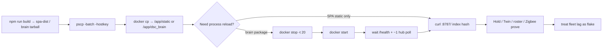

# Pi SPA / brain hotpatch (Windows)

**In one line:** Push a rebuilt `frontend/spa-dist` (and optionally the brain package) into the live `dsc-hub-brain` container with **PuTTY `pscp`/`plink`**, then reload with **`docker stop -t 20` + `start`** — never bare `restart` or `kill` on this Pi.

Verified against tip `cce5c74` (Hub **8.1.0**; firmware train still **8.0.0.0**; SoftAP kit bake + real card bins + thin-catalog cannalib). Rule: [`.cursor/rules/dsc-pi-hotpatch.mdc`](../../.cursor/rules/dsc-pi-hotpatch.mdc) · AGENTS Pi hotpatch bullet. Lab host: `dsc@…`, container `dsc-hub-brain`, static `/app/static/`.

## Intent

Verify SPA/brain changes on the live kit without a full image rebuild. Agent shells on Windows hang on OpenSSH `scp` password prompts — PuTTY batch tools with an explicit hostkey avoid that. Container lifecycle choice is part of honesty: a hung Docker daemon looks like a gate failure and can force an operator power-cycle mid-prove.

## Architecture



Hub Native API poll sleeps **~5s** between hub reconnect/poll cycles (`esphome_client`). After `POST /control/service`, `hass_extras` on `/fleet/computed` can lag **~1 poll (~5–10s)** — wait/re-fetch before asserting Manual Light Hold off or Twin state.

## Container lifecycle

| Action | Use when | Do not |
|--------|----------|--------|
| **`docker stop -t 20` + `docker start`** | Brain package reload after `docker cp` | — |
| SPA `docker cp` only | Static assets already match tip hash | Restart for SPA-only |
| Zigbee MQTT resume script | Wet→Problem prove after Pi recovery | Kill brain mid-prove |
| `docker restart` | — | Hung this Pi historically |
| `docker kill` | — | Hung the host (power-cycle) |

Always wrap remote docker with host `timeout`. If SSH/`/health` die mid-command: **operator power-cycle** — do not keep issuing kill/restart.

Safe pattern (password via operator env / Notion credentials — never paste into docs):

```bash
sudo timeout 20 docker stop -t 20 dsc-hub-brain
sudo timeout 30 docker start dsc-hub-brain
# wait for /health, then one more /fleet/computed before Hold/Twin asserts
```

## Scripts

| Script | Ships | Reload |
|--------|-------|--------|
| `.audit/stress-spa-only-hotpatch.ps1` | `frontend/spa-dist` → `/app/static/` | No |
| `.audit/cameras-spa-only-hotpatch.ps1` | Same SPA-only path (cameras tip) | No |
| `.audit/stress-roster-hotpatch.ps1` | SPA + brain tarball | Yes — **stop+start** (avoid older `restart` habits) |
| `.audit/space-energy-pi-closure.ps1` | SPA + brain + force-tick | Yes |
| `.audit/live-ux-pass5-prove.ps1` | GATE prove (energy 400, Hold, Twin, Zigbee) | Prefer **no** reload if SPA already matches tip |
| `.audit/live-ux-pass5-task5-zigbee-resume.ps1` | Wet→Problem MQTT | **No docker kill** |

## SPA-only flow

1. `cd frontend && npm run build` so `frontend/spa-dist/index.html` references the new `assets/index-*.js`.
2. Optionally gate with `npx vite preview` — see [`SPA-PROD-BUNDLE.md`](SPA-PROD-BUNDLE.md).
3. `tar -czf %TEMP%\stress-spa.tgz -C frontend/spa-dist .`
4. Run spa-only hotpatch (`pscp` + remote `docker cp`).
5. Verify local vs served hashes:

```bash
grep -oE 'assets/index-[^"]+\.js' frontend/spa-dist/index.html | head -1
curl -sf http://127.0.0.1:8787/ | grep -oE 'assets/index-[^"]+\.js' | head -1
```

## Hold / Twin control prove

- Clear Manual Light Hold via `/control/service` on `switch.dsc_hub_manual_light_hold` (must stay in `HUB_SWITCH_ENTITY_TO_OID` — `hub_controls.py`).
- After Hold/Twin control, wait ~1 poll (~5–10s) and re-fetch `/fleet/computed` before asserting fleet state.
- Twin HTTP turn_on/brightness may succeed while fleet still shows `off` without GPIO5 PWM — software accept path green; optical N/A until wired.

## Prove flakes (not gate failures)

Do **not** reopen Live UX as regressions without new dishonesty evidence.

| Residual | Treat as |
|----------|----------|
| **Hold / Twin fleet lag** | After `POST /control/service`, wait/re-fetch `/fleet/computed` (~5–10s) |
| **Twin fleet mirror vs command** | Command OK + fleet `off` without GPIO5 — optical N/A |
| **SF1000 / Twin Actual sub-0.1H** | Brief gate cycles can show ~0.05H Actual while lamp OFF |
| **Historical `sf1000_on` gap** | No backfill — DutyStrip honesty improves going forward |
| **`policy_state` after brain restart** | Clears until MQTT occupancy — dry-pub re-seed before Problem/Clear asserts |

## Constraints

- Use **`pscp`/`plink` `-batch -hostkey …`**. Do not rely on interactive OpenSSH `scp`.
- If PowerShell execution policy blocks `-File`, invoke `pscp`/`plink` directly.
- **Never commit** live Pi passwords, sudo phrases, API keys, or hostkeys into docs, FOLLOWUPS tip blurbs, Notion Wiki, or PR bodies. Lab credentials live in the Notion **API Keys & Credentials** DB.
- Do not invent height/chem/PPFD/NPK or claim GPIO5 optical wired.
- Playwright vs `:8787`: prefer `domcontentloaded` over `networkidle`.
- Tip `cce5c74` / 8.1.0 product (Settings S4/S5 + Tuya T1 + release bump + SoftAP kit bake + real card bins) is **not yet assumed hotpatched** to the lab Pi — verify served index hash and `/health` `version` before claiming live.

## Related

- SPA chunk / blank-Pi pitfall: [`SPA-PROD-BUNDLE.md`](SPA-PROD-BUNDLE.md)
- Relay honesty soak: [`RELAY-HONESTY.md`](RELAY-HONESTY.md)
- Twin desk: [`../brain/TWIN.md`](../brain/TWIN.md)
- Zigbee radio recovery: [`ZIGBEE-RECOVERY.md`](ZIGBEE-RECOVERY.md)
- Settings / System cards: [`../brain/SETTINGS.md`](../brain/SETTINGS.md)
