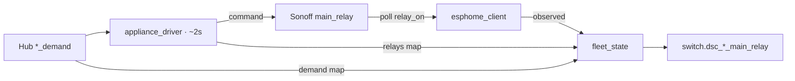

# Sonoff relay honesty

**In one line:** Fleet `switch.dsc_<seat>_main_relay` prefers the **device-observed** contact; falls back to what the driver last **commanded**; always exposes hub **demand** as attributes — never paint demand as the contact.

Finding + fix: 2026-09-06 physical soak (PR #198). Code: `appliance_driver.py`, `esphome_client.py`, `fleet_state.py`. Tests: `brain/tests/test_relay_honesty.py`.

## Three signals



| Signal | Meaning | Where |
|---|---|---|
| **demand** | What the hub ladder is asking | `get_appliance_status()["demand"]` |
| **commanded** | What the driver last wrote (skipped when seat OOS unless `force`) | `["relays"]` / `_relay_commanded` |
| **observed** | Sonoff's own `main_relay` from Native API poll | `seat.values["relay_on"]` |

Entity state preference: **observed → commanded → unavailable**. Attributes always carry `commanded`, `demand`, `in_service`, and `source` (`device` | `commanded`).

### Example attributes

```json
{
  "state": "off",
  "attributes": {
    "source": "device",
    "commanded": true,
    "demand": true,
    "in_service": false
  }
}
```

Here the driver last commanded ON and the hub still demands ON, but the contact is open (OOS / cut-out / hardware) — SPA and automations must read **state**, not demand.

## Operational rules

- Out-of-service Sonoffs stay **read-only** on the poll path — observation continues; the driver does not overwrite `relay_on` with demand.
- Hub offline / stale → appliance driver failsafe forces every driven seat **OFF** (`force=True`), including OOS seats that rules previously cut out.
- Hub demand proposals from `hub_native.emit_proposal` stay **shadow-mode** (logged only) — see [`docs/DSC-BRAIN.md`](../DSC-BRAIN.md). Real brain authority for appliances is the driver mirror + Zigbee tasks + automation cut-outs.

## Pitfalls

| Pitfall | Honest behavior |
|---|---|
| Treating `demand` as the live relay | Wrong — demand is the ask; contact may disagree under OOS / cut-out / lag |
| Automation writing Sonoff ON | Rejected at save — cut-out only ([AUTOMATION-RULES](../brain/AUTOMATION-RULES.md)) |
| Assuming OOS seats are dark to telemetry | Poll still observes `relay_on` for honesty |

## Soak / audit helpers

Under `.audit/`: `zbc-sonoff-state.sh`, `zbc-soak-c|d|e.sh`, ESPHome smoke scripts from the relay-honesty pass. Prefer docker **`stop -t 20` + `start`** for brain hotpatch (not `restart` / `kill`).
