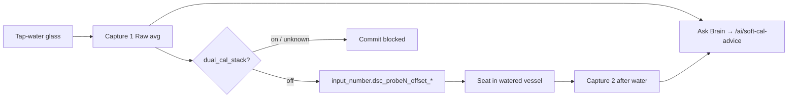

# Soft calibrate + SoftCal AI

**In one line:** SoftCal averages **Soil \* Raw**, writes Got-plane offsets (not ESP lab NVS). Ask Brain returns guardrailed advice only.

Verified against tip `6a89efa` (Hub **8.1.0** / kit **8.1.0.0**; QA dry-EC honesty). Sources: `frontend/src/lib/softCalibrate.ts`, `SoftCalWizard.tsx`, `brain/dsc_brain/soft_cal_ai.py`, `soft_cal_history.py`.

## Where it lives

| Layer | Path |
|-------|------|
| SPA | Tune → Calibrate → Soil → Soft calibrate |
| Lib | `frontend/src/lib/softCalibrate.ts` |
| Wizard | `frontend/src/components/SoftCalWizard.tsx` |
| Dual-stack gate | `binary_sensor.dsc_probeN_dual_cal_stack` |
| Firmware burst | `switch.dsc_probeN_cal_session` + `text.dsc_probeN_cal_capture` |
| Brain AI | `POST /ai/soft-cal-advice` (`soft_cal_ai.py`) |
| Brain history | `GET\|POST /soft-cal/sessions` |

Kit SoftCal pickers use `KIT_PROBE_NUMBERS` = **[1, 2]** (`SOFT_CAL_PROBES`). Sessions API still accepts probe **1–4** for Advanced restore / history.

## SoftCal workflow

1. Select kit probe(s) 1–2.
2. **Phase 1 · Tap water** — put probes in a glass of tap water; enter real tap pH (3–10); optional tap EC µS/cm.
3. Prefer **Cal Session ON** first so Modbus bursts and SoftCal sees unique stamps.
4. Soft Calibrate → averages Raw entities (`soil_*_raw` — moisture, temp, EC, pH). **Not** N/P/K.
5. `<3` unique Modbus timestamps → UI **cached not σ**.
6. Confirm → write `input_number.dsc_probeN_offset_*` **only if** `dual_cal_stack` is off (unknown also blocks).
7. **Phase 2 · After water** — seat probes in watered vessels; Soft Calibrate again (optional pH refine).

Offset math: `Got ≈ raw + offset` → `offset = known − average` (`softOffsetsFromWater`). Moisture SoftCal targets **100%** while immersed (`WATER_MOISTURE_TARGET`).



## Pitfall — dry medium EC ≠ SoftCal / fault

Soil EC needs **dissolved ions in solution**. Before the first water (or when medium is effectively dry), `ec_us` / `soil_conductivity` of **0 µS is the expected reading**, not a dead probe.

Live QA (tip `6a89efa`, [`TEST-PASS-8.1.0`](../qa/TEST-PASS-8.1.0-2026-09-08.md)): probe2 reported `ec_us 0.0` beside probe1 `48.0` at similar moisture — operator pots had not been watered yet. **Natural test:** water both; if probe2 EC rises with probe1, both probes are good; if probe2 holds at 0 while probe1 responds, re-open as hardware.

Do **not**:

- SoftCal EC offsets from dry pots (phase 1 is tap water; phase 2 needs watered vessels).
- Treat Root EC `0` on unwatered medium as SENSOR FAULT when Modbus/trust binaries are healthy.
- SoftCal N/P/K as independent channels (they are EC-derived).

## SoftCal AI

Wizard **Ask Brain (guardrailed)** → `POST /ai/soft-cal-advice`.

| Behavior | Detail |
|----------|--------|
| Core | `decision_tick(..., emit=False)` — Want/Need/advisories; **no hub emit** |
| Actions | Filtered to `demand_on` / `demand_off` / `advise_only` / `soft_cal_recheck` / `open_root_steering` / `no_op` |
| Dropped | Any other model/tick action |
| Narrative | Optional Ollama via `ollama_base_url`; else advisories text |
| SoftCal context | Body `soft_cal` appends `soft_cal_recheck` |

```http
POST /ai/soft-cal-advice
{
  "seat": "pot1",
  "stage": "veg",
  "got": {"moisture_pct": 42, "ph": 6.2},
  "soft_cal": {"phase": "water", "pots": [1, 2], "knownPh": "7.0"}
}
```

`Switch phase` / Ask Brain stay enabled while a 15s capture is in flight (own `aiBusy` — not a shared `busy`).

## Session history API

Table `soft_cal_sessions` (Pi SQLite):

```http
GET  /soft-cal/sessions?probe_n=2&limit=50
POST /soft-cal/sessions
{"probe_n": 2, "phase": "water", "payload": {"known_ph": 7.0, "n": 15}}
```

| Constraint | Reality |
|------------|---------|
| `probe_n` | POST requires **1–4** (HTTP 400 otherwise) |
| `phase` | Required non-empty string |
| SPA | SoftCalWizard does **not** POST sessions yet — API for scripts/operators |
| Ask Brain | Calls `/ai/soft-cal-advice` only — no implied session row |

## Honesty

| Claim | Reality |
|-------|---------|
| SoftCal σ | Needs cal_session or ≥3 unique Modbus stamps — else cached not σ |
| Channels | Soil \* Raw only — never SoftCal N/P/K independently |
| vs lab wet | Lab → ESP via `script.dsc_pots_apply_lab_wet_to_esp`; SoftCal → Got offsets only |
| Dual stack | Blocks commit until one cal plane cleared |
| AI | Advice + filtered actions only — never invent actuators |
| Assignment | SoftCal OK while plant assigned — detach is Roster SoT |
| Dry EC 0 | Expected pre-water; prove with watering differential, not phantom issues |

## Residual

- SoftCal → ESP NVS push then zero Got-plane offsets (one-plane end-state).
- Wire SoftCalWizard → `POST /soft-cal/sessions`.

## Tests

```bash
cd brain && python -m pytest tests/test_soft_cal_ai.py -q
```

## Related

- Lab wet (ESP NVS stamp): [`LAB-WET-CAL.md`](LAB-WET-CAL.md)
- Live QA EC note: [`../qa/TEST-PASS-8.1.0-2026-09-08.md`](../qa/TEST-PASS-8.1.0-2026-09-08.md)
- Pi hotpatch: [`PI-HOTPATCH.md`](PI-HOTPATCH.md)
