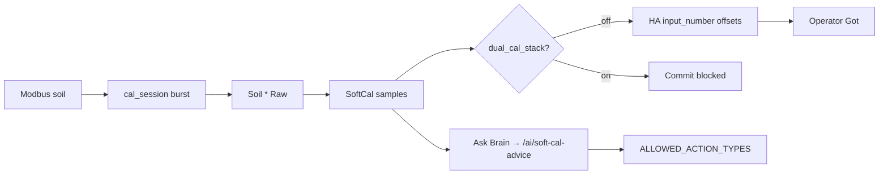

# Soft calibrate + SoftCal AI

**In one line:** SoftCal averages **Soil \* Raw**, writes HA Got offsets (not ESP lab NVS). Ask Brain returns guardrailed advice only.

**Tip:** SoftCal Raw + sessions API (earlier tips) · SoftCal AI `bce7ca9` · SPA `SoftCalWizard.tsx` · `soft_cal_ai.py` · `soft_cal_history.py`

## Where it lives

| Layer | Path |
|-------|------|
| SPA | Tune → Calibrate → Soil → Soft calibrate |
| Lib | `frontend/src/lib/softCalibrate.ts` |
| Wizard | `frontend/src/components/SoftCalWizard.tsx` |
| Dual-stack gate | `binary_sensor.dsc_probeN_dual_cal_stack` |
| Firmware burst | `switch.dsc_probeN_cal_session` + `text.dsc_probeN_cal_capture` |
| Brain AI | `POST /ai/soft-cal-advice` (`soft_cal_ai.py`) |
| Brain history | `GET\|POST /soft-cal/sessions` |

## SoftCal workflow

1. Select kit probes (1–2 on Live kit; wizard still lists SoftCal pots).
2. Enter known tap-water pH (3–10); optional EC µS/cm.
3. Prefer **Cal Session ON** first so Modbus bursts (~2.5s × 45s) and SoftCal sees unique stamps.
4. Capture from Raw entities (`soil_*_raw` — moisture, temp, EC, pH). Not N/P/K.
5. `<3` unique Modbus timestamps → UI **cached not σ**.
6. Confirm → write `input_number.dsc_potN_offset_*` **only if** `dual_cal_stack` is off.
7. Optional second capture after watering.

Offset: `Got ≈ raw + offset` → `offset = known − average`.



## SoftCal AI (tip `bce7ca9`)

Wizard **Ask Brain (guardrailed)** → `getSoftCalAdvice` → `POST /ai/soft-cal-advice`.

| Behavior | Detail |
|----------|--------|
| Core | `decision_tick(..., emit=False)` — Want/Need/advisories; **no hub emit** |
| Actions | Filtered to `demand_on` / `demand_off` / `advise_only` / `soft_cal_recheck` / `open_root_steering` / `no_op` |
| Dropped | Any other model/tick action (e.g. invented relays) |
| Narrative | Optional Ollama via `ollama_base_url` setting; else advisories text |
| SoftCal context | If body includes `soft_cal`, appends `soft_cal_recheck` action |

Example:

```http
POST /ai/soft-cal-advice
{
  "seat": "pot1",
  "stage": "veg",
  "got": {"moisture_pct": 42, "ph": 6.2},
  "soft_cal": {"phase": "water", "pots": [1, 2], "knownPh": "7.0"}
}
```

Response includes `actions`, `narrative`, `ollama` bool, `guardrail` string.

## Session history API

Table `soft_cal_sessions` (Pi SQLite):

```http
GET  /soft-cal/sessions?probe_n=2&limit=50
POST /soft-cal/sessions
{"probe_n": 2, "phase": "capture", "payload": {"n": 15, "ph_avg": 6.4}}
```

**Constraint:** SoftCalWizard does **not** POST sessions yet — API is for scripts/operators; UI wiring residual.

## Honesty

| Claim | Reality |
|-------|---------|
| SoftCal σ | Needs cal_session or ≥3 unique Modbus stamps — else cached not σ |
| Channels | Soil \* Raw only — never SoftCal N/P/K as independent measured channels |
| vs lab wet | Lab → ESP via `script.dsc_pots_apply_lab_wet_to_esp`; SoftCal → HA offsets only |
| Dual stack | Blocks commit until one cal plane cleared |
| AI | Advice + filtered actions only — never invent actuators |

## Residual

- SoftCal → ESP NVS push then zero HA (one-plane end-state).
- Wire SoftCalWizard → `POST /soft-cal/sessions`.

## Tests

```bash
cd brain && python -m pytest tests/test_soft_cal_ai.py -q
```

## Related

- [`LAB-WET-CAL.md`](LAB-WET-CAL.md) · [`../brain/ROOT-STEERING.md`](../brain/ROOT-STEERING.md) · [`../brain/DECISION_LOOP.md`](../brain/DECISION_LOOP.md)
- Design climate/probe: [`../superpowers/specs/2026-08-29-climate-mode-probe-rebuild-design.md`](../superpowers/specs/2026-08-29-climate-mode-probe-rebuild-design.md)
