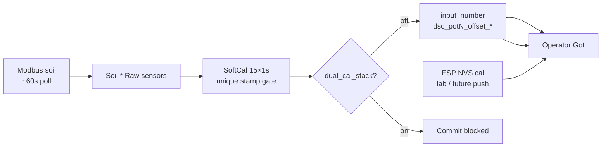

# Soft calibrate (Raw honesty)

**In one line:** SoftCal averages **Soil \* Raw** for ~15s, then writes HA `input_number.dsc_potN_offset_*` — it does **not** stamp ESP lab NVS. Commit is blocked when `dual_cal_stack` is on.

Verified tip: `9343be6` against `softCalibrate.ts`, `SoftCalWizard.tsx`, `CalibratePage.tsx`, `homeassistant/packages/dsc_v4_sensor_cal.yaml`.

## Where it lives

- SPA: **Tune → Calibrate → Soil → Soft calibrate**
- Lib: `homeassistant/custom_components/dsc_hub/frontend/src/lib/softCalibrate.ts`
- Wizard: `.../components/SoftCalWizard.tsx`
- Dual-stack sensors: `binary_sensor.dsc_potN_dual_cal_stack` (+ fleet summary)

## Workflow

1. Select pots (1–4).
2. Enter known tap-water pH (3–10); optional EC µS/cm.
3. Capture **15 samples @ 1s** from Raw entities:
   - `sensor.dsc_potN_soil_moisture_raw`
   - `sensor.dsc_potN_soil_temperature_raw`
   - `sensor.dsc_potN_soil_conductivity_raw`
   - `sensor.dsc_potN_soil_ph_raw`
4. If `<3` unique Modbus `last_updated` stamps → UI **cached not σ** (1 Hz poll of a 60s holding register is not variance).
5. Confirm → write soft offsets **only if** `dual_cal_stack` is off for those pots.
6. Optional second capture after watering.

Offset math: `Got ≈ raw + offset` → `offset = known − average` (pH / moisture-to-100 / optional EC).

## Honesty constraints

| Claim | Reality |
|-------|---------|
| SoftCal σ from 15×1s | Modbus soil bus often polls **60s**. Without ≥3 unique timestamps, variance is **cached not σ**. |
| Sensors sampled | **Soil \* Raw** only (tip `9343be6`). Not double-calibrated `soil_*`, not N/P/K. |
| NPK | EC-derived on many sticks — SoftCal does **not** SoftCal N/P/K as independent channels. |
| vs lab wet | Lab wet → ESP via `script.dsc_pots_apply_lab_wet_to_esp` + helpers. SoftCal → HA offsets only. |
| Dual stack | `dual_cal_stack` = HA offsets **and** ESP cal scale/offset both non-identity. Wizard **blocks commit** until one plane is cleared (prefer push SoftCal to ESP NVS and zero HA — residual). |

## Lab wet (related)

SPA Lab wet sets `input_number.dsc_lab_wet_pot` then runs **`script.dsc_pots_apply_lab_wet_to_esp`** (not the dead per-pot `script.dsc_potN_lab_wet_cal`). Details: [`LAB-WET-CAL.md`](LAB-WET-CAL.md).

## History

Brain `history_ops.ENTITY_METRIC_MAP` maps `sensor.dsc_potN_soil_conductivity` → `ec_us` (legacy `soil_ec` alias retained).

## Residual

- Firmware `cal_session` burst Modbus + ESP-NOW pause (design approved, not in this tip).
- SoftCal → ESP NVS push then zero HA (one cal plane end-state).
- Soft-cal session history table in brain DB.

## Related

- [`LAB-WET-CAL.md`](LAB-WET-CAL.md) · [`../brain/PROBE-PLANT-MODEL.md`](../brain/PROBE-PLANT-MODEL.md) · [`../brain/CLIMATE-MODE-POLICY.md`](../brain/CLIMATE-MODE-POLICY.md)
- Design: [`../superpowers/specs/2026-08-29-climate-mode-probe-rebuild-design.md`](../superpowers/specs/2026-08-29-climate-mode-probe-rebuild-design.md)
