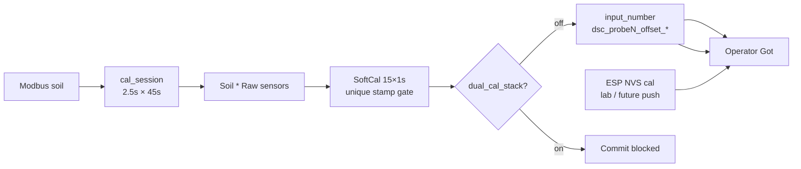

# Soft calibrate (Raw honesty + cal_session)

**In one line:** SoftCal averages **Soil \* Raw** for ~15s, then writes HA `input_number.dsc_probeN_offset_*` — it does **not** stamp ESP lab NVS. Commit is blocked when `dual_cal_stack` is on. Firmware **Cal Session** bursts Modbus so SoftCal can see real variance.

Verified tip: `654d0f8` (+ SoftCal Raw gate from `9343be6`; OTA live `18849da`/`05e8471`) against `softCalibrate.ts`, `SoftCalWizard.tsx`, `CalibratePage.tsx`, `dsc-pot-common.yaml` (`cal_session`), `brain/dsc_brain/soft_cal_history.py`.

## Where it lives

- SPA: **Tune → Calibrate → Soil → Soft calibrate**
- Lib: `homeassistant/custom_components/dsc_hub/frontend/src/lib/softCalibrate.ts`
- Wizard: `.../components/SoftCalWizard.tsx`
- Dual-stack sensors: `binary_sensor.dsc_probeN_dual_cal_stack` (+ fleet summary)
- Firmware: `switch.dsc_probeN_cal_session` + diagnostic `text.dsc_probeN_cal_capture`
- Brain history API: `GET|POST /soft-cal/sessions` (`soft_cal_history.py`)

## Workflow

1. Select probes (1–4).
2. Enter known tap-water pH (3–10); optional EC µS/cm.
3. Prefer **Cal Session ON** on the probe(s) first (after OTA with `cal_session` firmware) so Modbus polls every **2.5s** for **45s** and ESP-NOW soil TX pauses.
4. Capture **15 samples @ 1s** from Raw entities:
   - `sensor.dsc_probeN_soil_moisture_raw`
   - `sensor.dsc_probeN_soil_temperature_raw`
   - `sensor.dsc_probeN_soil_conductivity_raw`
   - `sensor.dsc_probeN_soil_ph_raw`
5. If `<3` unique Modbus `last_updated` stamps → UI **cached not σ** (1 Hz poll of a 60s holding register is not variance).
6. Confirm → write soft offsets **only if** `dual_cal_stack` is off for those probes.
7. Optional second capture after watering.

Offset math: `Got ≈ raw + offset` → `offset = known − average` (pH / moisture-to-100 / optional EC).

## Firmware `cal_session` (tip `654d0f8`)

| Step | Behavior |
|------|----------|
| Start | `cal_session_active`; Modbus bus `update_interval` → **2500 ms**; ESP-NOW `packet_transport` soil interval → ~1h (pause) |
| Window | **45s** burst; accumulates pH/temp samples for Cal Capture |
| Finish | Publishes `Cal Capture` diag (`n=… ph_avg=…` or `cached_not_sigma n=…`) |
| Stop | Modbus + ESP-NOW soil intervals restored to **60s**; switch optimistic OFF |

SPA SoftCalWizard warns to prefer cal_session when stamps are insufficient; it does **not** auto-flip the switch.



## Honesty constraints

| Claim | Reality |
|-------|---------|
| SoftCal σ from 15×1s | Default Modbus poll is **60s**. Without cal_session or ≥3 unique timestamps, variance is **cached not σ**. |
| Sensors sampled | **Soil \* Raw** only. Not double-calibrated `soil_*`, not N/P/K. |
| NPK | EC-derived on many sticks — SoftCal does **not** SoftCal N/P/K as independent channels. |
| vs lab wet | Lab wet → ESP via `script.dsc_pots_apply_lab_wet_to_esp`. SoftCal → HA offsets only. |
| Dual stack | `dual_cal_stack` = HA offsets **and** ESP cal scale/offset both non-identity. Wizard **blocks commit** until one plane is cleared. |

## Soft-cal session history (Pi SQLite)

Table `soft_cal_sessions` in brain DB (`soft_cal_history.py`):

| Column | Notes |
|--------|-------|
| `ts` | Unix time |
| `probe_n` | 1–4 |
| `phase` | Free-text phase label from caller |
| `payload` | JSON blob |

API:

```http
GET  /soft-cal/sessions?probe_n=2&limit=50
POST /soft-cal/sessions
{"probe_n": 2, "phase": "capture", "payload": {"n": 15, "ph_avg": 6.4}}
```

**Constraint:** SPA SoftCalWizard does **not** call this API yet — history is available for operators/scripts and future UI wiring. Init runs at brain startup. FOLLOWUPS: SoftCal API up (0 sessions until SPA posts).

## Lab wet (related)

SPA Lab wet sets `input_number.dsc_lab_wet_pot` then runs **`script.dsc_pots_apply_lab_wet_to_esp`**. Details: [`LAB-WET-CAL.md`](LAB-WET-CAL.md).

## Residual

- SoftCal → ESP NVS push then zero HA (one cal plane end-state).
- Wire SoftCalWizard → `POST /soft-cal/sessions`.

## Related

- [`LAB-WET-CAL.md`](LAB-WET-CAL.md) · [`../brain/PROBE-PLANT-MODEL.md`](../brain/PROBE-PLANT-MODEL.md) · [`../brain/CLIMATE-MODE-POLICY.md`](../brain/CLIMATE-MODE-POLICY.md)
- Design: [`../superpowers/specs/2026-08-29-climate-mode-probe-rebuild-design.md`](../superpowers/specs/2026-08-29-climate-mode-probe-rebuild-design.md)
- OTA / DNS: [`ESPHOME-OTA-PI.md`](ESPHOME-OTA-PI.md)
