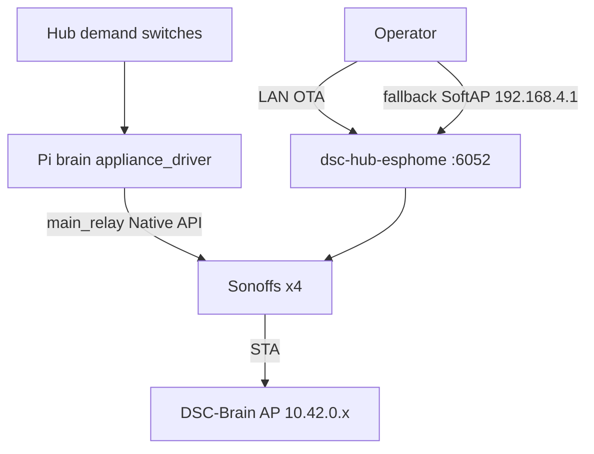

# Sonoff flash + Pi AP heal (7.1)

**Intent:** After ETH01 bridge retirement, Sonoffs are OTA’d from the Pi (or a Windows workstation) onto firmware **7.0.0.0**, then driven by the brain appliance driver — not `dsc-bridge`.

**Acceptance / product context:** [`LIVE-ACCEPTANCE-7.1.md`](../qa/LIVE-ACCEPTANCE-7.1.md) · [`DSC-HUB-DOCKER.md`](DSC-HUB-DOCKER.md) · [`RELEASE.md`](../../RELEASE.md)

## Architecture



Bridge YAML is archived under `firmware/_history/v4/dsc-bridge*.yaml`. Do not flash it for Pi island product.

## Seats and addresses

| Seat | Stub | Pi AP IP | House LAN IP (script SoT) | Fallback SoftAP SSID |
|---|---|---|---|---|
| heater | `dsc-heater.yaml` | `10.42.0.50` | `192.168.86.50` | `DSC-Heater Fallback Hotspot` |
| heatmat | `dsc-heatmat.yaml` | `10.42.0.51` | `192.168.86.51` | `DSC-HeatMat Fallback Hotspot` |
| humidifier | `dsc-humidifier.yaml` | `10.42.0.54` | `192.168.86.54` | `DSC-Humidifier Fallback Hotspot` |
| dehumidifier | `dsc-de-humidifier.yaml` | `10.42.0.55` | `192.168.86.184` | `DSC-De-Humidifi Fallback Hotspot` |

Fallback AP PSK secret keys in `firmware/v4/secrets.yaml`: `dsc_heater_ap_password`, `dsc_heatmat_ap_password`, `dsc_humidifier_ap_password`, `dsc_dehumidifier_ap_password`. Store live values in Notion **API Keys & Credentials** — never paste into Wiki/PRs.

## Choose a path

| Path | When | Entry |
|---|---|---|
| **LAN via Pi** | Sonoff still on house Wi‑Fi and pingable | `services/dsc-hub/pi/flash-sonoff-lan.ps1` → `flash-sonoff-lan-remote.sh` |
| **Fallback via Pi wlan0** | Offline on LAN / stuck on wrong SSID; no Windows admin | `flash-sonoff-fallback-pi.ps1` → `flash-sonoff-fallback-remote.sh` |
| **Fallback from Windows** | Operator Wi‑Fi can join device SoftAP; needs elevation for static `192.168.4.2` | `flash-sonoff-fallback.ps1` / `flash-sonoff-fallback-admin.ps1` |
| **Fleet bulk** | Hub/pots/panel + Sonoffs already on Pi AP | `flash-fleet-700.ps1` (quote `'$Seats'` for plink) |

Prefer **LAN** first. Fallback paths briefly stop `dsc-hub-ap.service` so Pi `wlan0` can join the Sonoff SoftAP — climate island Wi‑Fi drops until restore.

## LAN flash (Pi)

From Windows with Pi reachable (AP `10.42.0.1` or eth0):

```powershell
services/dsc-hub/pi/flash-sonoff-lan.ps1 -Seats "heater heatmat humidifier dehumidifier"
```

Remote behavior (`flash-sonoff-lan-remote.sh`):

1. Optional unpack `/tmp/dsc-firmware-v4.tgz` → `/opt/dsc-hub-repo/firmware/v4`
2. Per seat: ping house LAN IP → `docker exec … esphome run <yaml> --device <lan-ip> --no-logs`
3. Skip offline seats; continue on FAIL

## Fallback flash (Pi as SoftAP client)

```powershell
# eth0 recommended so SSH survives while Brain AP is stopped
services/dsc-hub/pi/flash-sonoff-fallback-pi.ps1 -PiHost "192.168.86.30" -ApWaitSeconds 120
```

Remote behavior (`flash-sonoff-fallback-remote.sh`):

1. Try LAN OTA first (same IPs as above)
2. On miss: `systemctl stop dsc-hub-ap.service`, flush `wlan0`, scan for seat SSID up to `AP_WAIT` seconds
3. Join SoftAP → assign `192.168.4.2/24` → OTA to `192.168.4.1`
4. Restore Brain AP (`dsc-hub-ap.service` / `wlan0-ap.sh` if `10.42.0.1` missing)
5. Wait ~25s and ping Pi seat IP

**Operator tip:** Power-cycle the Sonoff away from house Wi‑Fi so the fallback SoftAP actually broadcasts. SSID truncation for dehumidifier (`DSC-De-Humidifi…`) is intentional — match the firmware SoftAP name in the scripts.

`EXIT` trap always attempts AP restore.

## Windows SoftAP client

`flash-sonoff-fallback.ps1` tries LAN, then joins each fallback SSID from the workstation. Static IP on the SoftAP requires elevation (`flash-sonoff-fallback-admin.ps1`). Log: `%TEMP%\dsc-sonoff-flash.log`.

## AP / hub diagnostics

When hub flaps off `DSC-Brain` after container or AP restarts (see LIVE-ACCEPTANCE-7.1):

| Script | Job |
|---|---|
| `diag-ap.sh` / `diag-ap.ps1` | hostapd ssid/channel, wlan0 addr, secrets wifi keys present, hub yaml wifi hints, dnsmasq leases, recent `dsc-hub-ap` journal |
| `diag-hub.sh` | ping `10.42.0.10`, TCP `6053`, hostapd deauth/handshake lines, brain `/fleet` hub online/fw |
| `check-ap-data.sh` | ops hostapd passphrase present + brain `ap_psk` setting (values stay on host — do not copy out) |

```bash
# on Pi
bash services/dsc-hub/pi/diag-ap.sh
bash services/dsc-hub/pi/diag-hub.sh
```

If AP PSK drifted from fleet secrets: `fix-ap-psk.sh` (canonical PSK only in Notion *DSC-Brain Pi AP*).

## Verify

```bash
curl -s http://10.42.0.1:8787/fleet | python3 -c \
  "import sys,json;d=json.load(sys.stdin);print({k:(d.get(k) or {}).get('online'), (d.get(k) or {}).get('firmware')} for k in ('heater','heatmat','humidifier','dehumidifier'))"
# demand → relay (when hub online)
curl -s -X POST http://10.42.0.1:8787/control/demand \
  -H 'content-type: application/json' \
  -d '{"seat":"dehumidifier","state":true}'
```

Expect firmware text **7.0.0.0** on Sonoffs (`project.version` **and** text `Firmware Version`). Relays appear under fleet `system.relays` when the appliance driver is healthy.

## Constraints / pitfalls

- Bridge path is **retired** — do not reintroduce ETH01 as the primary Sonoff driver on Pi island.
- Fallback flash **stops** Brain AP; use eth0 SSH (`192.168.86.30` lab) when possible.
- Dehumidifier house LAN reservation in these scripts is **`.184`**, Pi AP seat remains **`.55`**.
- Quote `'$Seats'` when wrapping remote bash from PowerShell (same rule as `flash-fleet-700.ps1`).
- Secrets stay in `secrets.yaml` / Notion credentials DB — scripts may carry lab defaults; rotate and never commit live PSKs into docs.
- After flash, hard-refresh SPA (`index-Bxr2Zt3b` on 7.1) and re-check `/fleet`.
