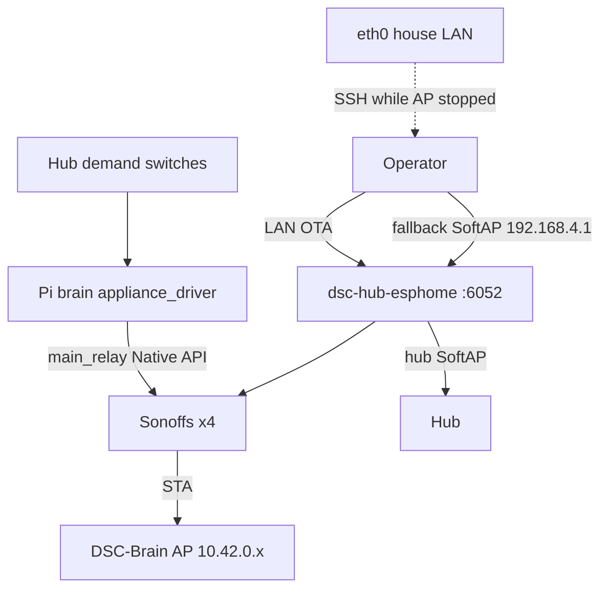

# Sonoff flash + Pi AP heal (7.1.2)

**Intent:** After ETH01 bridge retirement, Sonoffs (and hub SoftAP recovery) are OTA’d from the Pi onto firmware **7.0.0.0**, then driven by the brain appliance driver — not `dsc-bridge`.

**Acceptance / product context:** [`LIVE-ACCEPTANCE-7.1.md`](../qa/LIVE-ACCEPTANCE-7.1.md) · [`FLEET-INGEST.md`](../brain/FLEET-INGEST.md) · [`DSC-HUB-DOCKER.md`](DSC-HUB-DOCKER.md) · [`RELEASE.md`](../../RELEASE.md)

## Architecture



Bridge YAML is archived under `firmware/_history/v4/dsc-bridge*.yaml`. Do not flash it for Pi island product.

## Seats and addresses

| Seat | Stub | Pi AP IP | House LAN IP (script SoT) | Fallback SoftAP SSID |
|---|---|---|---|---|
| heater | `dsc-heater.yaml` | `10.42.0.50` | `192.168.86.50` | `DSC-Heater Fallback Hotspot` |
| heatmat | `dsc-heatmat.yaml` | `10.42.0.51` | `192.168.86.51` | `DSC-HeatMat Fallback Hotspot` |
| humidifier | `dsc-humidifier.yaml` | `10.42.0.54` | `192.168.86.54` | `DSC-Humidifier Fallback Hotspot` |
| dehumidifier | `dsc-de-humidifier.yaml` | `10.42.0.55` | `192.168.86.184` | `DSC-De-Humidifi Fallback Hotspot` |

Fallback AP PSK secret keys in `firmware/v4/secrets.yaml`: `dsc_heater_ap_password`, `dsc_heatmat_ap_password`, `dsc_humidifier_ap_password`, `dsc_dehumidifier_ap_password`. Store live values in Notion **API Keys & Credentials** — never paste into Wiki/PRs.

Lab eth0 DHCP for the Pi may move (`.30` → `.48`); prefer `dsc-brain.local` or current lease. AP seat IPs stay `10.42.0.x`.

## Choose a path

| Path | When | Entry |
|---|---|---|
| **LAN via Pi** | Sonoff still on house Wi‑Fi and pingable | `services/dsc-hub/pi/flash-sonoff-lan.ps1` → `flash-sonoff-lan-remote.sh` |
| **Fallback via Pi wlan0** | Offline on LAN / stuck on wrong SSID | `flash-sonoff-fallback-pi.ps1` → `flash-sonoff-fallback-remote.sh` |
| **Hub SoftAP recovery** | Hub stuck on its own fallback hotspot | `flash-hub-fallback-remote.sh` (compile YAML first) |
| **Fallback from Windows** | Operator Wi‑Fi can join device SoftAP | `flash-sonoff-fallback.ps1` / `flash-sonoff-fallback-admin.ps1` |
| **Fleet bulk** | Hub/pots/panel + Sonoffs already on Pi AP | `flash-fleet-700.ps1` (quote `'$Seats'` for plink) |

Prefer **LAN** first. Fallback paths briefly stop `dsc-hub-ap.service` so Pi `wlan0` can join the device SoftAP — climate island Wi‑Fi drops until restore. Use **eth0** SSH when stopping the Brain AP.

## eth0 uplink (required for safe fallback)

```bash
# on Pi — bring cable uplink + re-assert routes if dhcpcd left noprefixroute
bash services/dsc-hub/pi/bring-up-eth0.sh
```

`deploy-brain-remote.sh` also brings eth0 up before compose so SSH survives AP flaps.

## LAN flash (Pi)

```powershell
services/dsc-hub/pi/flash-sonoff-lan.ps1 -Seats "heater heatmat humidifier dehumidifier"
```

Remote behavior (`flash-sonoff-lan-remote.sh`): optional unpack `/tmp/dsc-firmware-v4.tgz` → per seat ping house LAN IP → `docker exec … esphome run <yaml> --device <lan-ip> --no-logs` → skip offline seats.

## Fallback flash (Pi as SoftAP client)

```powershell
# eth0 recommended so SSH survives while Brain AP is stopped
services/dsc-hub/pi/flash-sonoff-fallback-pi.ps1 -PiHost "192.168.86.48" -ApWaitSeconds 120
```

Remote behavior (`flash-sonoff-fallback-remote.sh`):

1. Try LAN OTA first
2. On miss: stop `dsc-hub-ap.service`, flush `wlan0`, scan for seat SSID up to `AP_WAIT`
3. Join SoftAP → `192.168.4.2/24` → OTA to `192.168.4.1`
4. Restore Brain AP (`dsc-hub-ap.service` / `wlan0-ap.sh` if `10.42.0.1` missing)
5. Wait ~25s and ping Pi seat IP

Scripts use `set -eu` carefully around SoftAP join; corrupt firmware tarballs abort before AP stop. `EXIT` trap always attempts AP restore.

**Operator tip:** Power-cycle the Sonoff away from house Wi‑Fi so the fallback SoftAP broadcasts. Dehumidifier SSID truncation (`DSC-De-Humidifi…`) matches firmware.

## Hub SoftAP recovery

```bash
# Compile first so AP downtime is upload-only
docker exec dsc-hub-esphome esphome compile /config/dsc-hub.yaml
bash services/dsc-hub/pi/flash-hub-fallback-remote.sh
```

Stops Brain AP, joins `DSC-HUB Fallback Hotspot`, OTA’s the hub, restores AP. Same eth0 caution as Sonoff fallback.

## Windows SoftAP client

`flash-sonoff-fallback.ps1` tries LAN, then joins each fallback SSID from the workstation. Static IP on the SoftAP requires elevation (`flash-sonoff-fallback-admin.ps1`). Log: `%TEMP%\dsc-sonoff-flash.log`.

## Soak cron (T+24h gate)

```bash
# Install hourly soak-check (idempotent)
bash services/dsc-hub/pi/setup-soak-cron.sh
# Log: /var/lib/dsc-hub/soak-2026-08-26.log
```

See [`SOAK-2026-08-26.md`](SOAK-2026-08-26.md).

## AP / hub diagnostics

| Script | Job |
|---|---|
| `diag-ap.sh` / `diag-ap.ps1` | hostapd ssid/channel, wlan0 addr, secrets wifi keys present, dnsmasq leases, recent `dsc-hub-ap` journal |
| `diag-hub.sh` | ping `10.42.0.10`, TCP `6053`, hostapd handshake lines, brain `/fleet` hub online/fw |
| `check-ap-data.sh` | ops hostapd passphrase present + brain `ap_psk` setting (values stay on host) |

```bash
bash services/dsc-hub/pi/diag-ap.sh
bash services/dsc-hub/pi/diag-hub.sh
```

If AP PSK drifted from fleet secrets: `fix-ap-psk.sh` (canonical PSK only in Notion *DSC-Brain Pi AP*).

## Verify

```bash
curl -s http://10.42.0.1:8787/fleet | python3 -c \
  "import sys,json;d=json.load(sys.stdin);print({k:((d.get(k) or {}).get('online'), (d.get(k) or {}).get('firmware')) for k in ('heater','heatmat','humidifier','dehumidifier')})"
curl -s -X POST http://10.42.0.1:8787/control/demand \
  -H 'content-type: application/json' \
  -d '{"seat":"dehumidifier","state":true}'
```

Expect firmware text **7.0.0.0** on Sonoffs. Relays appear under fleet `system.relays` when the appliance driver is healthy. After SPA deploy, hard-refresh for bundle `index-DwSYxFmR`.

## Constraints / pitfalls

- Bridge path is **retired** — do not reintroduce ETH01 as the primary Sonoff driver.
- Fallback flash **stops** Brain AP; use eth0 SSH when possible.
- Dehumidifier house LAN reservation in these scripts is **`.184`**, Pi AP seat remains **`.55`**.
- Quote `'$Seats'` when wrapping remote bash from PowerShell.
- Secrets stay in `secrets.yaml` / Notion credentials DB — never commit live PSKs into docs.
- Undiscovered demand aliases must not be emitted as OFF — see [`FLEET-INGEST.md`](../brain/FLEET-INGEST.md#undiscovered-aliases-712).
