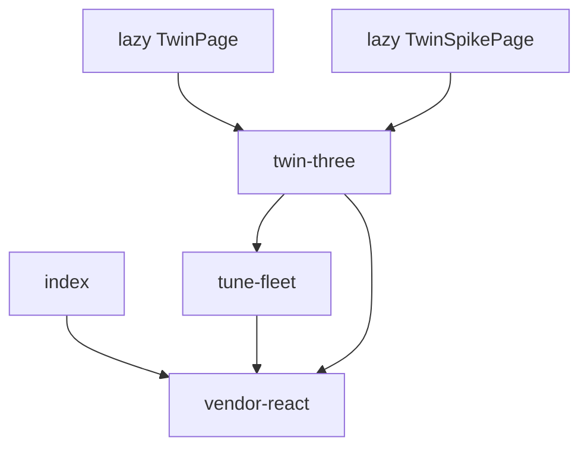

# SPA production bundle — chunk graph pitfalls

**In one line:** Vite **dev** does not exercise Rollup `manualChunks`; a green `:5173` session can still ship a blank Pi SPA.

Verified against tip `2d7bfca` (Hub **8.1.0** published; lazy Twin + `vendor-react` / `twin-three` chunk split still required). Code: `frontend/vite.config.ts`, `frontend/src/App.tsx` (default `surfaceVersion` **8.1.0**).

## Failure mode (2026-09-07)

1. Twin pages imported **statically** into the boot graph.
2. `manualChunks` put React into `twin-three` while `tune-fleet` and `twin-three` imported each other.
3. Pi served the production build → `Uncaught TypeError: Cannot read properties of undefined (reading 'createContext')` → blank SPA.
4. Local `npm run dev` stayed green because it never splits those chunks.

## Required shape



- `vendor-react` owns `node_modules/react` + `scheduler` — **no app chunk may own React**.
- Twin routes load via `React.lazy` in `App.tsx` (not a static top-level import).
- `TwinStage` / `TwinViewport` stay lazy inside their panels.

## Checklist before Pi hotpatch

```bash
cd frontend
npm run build
npx vite preview --host 127.0.0.1 --port 4180
# open the preview URL, hit #/overview and #/twin — SPA must mount
```

If `createContext` / blank root appears only in preview or on the Pi, check for a new static import that pulls `/twin/` or `three` into a non-lazy path.

## Related

- Twin architecture: [`../brain/TWIN.md`](../brain/TWIN.md)
- Pi hotpatch runbook: [`PI-HOTPATCH.md`](PI-HOTPATCH.md) · rule `.cursor/rules/dsc-pi-hotpatch.mdc` (`docker stop -t 20` + `start`)
