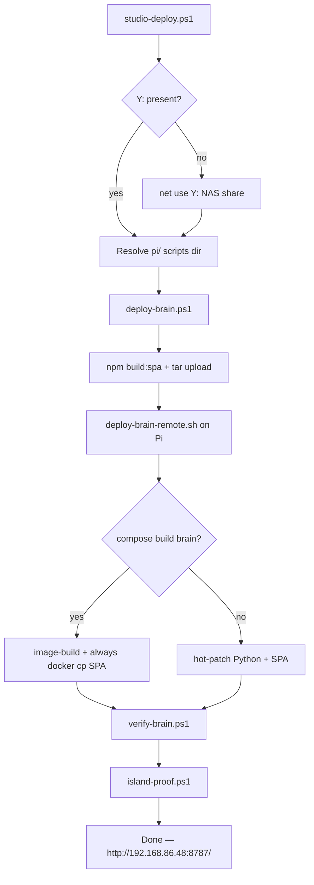

# Studio deploy (Windows → Pi from NAS)

**Intent:** One-shot operator path from a studio Windows host that keeps the repo on the NAS share. Maps drive `Y:` when needed, then runs deploy → verify → island-proof so operators avoid UNC/`cmd` pitfalls.

**Script:** [`services/dsc-hub/pi/studio-deploy.ps1`](../../services/dsc-hub/pi/studio-deploy.ps1)  
**Tip:** `408cdee` · defaults to studio LAN Brain **`192.168.86.48:8787`**

## When to use

| Path | Use when |
|------|----------|
| **`studio-deploy.ps1`** | Windows studio PC; repo lives on NAS (`Digital-Documents`); you want deploy + acceptance in one shot |
| **`deploy-brain.ps1` alone** | Already in a mapped repo tree; need `-PiHost` override or only want upload/rebuild |
| **AP-side curls** | Connected to `DSC-Brain` Wi‑Fi (`10.42.0.1`) for health/fleet checks |

Do **not** run PowerShell scripts via raw UNC (`\\NAS\…\studio-deploy.ps1` without a drive letter) when the chain will `Set-Location` and invoke sibling `.ps1` / `npm` — map `Y:` (or clone to local disk) first.

## Prerequisites

- Studio LAN reachability to Brain eth0 (default **`192.168.86.48`**, or `dsc-brain.local`)
- PuTTY **`plink` / `pscp`** on PATH (same pattern as `sync-cutover.ps1`)
- Node/`npm.cmd` available for `deploy-brain.ps1` SPA build (`build:spa`)
- `services/dsc-hub/.env` present in the repo tree (normalized to LF on upload)
- SSH credentials live in Notion **API Keys & Credentials** / *DSC-Brain Pi AP* — do not paste into Wiki or PR bodies

## Flow



## Run

From any PowerShell (right-click → Run with PowerShell, or):

```powershell
powershell -ExecutionPolicy Bypass -File "Y:\Digital Stealth Care\Projects\DSC-HUB\services\dsc-hub\pi\studio-deploy.ps1"
```

What it does (verified against source):

1. If `Y:` is missing, maps `\\192.168.86.2\Digital-Documents` → `Y:` (`/persistent:no`).
2. Resolves `…\DSC-HUB\services\dsc-hub\pi` (UNC share path or `Y:\…`); throws if `deploy-brain.ps1` is missing.
3. `Set-Location` into that `pi/` directory.
4. Runs, stop-on-fail:
   - `.\deploy-brain.ps1` — SPA build, upload brain/SPA/.env/compose, remote apply
   - `.\verify-brain.ps1` — `/health`, `/fleet` summary, appliance_driver seats, SPA hash in container, recent logs
   - `.\island-proof.ps1` — hub online + firmware train, inventory snapshot, critical ingest audit when present, SPA bundle grep
5. Prints Brain URL `http://192.168.86.48:8787/`

Override host on the leaf scripts if needed (studio-deploy itself does not pass params):

```powershell
.\deploy-brain.ps1 -PiHost "dsc-brain.local"
.\verify-brain.ps1 -PiHost "dsc-brain.local"
.\island-proof.ps1 -PiHost "dsc-brain.local"
```

## Deploy modes (on Pi)

`deploy-brain-remote.sh`:

1. Extracts brain Python + SPA static under `/opt/dsc-hub-repo`
2. Brings up eth0 / Docker DNS when possible
3. Tries `docker compose build brain` → **`image-build`**
4. On build failure → recreate + **`hot-patch`** (`docker cp` Python)
5. **Always** `docker cp` SPA static afterward (BuildKit can cache stale `COPY brain/static`)

Expect a short fleet-offline window while the brain container restarts (AP briefly drops) — not a fault. See [`DSC-HUB-DOCKER.md`](DSC-HUB-DOCKER.md).

## Acceptance signals

| Check | Source | Pass signal |
|-------|--------|-------------|
| Health | `verify-brain` / `curl …/health` | HTTP 200 |
| Hub ingest | `verify-brain` / `island-proof` | `hub.online` true (WARN if still warming) |
| Firmware train | `island-proof` | hub firmware starts with `7.0.0` |
| SPA bundle | both | `assets/index-*.js` inside container `/app/static/index.html` |
| pot3 gate | `island-proof` | WARN if `pot3` still `in_service` (F-003) |
| Operator | manual | Nest/HA climate automations off for true island |

## Common pitfalls

| Pitfall | Why | Fix |
|---------|-----|-----|
| UNC path / `cmd` | Sibling script + `npm` resolution break off `\\server\share` | Use `studio-deploy.ps1` (maps `Y:`) or local clone |
| Wrong Brain IP (`.30`) | Stale DHCP / docs | Scripts default **`.48`**; prefer `dsc-brain.local` |
| Running from AP-only NIC | Studio host on house LAN cannot reach `10.42.0.1` | Use eth0 `.48` / mDNS from studio |
| CRLF on `.sh` | Windows line endings | Wrappers strip `\r` after `pscp` before `bash` |
| Missing `.env` | `deploy-brain.ps1` throws | Copy `env.example` → `.env`; secrets only in Notion credentials DB |
| npm stall on NAS | Share latency during `build:spa` | Keep on mapped `Y:` (not UNC); if stuck, stage frontend to local disk (see `scripts/build-dsc-hub-panel.ps1` pattern) then re-run deploy |
| Hot-patch only after map changes | Stale image layers | Prefer successful `image-build`; always re-check SPA hash via `verify-brain` |

## Related

- Compose cutover: [`DSC-HUB-DOCKER.md`](DSC-HUB-DOCKER.md)
- Services README: [`services/dsc-hub/README.md`](../../services/dsc-hub/README.md)
- Live acceptance: [`docs/qa/LIVE-ACCEPTANCE-7.1.md`](../qa/LIVE-ACCEPTANCE-7.1.md)
- Closure matrix: [`docs/qa/AUDIT-CLOSURE-7.1.2.md`](../qa/AUDIT-CLOSURE-7.1.2.md)
