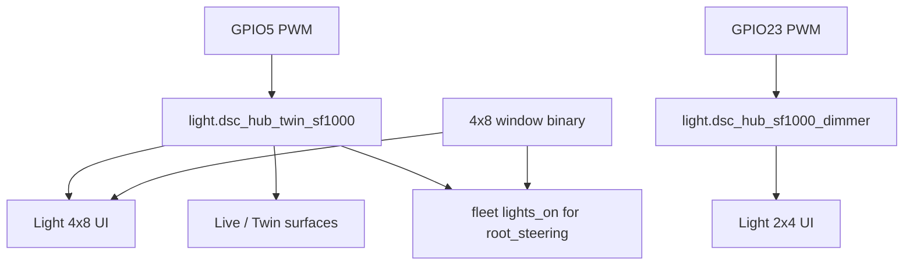

# Twin SF1000 (4×8 GPIO5 lamp)

**In one line:** Main-tent PWM light on hub GPIO5 is distinct from the clone SF1000 on GPIO23; Twin UI prefers the twin entity when available.

**Tip:** `bce7ca9` · Firmware `dsc-hub-v4_0.yaml` · SPA Light / Live / `lightSchedule.ts` · Design [twin-sf1000](../superpowers/specs/2026-08-29-twin-sf1000-design.md)

## Entities

| Tent | Entity | Hub pin | Notes |
|------|--------|---------|-------|
| 4×8 main | `light.dsc_hub_twin_sf1000` | **GPIO5** LEDC | Name **Twin SF1000**; history key `twin_sf1000_brightness` |
| 2×4 clone | `light.dsc_hub_sf1000_dimmer` | GPIO23 | Unchanged; clone-owned history |
| Photoperiod fallback | `binary_sensor.dsc_hub_4x8_window_open` | — | Honest Got-hours proxy when PWM dark / unavailable |

Slug is `light.dsc_hub_twin_sf1000` (not `*_dimmer`) — confirm after hub OTA.

## SPA consumers

| Surface | Behavior |
|---------|----------|
| Light page | Twin chip/toggle when entity available; window remains photoperiod SoT for Got hours |
| Live Twin / Mission | Prefer twin for main tent; clone dimmer stays 2×4 |
| `lightSchedule.ts` | `tent === "main"` → twin entity; else clone dimmer |
| Root steering `lights_on` | Twin **or** clone SF1000 **or** 4×8 window → day |

Twin / 3D remain a **presence / projection plane** — not a controller. Do not invent independent HVAC rooms.

## Architecture



## Honesty / constraints

- Software path + entity can ship before the external PWM module is wired. Brightness may sit at floor (~1) until hardware is present — do not claim live dimming without wire-up (FOLLOWUPS).
- Do not retarget clone history onto twin.
- KeepAlive / TwinViewport may mount on Pi (`VITE_DSC_PI=1`); still prefer honesty cards over blank theater when WebGL fails.

## Ops checks

```bash
# After hub OTA — entity present
# HA / brain hass_states should list light.dsc_hub_twin_sf1000
# Light page: Twin SF1000 chip when available
```

## Related

- [`../brain/ROOT-STEERING.md`](../brain/ROOT-STEERING.md) — `lights_on` consumers
- [`ZIGBEE-RECOVERY.md`](ZIGBEE-RECOVERY.md) — radio separate from lamp PWM
- [`../qa/TWIN-PARITY-7.3.md`](../qa/TWIN-PARITY-7.3.md) — older Twin viz parity notes
