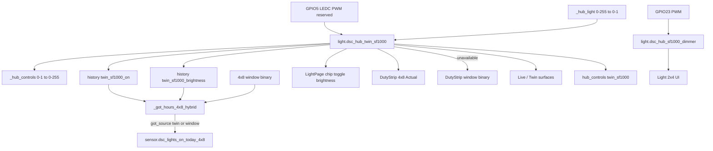

# Twin SF1000 (4×8 GPIO5 lamp)

**In one line:** Main-tent PWM light on hub GPIO5 is distinct from the clone SF1000 on GPIO23; when Twin is available, Light treats it as the live 4×8 actuator and Got prefers Twin on-hours when history is healthy — GPIO5 stays reserved until physically wired.

**Tip:** `b429179` · spa-dist `index-BEjnawnp.js` · Firmware `dsc-hub-v4_0.yaml` · SPA Light / Live / `lightSchedule.ts` · Design [twin-sf1000](../superpowers/specs/2026-08-29-twin-sf1000-design.md) · Pass 4 [pass4 design](../superpowers/specs/2026-09-01-live-ux-pass4-twin-integrated-design.md) · [pass4 plan](../superpowers/plans/2026-09-01-live-ux-pass4-twin-integrated.md) · Task 4 [report](../../.superpowers/sdd/pass4-task-4-report.md)

## Entities

| Tent | Entity | Hub pin | Notes |
|------|--------|---------|-------|
| 4×8 main | `light.dsc_hub_twin_sf1000` | **GPIO5** LEDC | Name **Twin SF1000**; history `twin_sf1000_on` + `twin_sf1000_brightness` |
| 2×4 clone | `light.dsc_hub_sf1000_dimmer` | GPIO23 | Unchanged; clone-owned history |
| Photoperiod fallback | `binary_sensor.dsc_hub_4x8_window_open` | — | Got + DutyStrip fallback when Twin unavailable or history unhealthy |

Slug is `light.dsc_hub_twin_sf1000` (not `*_dimmer`) — confirm after hub OTA.

## Architecture



## Brightness scale (Task 4)

| Direction | Codepath | Rule |
|-----------|----------|------|
| Command out | `control_ops._hub_light` | HA-shaped callers use **0–255**; aioesphomeapi wants **0.0–1.0** — values `>1` divide by 255; values `≤1` clamp as already-normalized |
| Command off | same | `state=False, brightness=0.0` clears sticky monochromatic ON |
| Ingest in | `esphome_client._hub_controls_from_states` | Native API **0–1** → fleet **0–255**; legacy 0–255 tolerated |

Do not double-scale. Optical lamp output remains **N/A** until GPIO5 PWM module is physically wired.

## SPA / brain consumers (verified tip `b429179`)

| Surface | Behavior |
|---------|----------|
| Light page | Twin chip + `EntityToggle` with brightness when available; honesty: Twin = live actuator; GPIO5 **reserved**; `Got · Twin` / `Got · Window` from sensor attrs |
| DutyStrip 4×8 | Actual entity = Twin when available; else window binary |
| Live Twin / Mission | Prefer twin for main tent; clone dimmer stays 2×4 |
| `lightSchedule.ts` | `tent === "main"` → twin entity; else clone dimmer |
| Brain Got | `_got_hours_4x8_hybrid`: Twin on-hours when available + healthy history; else `window_4x8_open`; emits `got_source` |

Twin / 3D remain a **presence / projection plane** — not a controller. Do not invent independent HVAC rooms.

## Pass 4 Twin-first status

| Item | Status on tip `b429179` |
|------|-------------------------|
| Design + implementation plan | **Landed** |
| Task 1 walk scaffold + GPIO5 stub | **Landed** |
| Hybrid Got + Twin on ingest | **Landed** (`b4ca126`) |
| Light Twin honesty + DutyStrip Actual | **Landed** (`5144978` / `index-BEjnawnp.js`) |
| `test_live_ux_pass4_twin.py` | **8 passed** |
| Task 4 Pi smoke + brightness scale | **Phase A GREEN** (`48b443d`) — walk A1–A8 pass; evidence `.audit/live-ux-pass4-prove-evidence.json` |
| Phase B / C / Task 7 gate | **Open** |
| Optical / physical PWM | **Not claimed** — GPIO5 reserved |

Named parks Pass 4 Phase C must clear or defer: **SV-P1-6** (esp. 2×4 DutyStrip 0.0H while ON), **AirPathMap** cascade ← `intakeClone`, **GAUGE-P0-1** Overview moisture vs `potWantBand`.

## Honesty / constraints

- Software path treats Twin as live actuator before the external PWM module is wired. Brightness may sit at floor (~1) until hardware is present — **never claim live optical dimming / “wired”** without operator physical confirm.
- **GPIO5 handoff:** reserved for Twin SF1000 PWM module (operator wire-up later). See FOLLOWUPS Pass 4; expand at gate.
- Healthy history = ≥1 Twin on/brightness sample since local midnight; cold start falls back to window with honesty attrs.
- Do not retarget clone history onto twin.
- KeepAlive / TwinViewport may mount on Pi (`VITE_DSC_PI=1`); still prefer honesty cards over blank theater when WebGL fails.
- Prefer `docker kill` + `start` for brain hotpatch restarts — bare `docker restart` hung the Pi during Task 4 smoke.

## Ops checks

```bash
# After hub OTA — Twin entity present in brain hass/controls
# Light: Twin toggle + Got · Twin / Got · Window chip
# History: twin_sf1000_on ingest after on/off; DutyStrip Actual tracks Twin
# Prove: .audit/live-ux-pass4-prove.ps1 (Phase A; optical N/A)
# Never paste API keys / Wi-Fi / hostkeys into walks
```

## Related

- [`../brain/LIVE-UX-HONESTY.md`](../brain/LIVE-UX-HONESTY.md) — Pass 4 program runbook  
- [`../brain/PHOTOPERIOD-TIMELINE.md`](../brain/PHOTOPERIOD-TIMELINE.md) — schedule SVG (not DutyStrip)  
- [`ZIGBEE-RECOVERY.md`](ZIGBEE-RECOVERY.md) — radio separate from lamp PWM  
- [`../qa/TWIN-PARITY-7.3.md`](../qa/TWIN-PARITY-7.3.md) — older Twin viz parity notes  
- [`../qa/LIVE-UX-PASS4-WALK-2026-09.md`](../qa/LIVE-UX-PASS4-WALK-2026-09.md) — Pass 4 walk (Phase A filled)  
