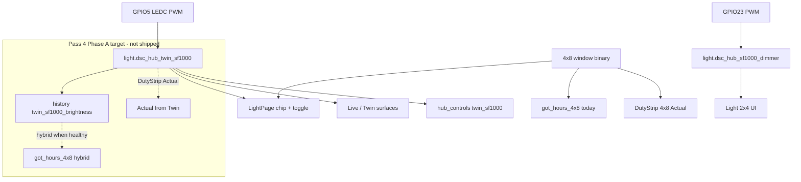

# Twin SF1000 (4×8 GPIO5 lamp)

**In one line:** Main-tent PWM light on hub GPIO5 is distinct from the clone SF1000 on GPIO23; Twin UI prefers the twin entity when available; Got hours stay window-proxy until Pass 4 Phase A hybrid lands.

**Tip:** `e7ebfd3` · spa-dist `index-C8GkS5XE.js` · Firmware `dsc-hub-v4_0.yaml` · SPA Light / Live / `lightSchedule.ts` · Design [twin-sf1000](../superpowers/specs/2026-08-29-twin-sf1000-design.md) · Pass 4 [pass4 design](../superpowers/specs/2026-09-01-live-ux-pass4-twin-integrated-design.md) · [pass4 plan](../superpowers/plans/2026-09-01-live-ux-pass4-twin-integrated.md)

## Entities

| Tent | Entity | Hub pin | Notes |
|------|--------|---------|-------|
| 4×8 main | `light.dsc_hub_twin_sf1000` | **GPIO5** LEDC | Name **Twin SF1000**; history key `twin_sf1000_brightness` |
| 2×4 clone | `light.dsc_hub_sf1000_dimmer` | GPIO23 | Unchanged; clone-owned history |
| Photoperiod fallback | `binary_sensor.dsc_hub_4x8_window_open` | — | **Current** Got-hours + DutyStrip Actual SoT on tip |

Slug is `light.dsc_hub_twin_sf1000` (not `*_dimmer`) — confirm after hub OTA.

## Architecture



## SPA consumers (verified tip)

| Surface | Behavior |
|---------|----------|
| Light page | Twin chip/toggle when `available(light.dsc_hub_twin_sf1000)`; honesty copy: window remains Got SoT; DutyStrip entity = window binary |
| Live Twin / Mission | Prefer twin for main tent; clone dimmer stays 2×4 |
| `lightSchedule.ts` | `tent === "main"` → twin entity; else clone dimmer |
| Brain Got | `_hub_values_for_light_loop` → `window_4x8_open` hours only (hybrid **not** shipped) |

Twin / 3D remain a **presence / projection plane** — not a controller. Do not invent independent HVAC rooms.

## Pass 4 Twin-first (approved plan — not implemented)

| Item | Status on tip `e7ebfd3` |
|------|-------------------------|
| Design + implementation plan | **Landed** |
| Hybrid Got / DutyStrip Twin Actual | **Not started** |
| `LIVE-UX-PASS4-WALK-2026-09.md` | **Absent** |
| `test_live_ux_pass4_twin.py` | **Absent** |
| Gate FOLLOWUPS write-up | **Absent** (gate-blocking when Phase G runs) |

Named parks Pass 4 must clear or defer: **SV-P1-6** DutyStrip, **AirPathMap** cascade ← `intakeClone`, **GAUGE-P0-1** Overview moisture vs `potWantBand`.

## Honesty / constraints

- Software path + entity can ship before the external PWM module is wired. Brightness may sit at floor (~1) until hardware is present — **never claim live optical dimming / “wired”** without operator physical confirm.
- **GPIO5 handoff:** reserved for Twin SF1000 PWM module (operator wire-up later). Document in FOLLOWUPS at Pass 4 Task 1 / gate; do not invent “physically wired”.
- Do not retarget clone history onto twin.
- KeepAlive / TwinViewport may mount on Pi (`VITE_DSC_PI=1`); still prefer honesty cards over blank theater when WebGL fails.

## Ops checks

```bash
# After hub OTA — entity present in brain hass/controls
# Light page: Twin SF1000 chip when available
# Got hours: still track window until Pass 4 Phase A
# Never paste API keys / Wi-Fi / hostkeys into walks
```

## Related

- [`../brain/LIVE-UX-HONESTY.md`](../brain/LIVE-UX-HONESTY.md) — Pass 4 program runbook  
- [`../brain/PHOTOPERIOD-TIMELINE.md`](../brain/PHOTOPERIOD-TIMELINE.md) — schedule SVG (not DutyStrip)  
- [`ZIGBEE-RECOVERY.md`](ZIGBEE-RECOVERY.md) — radio separate from lamp PWM  
- [`../qa/TWIN-PARITY-7.3.md`](../qa/TWIN-PARITY-7.3.md) — older Twin viz parity notes
