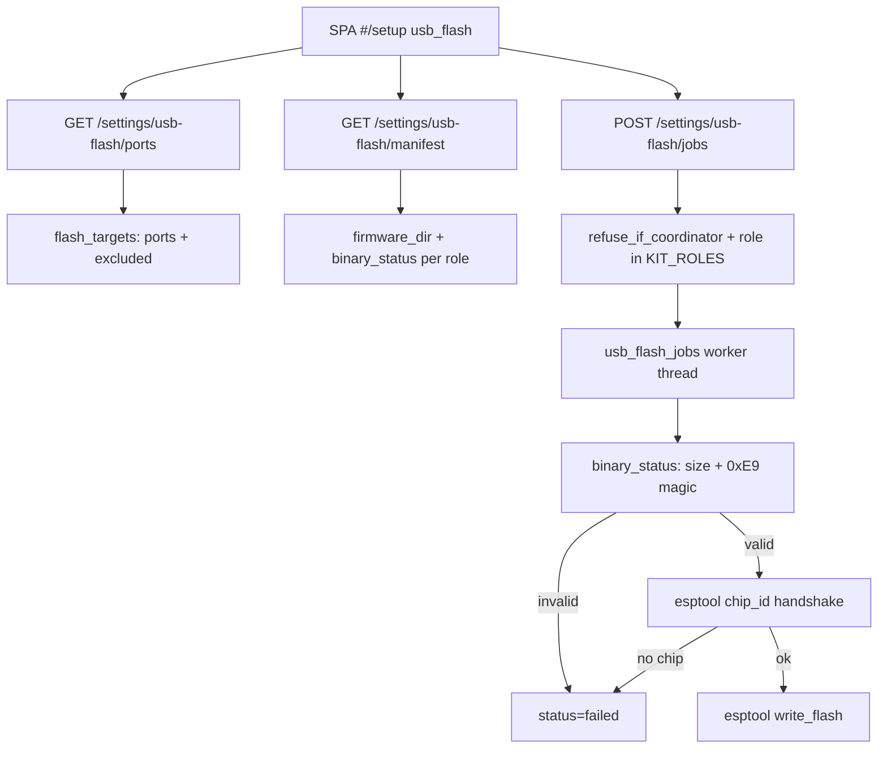

# USB kit flash (baked binaries + host esptool)

**Tip SoT:** `17aa6bd` — flash guards landed with commissioning honesty and the plausibility reject layer.

USB flash is the **first-boot / unbox** path: plug a device into the Pi, pick a kit role, run host `esptool.py` against a **baked** `.bin`. It is not Settings → ESPHome OTA (`esphome_jobs` / dashboard WebSocket). See [`ESPHOME-TOOLCHAIN.md`](ESPHOME-TOOLCHAIN.md) for compile/OTA.

## Intent

- Never write a hollow or foreign image to silicon.
- Never offer (or accept) the Zigbee coordinator as a flash target.
- Tell the operator what is actually on disk before they press Flash.
- One job at a time; fail closed with an honest detail string.

## Architecture

| Piece | Where |
|---|---|
| Roles | `usb_flash.KIT_ROLES` — hub, control, pot1, pot2, heater, heatmat, humidifier, dehumidifier. **No `bridge`** (WT32-ETH01 retired from the bake). |
| Binaries | Prefer `/opt/dsc-hub/firmware/kit`; else repo `services/dsc-hub/firmware/kit`. `firmware_dir()` is a **pure read** — it does not mkdir. |
| Manifest | `kit-manifest.json` next to the kit dir, or `_DEFAULT_MANIFEST`. Public payload adds exists/size/sha256/mtime/valid/reason + `available_roles`. |
| Ports | Prefer `/dev/serial/by-id`. Coordinators (SkyConnect / ConBee / Sonoff Zigbee / `zigbee_serial_port` setting, …) go to `excluded`, not `ports`. |
| Jobs | SQLite `usb_flash_jobs` via ops settings DB. |

## API

| Method | Path | Notes |
|---|---|---|
| GET | `/settings/usb-flash/ports` | `{ "ports": [...], "excluded": [...] }` |
| GET | `/settings/usb-flash/manifest` | Role table + disk truth + `firmware_dir` |
| POST | `/settings/usb-flash/jobs` | `{ "role", "port" }` → 400 bad role/port/image/coordinator; 409 job already running |
| GET | `/settings/usb-flash/jobs` · `…/{id}` | Status: `queued` \| `running` \| `done` \| `failed` |

## Pre-write guards (order)

1. Role ∈ `KIT_ROLES` and present in manifest.
2. Port non-empty; `refuse_if_coordinator(port)`.
3. Binary exists; `binary_status` valid (non-zero; `0xE9` at `0x0`, or at `0x1000` for classic ESP32 merged images when chip is `esp32*`).
4. `esptool.py --chip <chip> --port <port> chip_id` must succeed before any `write_flash`.

## SPA (`SetupPage`)

- Role options with `valid === false` are **disabled** (shows reason / size).
- Flash button disabled when busy, no port selected, or selected role image invalid.
- Header uses `state.version` (not a hardcoded `8.0`).
- Parked when `commissioned` **or** `commissioned_inferred` — see [`../brain/KIT-SETUP.md`](../brain/KIT-SETUP.md).

## Operator checklist

1. Confirm baked kit dir exists: `GET /settings/usb-flash/manifest` → `firmware_dir_exists` and `available_roles` non-empty.
2. Plug **one** USB-UART / device; leave SkyConnect alone — it should appear only under `excluded`.
3. Put the target in bootloader if auto-reset fails (manifest `boot_mode_note`).
4. Flash → wait for job `done` / `failed` detail. Never green on fail.
5. Skip records `not_flashed:<role>` debt; go-live still requires hub online unless hub flash was skipped.

## Pitfalls

| Symptom | Likely cause |
|---|---|
| `available_roles: []` | Empty or unmounted firmware dir; do not trust a mkdir'd empty path (fixed: no mkdir). |
| Port list empty but radio works | Adapter not passed into the brain container / host path — deployment issue, not wizard theater. |
| Flash refused: Zigbee coordinator | Correct — flashing the SkyConnect bricks the mesh. |
| `No esp32 answered on …` | Wrong port, not in bootloader, or bad cable — chip_id failed before write. |
| Bridge missing from roles | Intentional; bake never produced `bridge.bin`. |

## Tests

`brain/tests/test_usb_flash_safety.py` — bridge omitted, firmware_dir pure read, hollow/foreign images, coordinator exclusion, manifest disk truth.

## Related

- [`../brain/KIT-SETUP.md`](../brain/KIT-SETUP.md) — commission inference + go-live gates
- [`../../SETUP.md`](../../SETUP.md) — SoftAP fleet join after USB flash
- [`PANEL-HUB-COFLASH-CHECKLIST.md`](../qa/PANEL-HUB-COFLASH-CHECKLIST.md) — panel/hub co-flash QA
