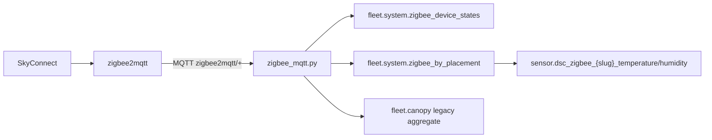

# Zigbee2MQTT radio recovery + multi-sensor ingest (SkyConnect / TS0201)

**Brain:** `http://192.168.86.48:8787` · Settings → Zigbee  
**No factory reset** without explicit operator approval.

Companion: global temp/RH offsets on Zigbee ingest — [`docs/brain/GLOBAL-MODIFIERS.md`](../brain/GLOBAL-MODIFIERS.md).

## Multi-sensor model (7.2)



| Concept | Where | Notes |
|---------|-------|-------|
| Placement map | settings `zigbee_placements` JSON **or** inventory `extra.zigbee_friendly_name` + `extra.placement` | Friendly name → label (e.g. `canopy_4x8`) |
| Per-device state | `fleet.system.zigbee_device_states` | Full MQTT payload + `updated_at` |
| Per-placement | `fleet.system.zigbee_by_placement` | Last row per placement label |
| Virtual entities | `FleetState.to_hass_states` | `sensor.dsc_zigbee_{slug}_temperature` / `_humidity` (`slug` = placement lowercased) |
| Modifiers | `apply_temp_rh_offsets` | Zone from placement: `4x8`/`main` → main, `2x4`/`clone` → clone, else room |
| Health | `GET /settings/zigbee/health` | `radio_up`, `bridge_state`, `radio_note`, permit join |

**SPA:** Climate page shows Zigbee-by-placement table; Settings → Zigbee placements when devices exist.

**Constraint:** Built-in z2m converters for Tuya `TS0201` — no DSC device library. Multiple sensors need distinct placements or they overwrite the same `zigbee_by_placement` key.

## Symptoms

- Settings shows **RADIO DOWN** / `bridge_state: offline`
- z2m container crash-loop: `HOST_FATAL_ERROR` in logs
- `bridge/devices` empty; permit join has no effect

## Pi checks

```bash
# One z2m container, one data volume
docker ps -a --filter name=z2m
ls -la /var/lib/dsc-hub/z2m/

# USB stick
ls -l /dev/ttyACM0
dmesg | tail -30 | grep -i tty
```

## Adapter firmware

Repo default: `adapter: ezsp` in `services/dsc-hub/zigbee2mqtt/configuration.yaml`.

If EZSP fails to start, try **ember** (newer SkyConnect firmware):

1. Edit `/var/lib/dsc-hub/z2m/configuration.yaml` on Pi (or redeploy from repo after changing template).
2. Set `adapter: ember` (or `emberznet` per z2m 2.x docs for your image version).
3. `docker compose restart zigbee2mqtt` from `services/dsc-hub`.

**Do not** wipe `database.db` or coordinator unless operator approves — that unpairs all devices.

## Pair TS0201 temp/humidity

Built-in z2m converters handle Tuya `TS0201` (`0x0402` + `0x0405`). No DSC-HUB device library required.

1. Confirm **RADIO UP** in Settings.
2. **Permit join** (30s auto-off via brain API).
3. Put sensor in pairing mode (hold reset ~5s until LED blinks).
4. Verify MQTT: `mosquitto_sub -h 127.0.0.1 -t 'zigbee2mqtt/+' -v`
   - Expect `temperature` and `humidity` on device topic.
5. Settings → Placements: label e.g. `canopy_4x8` or `canopy_2x4`.

## Pi maintenance

Kill stale log-follow if present:

```bash
pgrep -af 'esphome run dsc-hub.yaml' && sudo kill <pid>
```

## Deploy after code changes

From studio LAN (mapped `Y:` drive):

```powershell
powershell -ExecutionPolicy Bypass -File "Y:\Digital Stealth Care\Projects\DSC-HUB\services\dsc-hub\pi\studio-deploy.ps1"
```
