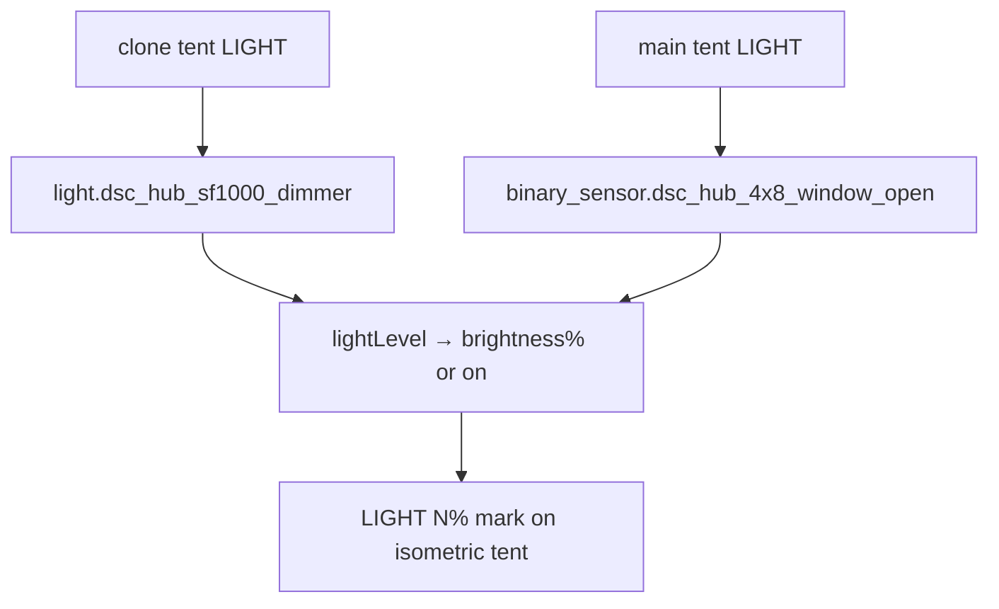

# Airflow map — tent LIGHT entity honesty

Default `light` bindings for `custom:dsc-airflow-map-card` after checkpoint
[#78](https://github.com/weddas/DSC-HUB/pull/78) / HACS sync `e0db778`.

## Intent

The Climate airflow card draws a **LIGHT** mark on each tent when
`lightLevel(hass, zone.light) > 0.02`. That helper treats:

- `light.*` with brightness → 0…1 from `brightness / 255`
- any entity whose state is `on` (no brightness) → **1.0** (100%)
- `off` / unavailable / unknown → 0

So a photoperiod `binary_sensor` is a valid **on/off** light proxy; it is **not**
dimmable.

## Defaults (www SoT)

Source: `homeassistant/www/dsc-airflow-map-card.js` zone defaults → published to
`dist/` via `scripts/sync-hacs-dist.sh`.

| Zone id | Label | `light` entity | Notes |
|---|---|---|---|
| `clone` | 2x4 Reservoir | `light.dsc_hub_sf1000_dimmer` | Real SF1000 PWM |
| `main` | 4x8 Main | `binary_sensor.dsc_hub_4x8_window_open` | Photoperiod / heat proxy until a 4×8 lamp entity exists (GPIO5 reserved) |



## Twin / panel parity

The Dash / Twin (`dsc-the-dash-card.js`) keeps separate fields:

- `entities.light` → SF1000 (clone / shared lamp)
- `entities.main_window` → `binary_sensor.dsc_hub_4x8_window_open`
- `entities.main_light` → empty until GPIO5 PWM is instrumented

Panel cockpits follow the same honesty: Main amber glow prefers `main_light` when
set, else the 4×8 window binary. Do **not** invent a 4×8 lamp entity in docs or
YAML.

## Constraints / pitfalls

- Pointing Main `light` at SF1000 makes the 4×8 LIGHT mark track the **clone**
  lamp — the bug `#78` closed.
- Lovelace YAML overrides under `entities:` / zone edits win over defaults; after
  Redownload, re-check Edit card if an old dashboard still pins SF1000 on Main.
- HACS-only sites need **Redownload** after `chore(hacs): sync dist/…`; Sync
  `/local` already follows www. Verify:

  ```bash
  bash scripts/sync-hacs-dist.sh && git diff --stat -- dist/
  ```

- Allocated CFM honesty (`sensor.dsc_cfm_exhaust_*_allocated`) is unrelated to
  LIGHT marks — do not conflate.

## Related

- [`scripts/HACS-FRONTEND.md`](../../scripts/HACS-FRONTEND.md) — bundle publish
- [`docs/qa/LIVE-UI-CUSTOM-PANEL.md`](LIVE-UI-CUSTOM-PANEL.md) — panel dual-path
- [`homeassistant/README.md`](../../homeassistant/README.md) — Lovelace card install
- FOLLOWUPS § “Tent pass (all tents) + 4×8 photoperiod glow”
