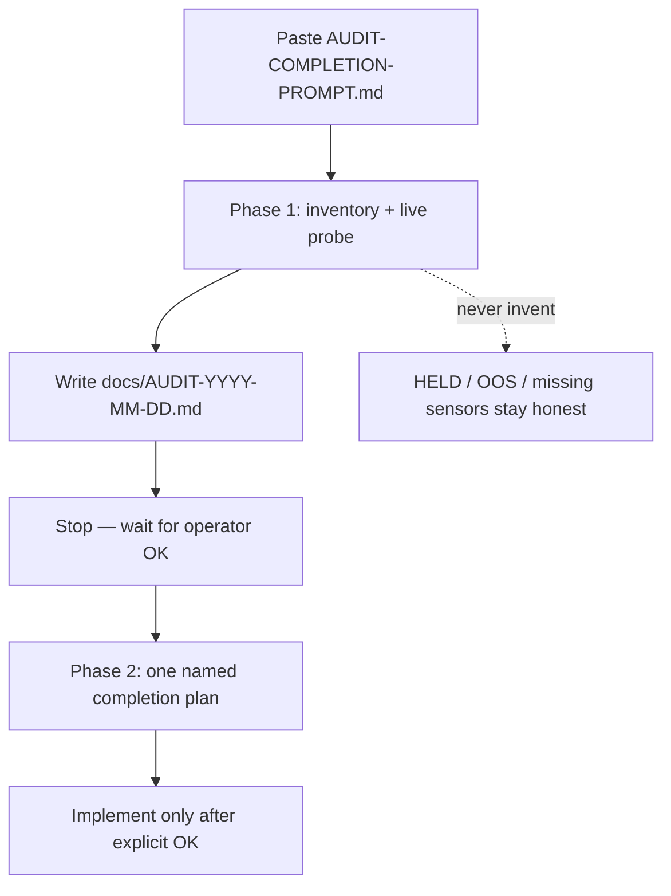

# Full audit → version-completion (ops)

Pasteable agent prompt: [`docs/AUDIT-COMPLETION-PROMPT.md`](../AUDIT-COMPLETION-PROMPT.md)  
Latest Phase 1 artifact: [`docs/AUDIT-2026-08-17.md`](../AUDIT-2026-08-17.md)  
Standing leftovers: [`docs/FOLLOWUPS.md`](../FOLLOWUPS.md)

## Intent

Run a **honest product audit** before any “version complete” claim. Phase 1 proves what works live. Phase 2 plans one named software completion. Coding Phase 2 starts only after the operator accepts the plan.

Trigger commit that landed the prompt: `97d8295` on `master`.

## Tip version trains (re-probe every audit)

Do **not** trust version strings embedded in the paste prompt. Re-read tip SoT:

| Train | Tip SoT (verified `97d8295` tree) | Live entity / file |
|---|---|---|
| HA surface | **7.2.0** | `sensor.dsc_ha_surface_version`, `SURFACE_VERSION` / `BUNDLE_V` |
| SoftAP-local firmware | **6.0.0.0** | `input_text.dsc_expected_release`, hub body `project.version` |
| GitHub release tag | `v5.1.0` (historical) | Releases page — not the live train |
| CannaLib API | probe `/health` | public host or LAN `:8790` |

Skew between repo tip and live HA is a **defect**, not a narrative. Last Phase 1 (`AUDIT-2026-08-17.md`) still saw live surface **7.1.3 / 7.1.4** while the tree moved to **7.2.0**.

## How to run Phase 1

1. Open a Cursor chat rooted on the DSC-HUB repo path in the prompt.
2. Paste **all** of `docs/AUDIT-COMPLETION-PROMPT.md` as the first message.
3. Re-probe tip versions (table above) before scoring version skew.
4. Inventory every operator-facing surface (firmware, packages, React `/dsc-hub`, Lovelace fallback, sync, CannaLib, operator docs).
5. For each row in the prompt’s prove-it matrix: **pass / fail / blocked** with evidence (URL, entity id, compile log, screenshot path). Reading code alone is not enough.
6. Read **all** of `docs/FOLLOWUPS.md`. For every open item, write a foolproof close-out shape (keep / close-with-evidence / redesign / hardware-blocked).
7. Query Notion Bug Box `collection://f18ec9d2-1ed1-4033-96b8-726971429250` if Notion MCP is ready; if not, say so — do not invent Bug Box rows.
8. Deliver `docs/AUDIT-YYYY-MM-DD.md` (or today’s date) and **stop**.

## Phase 2 (after operator OK only)

One coherent completion plan from Phase 1 evidence:

- One named release (e.g. Hub SoftAP-local **6.0.0.0** / Surface **7.2.0**)
- Ordered work that closes every **software-closable** follow-up
- Hardware-blocked items stay in FOLLOWUPS with honesty gates already proven
- Soak / acceptance a cold agent can run
- Explicit **not in version**: ESP-NOW deepening, R3F Twin rewrite, physical AC / mister / POT3 install

## Hard rules (do not weaken)

| Rule | Why |
|---|---|
| No invented sensor values, chemistry, CFM, height cm, or soak results | Catalog / Twin honesty |
| HELD / unavailable / OOS stay dim / dashed / no glow | No fake last-good as live |
| AC, clone mister, POT3 stay OOS (F-001–F-003) | Hardware absent |
| ESP-NOW parked (`d92d306`) | Not the default next campaign |
| Do not mark Done without live probe / compile / screenshot | Chat claims are not evidence |
| Off-scope house HA → Digital-Home, not DSC-HUB wiki | Audience boundary |
| Prompt says do not commit/push unless the user asks | Audit chat ≠ docs automation |

## Operator checklist

- [ ] Paste prompt; confirm chat roots on DSC-HUB
- [ ] Re-probe tip surface / expected firmware / CannaLib `/health`
- [ ] Fill surface matrix with evidence paths
- [ ] Close-out table for every open FOLLOWUPS row
- [ ] Bug Box listed or Notion noted unavailable
- [ ] `docs/AUDIT-YYYY-MM-DD.md` written
- [ ] Stop for Phase 2 acceptance before coding

## Related ops

| Topic | Prefer |
|---|---|
| Twin THREE red banner | open docs PR **#85** (`TWIN-THREE-PREREQ.md`) |
| CannaLib Restart vs Recreate | open docs PR **#86** (`CANNALIB-RESTART.md`) |
| ESP-NOW shelf | open docs PR **#84** |
| SoftAP / VERSION-TRAINS pages still thin on master | open docs PR **#77** |
| Release rollout | [`RELEASE.md`](../../RELEASE.md) |

## Common pitfalls

- Treating the prompt’s embedded “last seen” versions as tip SoT
- Starting Phase 2 implementation before operator acceptance
- Calling the fleet “complete” while live HA still serves a stale surface
- Reopening ESP-NOW / SoftAP deepening as the default completion work
- Plotting unavailable climate as `0.0` (Phase 1 already flagged this lie)
- Pasting live `CANNALIB_API_KEY` into wiki / PR bodies
