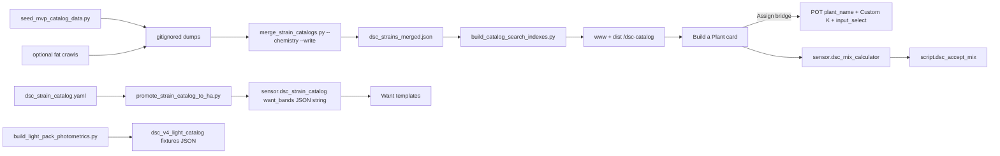
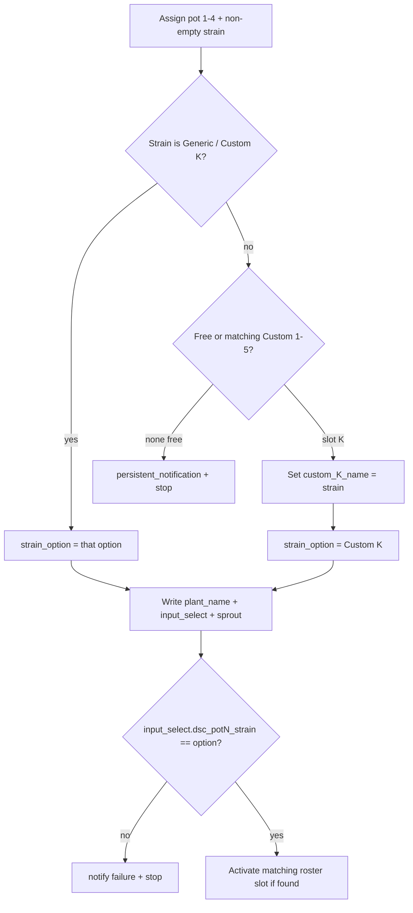

# Build a Plant — data pipeline + assign bridge (N-085)

Developer runbook for catalog provenance, slim indexes with chemistry/PPFD,
the pot-seat assign bridge, and short-stock-safe Accept. Shipped with HA
surface **5.1.11** (`1e5fc65`). Operator composition UX stays in
[`LIVE-UI-BUILD-A-PLANT.md`](LIVE-UI-BUILD-A-PLANT.md); POT3 soak evidence in
[`N-085-POT3-BROWSER.md`](N-085-POT3-BROWSER.md).

## Intent

Unblock the browser composition surface with **selectable** chemistry and at
least one real PPFD map URL, without committing fat crawl dumps or inventing
climate/PPFD grids. Catalog dumps stay local/gitignored; slim indexes and
curated YAML packs are what Sync/HACS deliver.



## Source of truth

| Layer | Authoritative | Notes |
|---|---|---|
| Live seat | `text.dsc_potN_plant_name`, `input_select.dsc_potN_strain`, sprout helpers | ESP `select` / `text` mirrored `continue_on_error` |
| Chemistry Want | Catalog `want_bands` → Custom helpers → Generic stage | Nested maps rejected on HA 2026.8 — store **JSON strings** |
| Climate Want | Custom temp/RH helpers **≠ 0** only | Unset sentinel is **0**, not `unknown` |
| Draft inventory | 8-slot plant roster | Commit fills next empty; assign can activate matching slot |
| Mix | Shared nutrient slots + `script.dsc_accept_mix` | Short lines skipped; covered lines still burn |
| Fat dumps | Local only (`.gitignore`) | `dsc_strains_*.json`, `dsc_*_merged.json`, lab/nutrient/medium/light dumps |
| Slim indexes | Committed under `www/dsc-catalog/` + `dist/dsc-catalog/` | Browser payload |

## MVP gate (unblocks UI)

Browser suite is blocked until all of these are true:

1. Merged dump (or seeded MVP) with chemistry on **≥1** selectable strain
2. **≥1** light with `ppfd_url` in the search index / photometrics pack
3. Nutrient + medium indexes non-empty
4. Full ~36k Herbies-style crawl remains **best-effort**, not a browser blocker

Committed slim indexes after N-085 (verified): strains carry `has_chemistry` /
`thc_range` / `cbd_range` / `top_terpenes` (e.g. Blue Dream); lights carry
`ppfd_url` (e.g. Spider Farmer SF1000).

## Toolchain (local rebuild)

Fat dumps are gitignored. On a clean tree, seed synthetic MVP fixtures first
(chemistry values are **UI fixtures**, not laboratory claims):

```bash
python scripts/seed_mvp_catalog_data.py
python scripts/merge_strain_catalogs.py --chemistry --write
python scripts/promote_strain_catalog_to_ha.py   # needs PyYAML
python scripts/build_light_pack_photometrics.py  # fixtures JSON string + max 255 URL helpers
python scripts/build_catalog_search_indexes.py
python scripts/gen_dsc_v4_build_plant.py         # regenerate package from generator
./scripts/sync-hacs-dist.sh                      # refresh dist/DSC-HUB.js + dist/dsc-catalog/
```

| Script | Writes | Constraint |
|---|---|---|
| `seed_mvp_catalog_data.py` | `dsc_strains_popular.json`, `dsc_lab_terpenes_mvp.json`, CANNA nute/medium dumps | Creates **only if missing** |
| `merge_strain_catalogs.py` | `dsc_strains_merged.json` | `--chemistry` attaches `dsc_lab_terpenes_*.json` |
| `promote_strain_catalog_to_ha.py` | `dsc_strain_catalog_want_bands.json` + inline `want_bands` in package | JSON **string** attr between BEGIN/END markers |
| `build_light_pack_photometrics.py` | pack YAML + `fixtures` JSON string on light catalog sensor | `input_text` URL helpers **max: 255** (512 breaks entire domain) |
| `build_catalog_search_indexes.py` | both `www/` and `dist/` dsc-catalog JSON | Prefer merged dump; caps 2500/1500/800/800 |

## Slim index fields (chem / PPFD)

Strain rows (from merged chemistry when present):

| Field | Role |
|---|---|
| `has_chemistry` | Card chemistry chip gate |
| `thc_range` / `cbd_range` | Display ranges |
| `top_terpenes` | Up to **3** names |
| `type` / `breeder` / `source` | Search metadata |

Light rows (from photometrics pack / dumps):

| Field | Role |
|---|---|
| `ppfd_url` | Card sets `input_text.dsc_light_ppfd_map_url` on pick |
| `has_ppfd` / `has_spectrum` | Capability flags |
| `wattage_w` / `ppf_umol_s` / `efficacy_umol_j` | Stated photometrics when present |

Card mapping: UI kinds stay singular (`strain`); index keys stay plural via
`INDEX_KEY` (see typeahead runbook / PR #40). Empty hits + Network **200** is
almost never “missing chemistry” — check card revision first.

## Assign bridge (`script.dsc_plant_assign_to_pot`)

Resolves free-text builder strain into the pot picker without silent partial
writes.



| Step | Behavior (verified) |
|---|---|
| Pot validation | Pot must be `1`–`4`; else notify + stop |
| Direct options | `Generic Photoperiod` / `Generic Autoflower` / `Custom 1`–`5` |
| Free-text → Custom | Fill empty or same-name Custom slot; explicit `input_select.dsc_build_custom_slot` wins |
| No Custom free | **Notify + stop** — never silent fail |
| Nickname | Always → `text.dsc_potN_plant_name` (+ underscore variant), `continue_on_error` |
| Confirm | **`input_select` only** — ESP `select` is best-effort so offline pots do not false-fail |
| Roster | Matching nickname/strain slot → pot + `active` |
| Combo script | `script.dsc_build_plant_commit_and_assign` commits then assigns when pot ≠ `none` |

When pot ESP is offline, `text.dsc_potN_plant_name` may stay `unavailable`.
Nickname still lands on roster + Custom slot name — Pro views read roster
context for that case.

## Want bands + HA 2026.8 packaging

- Template sensors reject nested YAML maps for `want_bands` / light `fixtures`.
- Promote + photometrics writers emit **JSON strings**; templates use `|from_json`.
- Climate Want templates use numeric **0** as unset (emitting `'unknown'` with
  UoM trips the numeric validator).
- Light URL helpers must stay **max ≤ 255** or the entire `input_text` domain
  fails setup.

## Short-stock Accept (`script.dsc_accept_mix`)

In `dsc_v4_nutrient_catalog.yaml` (not the build-plant generator):

- `sensor.dsc_mix_calculator` attributes `short_stock` per line + `short_stock_any`
- Accept **skips** understocked in-inventory lines (notify “Mix short stock”)
- Covered lines still burn; soak does **not** require Accept to burn the short line
- No pumps (N-012 deferred)

## Pro surface inclusion

N-085 does **not** move composition into Pro tabs. It adds context:

| View | What shows |
|---|---|
| Home | `text.dsc_potN_plant_name` chips + roster nickname/blend under pots |
| Root Zone | Assigned roster nickname / blend / recipe per pot |
| Nutrient Science | `sensor.dsc_mix_calculator`, short-stock banner, CANNA packs, deep-link `/dsc-build-plant/build` |
| Lighting | Fixture select, active summary, `sensor.dsc_light_ppfd_map` + URL helpers |
| Strains | Roster summary + Build a Plant deep-link |

HA surface marker: `sensor.dsc_ha_surface_version` = **5.1.11** with attribute
`build_plant_inclusion: N-085`.

## Pitfalls

| Symptom | Likely cause | Fix |
|---|---|---|
| Chemistry chip empty | Index rebuilt without merged chemistry, or stale card | Re-run merge `--chemistry` + index builder; hard-refresh card |
| PPFD chip missing | No `ppfd_url` on selected light / pack not promoted | Rebuild photometrics pack; confirm index row |
| `input_text` domain broken | Light URL helper `max > 255` | Cap at 255; restart Core |
| Template sensor rejected | Nested `want_bands` / `fixtures` maps | Re-run promote / photometrics writers (JSON strings) |
| Assign “failed” with ESP offline | Old script confirmed ESP `select` | Current script confirms `input_select` only — redeploy package |
| Assign silent / Custom full | All five Custom slots occupied | Clear a slot or set `dsc_build_custom_slot` |
| Sync wiped N-085 packages | Sync **boot=auto** while tree not on Sync `ref` | Keep **boot=manual** until Sync `ref` has N-085; then one controlled start |
| Surface fell to 5.1.10 | Sync pulled pre-N-085 master | Redeploy packages from current tree; confirm `sensor.dsc_ha_surface_version` |

## Related

- Composition ops — [`LIVE-UI-BUILD-A-PLANT.md`](LIVE-UI-BUILD-A-PLANT.md)
- POT3 browser evidence — [`N-085-POT3-BROWSER.md`](N-085-POT3-BROWSER.md)
- FOLLOWUPS N-085 / honesty table — [`../FOLLOWUPS.md`](../FOLLOWUPS.md)
- HA layout — [`../../homeassistant/README.md`](../../homeassistant/README.md)
