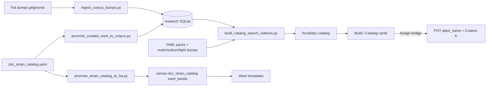

# Build a Plant — data pipeline (N-085 / N-087)

HA product flow for Compose + Catalog Explorer. Research corpus ingest lives in
[`CATALOG-RESEARCH-CORPUS.md`](CATALOG-RESEARCH-CORPUS.md) (N-087).



Default strain index path is **SQLite projection** (cap 2500). Legacy
`merge_strain_catalogs.py` → `dsc_strains_merged.json` remains available via
`build_catalog_search_indexes.py --from-dumps` when the DB is missing.

## SoT

| Layer | Authoritative |
|---|---|
| Live seat | `text.dsc_potN_plant_name`, strain select, sprout |
| Chemistry Want | Catalog want_bands → Custom helpers → Generic stage |
| Climate Want | Custom temp/RH ≠0 only |
| Draft inventory | 8-slot roster |
| Mix | Shared nutrient slots + Accept (soak: no stock burn) |
| Research corpus | Local SQLite + fat dumps (gitignore) |
| Slim indexes | Committed under `www/dsc-catalog` / `dist/dsc-catalog` |

## MVP gate (unblocks UI)

- Slim strain index with chemistry on ≥1 selectable strain
- ≥1 light with `ppfd_url` in index/pack
- Nutrient + medium indexes non-empty
- Full research corpus (~20k canonical / lab chemistry) is archival — browser
  payload stays capped (strains **2500**)

## Assign failure modes

- Free-text strain not in pot select → fill Custom slot + select `Custom K`
- No free Custom → persistent notification (no silent fail)
- Nickname always → `text.dsc_potN_plant_name` (+ underscore variant)

## Rebuild (product path)

```bash
python scripts/promote_curated_want_to_corpus.py   # optional Want overlay
python scripts/build_catalog_search_indexes.py     # SQLite strains + pack products
# then Sync / ha-sync.sh / scripts/sync-hacs-dist.sh
```

Committed N-087 counts: strains **2500** (`with_height=21`, `with_want=12`),
nutrients **3**, mediums **5**, lights **7**. Never invent missing height/chem/PPFD grids.
