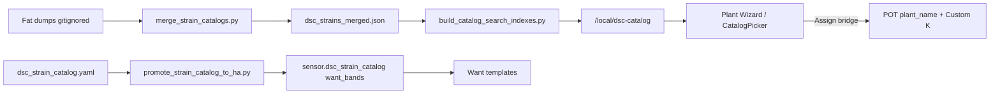

# Build a Plant — data pipeline (N-085)

UI entry (tip `91a4715`+): stepper [`PlantWizard`](../brain/PLANT-WIZARD.md) at `/grow/compose` (alias `ComposePlant`). Catalog search + filters still feed the same helpers below.

## SoT

| Layer | Authoritative |
|---|---|
| Live seat | `text.dsc_potN_plant_name`, strain select, sprout |
| Chemistry Want | Catalog want_bands → Custom helpers → Generic stage |
| Climate Want | Custom temp/RH ≠0 only |
| Draft inventory | 8-slot roster |
| Mix | Shared nutrient slots + Accept (soak: no stock burn) |
| Fat dumps | Local only (gitignore) |
| Slim indexes | Committed under `www/dsc-catalog` / `dist/dsc-catalog` |

## MVP gate (unblocks UI)

- Merged dump with chemistry on ≥1 selectable strain
- ≥1 light with `ppfd_url` in index/pack
- Nutrient + medium indexes non-empty
- Full ~36k crawl is best-effort, not a browser blocker

## Assign failure modes

- Free-text strain not in pot select → fill Custom slot + select `Custom K`
- No free Custom → persistent notification (no silent fail)
- Nickname always → `text.dsc_potN_plant_name` (+ underscore variant)
