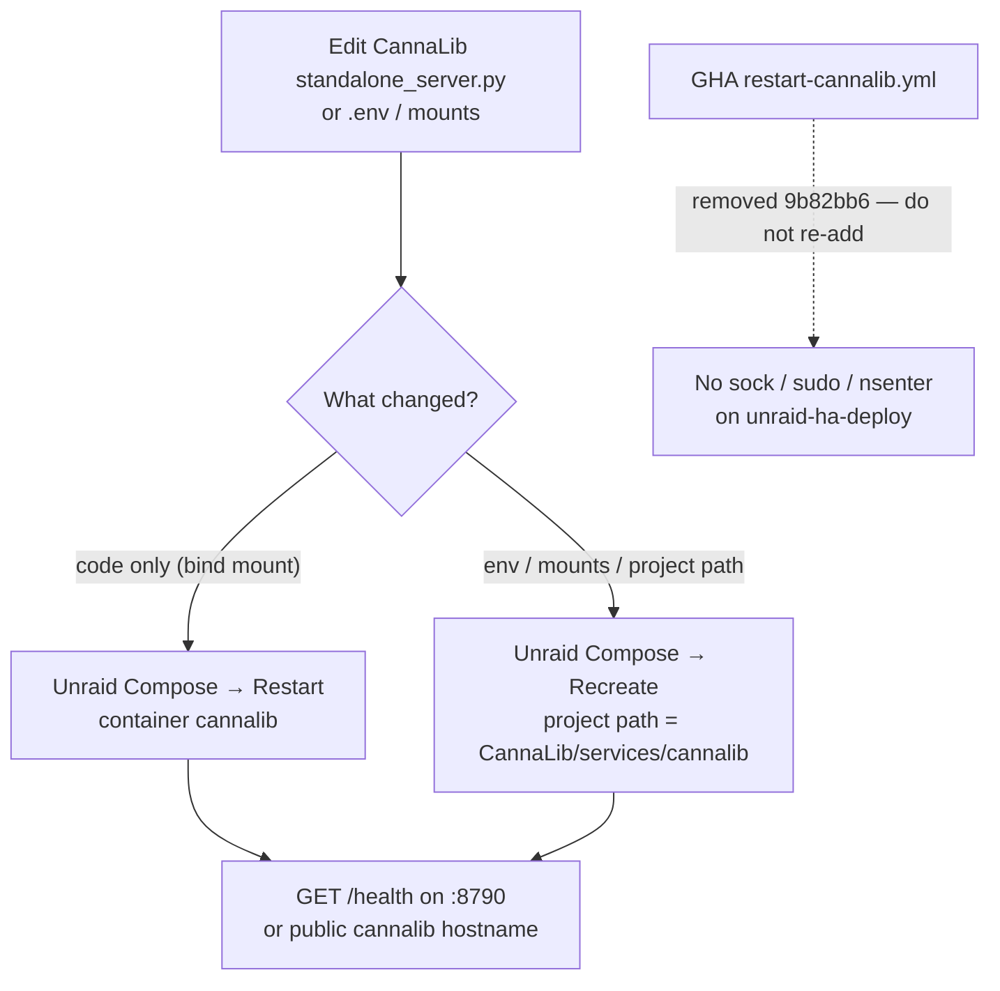

# CannaLib — restart vs Recreate (no Actions bounce)

Ops note after tip `9b82bb6` removed `.github/workflows/restart-cannalib.yml`.

**Trigger:** master reverts of the dispatch workflow that tried `docker restart cannalib` on `unraid-ha-deploy` (plain docker → `sudo` → host `nsenter`), then deleted the file.

## Intent

Bind-mounted CannaLib Python needs a **container restart** to pick up
`standalone_server.py` edits. Env / mount / project-path changes need a
**Compose Recreate**. Neither belongs in GitHub Actions today: the HA sync
runner label is for HA SSH + curl, not a reliable Unraid docker socket.

## Architecture



| Channel | What it does | Status |
|---|---|---|
| Unraid Compose Manager → **Restart** | Bounce running container; reload bind-mounted code | **Supported** |
| Unraid Compose Manager → **Recreate** / Force Update | Re-create with current compose + env | **Supported** (required for env/mounts) |
| Actions `Restart cannalib` (`workflow_dispatch`) | `docker restart cannalib` + `/health` poll | **Removed** (`9b82bb6`) |
| Hub `services/cannalib/docker-compose.yml` | Trampoline / stale Hub binds | **Do not Recreate from this file** |

## Why Actions was removed (verified history)

| Commit | Change |
|---|---|
| `e5a41f2` | Added `restart-cannalib.yml` on `[self-hosted, unraid-ha-deploy]` |
| `32d6b93` | Tried `sudo -n docker` when the socket is root-only |
| `c0641e7` | Tried `nsenter -t 1 -m docker` when the runner has no usable sock |
| `4ea15cc` / `f1adda1` / `9b82bb6` | Reverted those attempts and deleted the workflow |

Do **not** reintroduce the workflow unless the runner has a proven, intentional
docker control plane (sock mount or equivalent). `ha-sync.yml` on the same
label only needs SSH/`scp`/`curl` to HAOS — that is a different privilege set.

## Operator procedure

### A. Code-only bounce (Restart)

Use when CannaLib `standalone_server.py` (or other bind-mounted app files)
changed and env/mounts did not.

1. Unraid → Docker → Compose stacks → stack **`cannalib`**.
2. Confirm project path is under **CannaLib**, not DSC-HUB:

   `/mnt/user/Digital-Documents/Digital Stealth Care/Projects/CannaLib/services/cannalib`

3. **Restart** the `cannalib` container (not Recreate).
4. Smoke:

```bash
curl -fsS --max-time 5 http://192.168.86.2:8790/health
curl -fsS --max-time 5 https://cannalib.plausible-deniability.net/health
```

Expect JSON with `status` ok. Public hostname is the Cloudflare **Wordpress**
tunnel origin `http://127.0.0.1:8790` on Digital-Gateway.

### B. Env / mounts / project cutover (Recreate)

Use when changing `CANNALIB_*` env, bind paths, or finishing the Hub→CannaLib
mount cutover (`brain/data/CANNALIB-MOVED.md`).

1. Point Compose Manager at the **CannaLib** `services/cannalib` directory
   (see trampoline comments in Hub `services/cannalib/docker-compose.yml`).
2. **Recreate** / Force Update — plain Restart does **not** bake new env.
3. Confirm `/v1/corpus` still reports the remade freeze (do not invent a count;
   read the live response).
4. Only then delete leftover Hub `brain/data/dsc_brain.sqlite3*` copies if the
   live mounts no longer need them.

### C. What not to do

- Do not Recreate from Hub `services/cannalib/docker-compose.yml` — header says
  **STALE**; it still shows Hub binds and no `/data/media`.
- Do not paste live `CANNALIB_API_KEY` into Wiki, PRs, or this runbook.
- Do not expect Windows clients to `docker restart` — no sock/SSH path from
  the usual agent laptop; use the Unraid UI.
- Do not confuse HA sync green with a cannalib bounce — `ha-sync.yml` never
  restarts the API container.

## Hub ownership (unchanged)

Hub still owns the **client** only:

- `homeassistant/packages/dsc_v4_cannalib_api.yaml`
- Build / Catalog Lit cards
- capped `www/dsc-catalog/` indexes (built in CannaLib, copied here)

Pointer stub: [`docs/ops/CANNALIB-API.md`](../ops/CANNALIB-API.md).
Service sketch: [`services/cannalib/README.md`](../../services/cannalib/README.md).
Full credential / tunnel detail still prefers draft **#77** until that ops page
lands on master tip.
