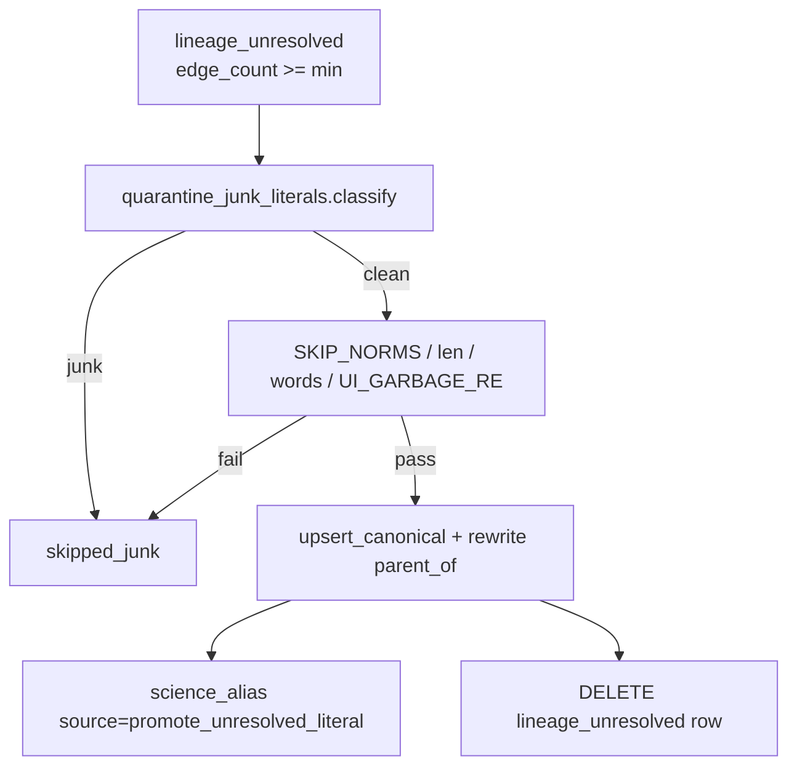

# Catalog collation contract (N-087)

**Status:** durable architecture — remember this. Merge, ingest, and schema work must align here.  
**Audience:** merge workers, importers, HA projection, future wordcloud/lineage UI.  
**Related:** [`CATALOG-RESEARCH-CORPUS.md`](CATALOG-RESEARCH-CORPUS.md), FOLLOWUPS **N-087**, `brain/dsc_brain/corpus_schema.py`.

---

## Three layers

| Layer | Role | Examples |
|---|---|---|
| **Canonical** | Shared identity + consensus evidence | `strain_canonical`; reviews / grow notes / lab chem / consensus grow traits attach here |
| **Variant** | Bank / breeder claims for a named cut | `strain_variant` (props from PDPs; not the place for forum anecdotes) |
| **Observation** | Sourced, append-only facts | review / note / edge rows keyed by `source_id`; never squash |

**Flow:** observation/review/note/edge ← sourced append-only → feed **canonical** (reviews, notes, chem, consensus grow) and **variant** (bank claims). Mermaid and wordclouds are **views**, not sources of truth.

---

## Grow notes & observations

- Grow **notes** and **observations** are **documents**, not columns on canonical.
- **Keep each note.** Never squash / merge / “best of” into a single field.
- **Hooks (required / optional):**
  - `canonical_id` (`name_norm`) — required
  - `variant_id` — optional
  - `source_record` / `source_id` — required
  - `date` (observed / posted / scraped) — when known
- **Typed extracts only when sure** (flowering days, height cm, climate, etc.) → also write `grow_trait` with the **same** `source_id`. Ambiguous prose stays note-only.
- **Forums** = note factories (long, noisy, high volume).
- **Bank PDPs** = shorter, higher-trust **variant** notes (and typed `grow_trait` when parseable).

---

## Reviews → collate → wordcloud

1. **Store raw reviews** (full text + provenance). Do not pre-summarize into canonical.
2. **Collate at read time** (by canonical / variant / source filters).
3. **Wordcloud** = derived projection only — never SoT; rebuild anytime from stored reviews.
4. **CannaReviews:** full review bodies need **medauth**; public scrape ≠ full corpus.
5. **Lab chem ≠ review vibes.** Chemistry rows and review sentiment stay separate tables/projections; do not blend into one “effects” field.

---

## Lineage in-DB

- Graph lives in SQLite via **`entity_link`** (or a future `lineage_edge` alias of the same shape).
- Predicates: **`parent_of` / `child_of`** (and related methods as needed).
- Every edge carries **`source_id`** (or `source` provenance) and may keep **unresolved literals** (parent name string not yet matched to a canonical).
- **Mermaid** (`lineage_mermaid`, exports) is a **view** of the graph — regenerate from edges; do not treat diagram text as the graph.
- Cross-ref queries (parents of X, children of Y, unresolved queue) must work against the DB, not against Mermaid strings.

---

## Practical merge order

1. **Merge contract first**
   - Match keys: `name_norm`, variant `id` / `name_norm::breeder`, chem/grow ids, `entity_link` ids.
   - Trust ladder: lab chem > bank typed PDP > directory scrape > forum note (still keep all; ladder guides UI default, not deletion).
   - Conflict = **keep both** (INSERT OR IGNORE / additive rows). Never invent a blended chem or grow range.
2. **`entity_link` on every genetics parse** — parent/child edges + unresolved literals when match fails.
3. **Observation / review ingest without `attribute_kv`** — documents in dedicated tables or `raw_record`; never explode review text or score spam into KV.
4. **Wordcloud builder later** — after raw reviews land and collate-at-read is stable.

---

## Honesty (non-negotiable)

- Never invent height / flowering / chem / lineage.
- Conflicting evidence: keep both with provenance.
- Staging holds FULL payloads; master stays matchable typed + rich `payload_json`.
- `attribute_kv` only for small bank/product overflow — never bulk scores or review bodies.

---

## Schema gaps vs this contract (as of 2026-08-10)

See FOLLOWUPS **N-087-COLLATION**.

**Landed (schema v4, additive):**
- First-class `observation` + `review` tables (append-only; provenance via `source_id` / optional `raw_record_id`).
- Helpers: `add_observation`, `add_review`, `add_lineage_edge`.
- Lineage SoT: `entity_link.method='parent_of'` with `from=parent → to=child`. Unresolved parents use `from_kind='name_literal'`. No inverse `child_of` rows (invert at read time).
- Idempotent projectors: `scripts/project_lineage_edges.py`, `project_observations_from_raw.py`, `project_reviews_from_raw.py`.
- Opt-in dual-write from `ingest_strain_row` when row carries note/review/parent fields — still keeps `raw_record` / chem / grow.

**Debt cleanup (2026-08-10, local `C:\DSC\collation\` then copy-back `*.pre_collation_debt`):**
- Quarantine table `entity_link_quarantine`: moved ~240k `seedfinder:lineage_tree` edges (`reason=lineage_tree_not_sot`). Tree/mermaid are never SoT.
- Structured-only re-project; silent `MAX_PARENTS_PER_FIELD=16` removed — oversize lists → `followup_gap` (`oversize_parent_list`), not truncate. Live `parent_of` ≈43.7k (max child degree ≤19).
- Exact literal resolve + `lineage_unresolved` queue (~10.4k distinct / ~14.6k edges). Includes `*null` suffix bug fix; junk `null` parents tagged `junk_literal_null`.
- Observations widened from staging banks/forums: ≈65.7k (`bank_note`≈64.2k, `forum_post`≈1.5k). CannaReviews descriptions → `bank_note` when present (rare in public scrape).
- `review=0` is correct: public CannaReviews + `dsc_reviews_cannareviews.json` are aggregates/`login_gated` only — no review bodies on disk. Projector skip counters: `skipped_login_gated` / `skipped_description_only` / `skipped_no_review_body`.

**Match-expand (2026-08-10, bak `*.pre_match_expand`):**
- Hard rule: `O.G.` / `F2` / `bx` / `cut` / `auto` stay in identity — never strip-to-match.
- `entity_link.method='subtype_of'` (~9.1k): subtype → base when base exact-matches (e.g. `auto blue dream` → `blue dream`).
- `o g`↔`og` exact `science_alias` hygiene (~68 pairs); junk literal quarantine (`null` / `Unknown *` / geo / marketing / review-chrome).
- Observations ≈71k (`bank_note`≈69.5k + forums); kind `grow_note` supported (0 rows until sources expose `grow_notes`).
- Thin-field chase list: [`CATALOG-THIN-FIELDS.md`](CATALOG-THIN-FIELDS.md).

**Catalog densify (2026-08-10, bak `*.pre_catalog_densify`):**
- Numeric height text → `grow_trait.height_cm_*` (~2% → ~12%); never invent cm from Short/Med/Tall.
- HA browse projection surfaces `height_band` from grow payload (ordinal; separate from `height_cm`).
- Exact bank slug↔name `science_alias` harvest + merch/SKU cleanup filter.
- Observations widened (forums `grow_note`, Herbies/Zamnesia filtered excerpts).
- **SeedFinder quiet merge** (orphan journal recovered; scrape PID dead): typed `--no-link` → canonical≈188.6k, SF variants≈22.8k, obs≈99.5k; `subtype_of`≈9.6k. StrainDB / medauth still chase-only.

**Unresolved promote (2026-08-10, `05f189a` + harden `096acb4`):**
- After SF end-link: promote high-frequency `lineage_unresolved` literals → exact `strain_canonical` + rewrite `parent_of` edges.
- Promoter rejects UI/marketing garbage (length, word count, review-chrome / family-tree phrases). See **Unresolved promote ops** below.
- Post-promote workset snapshot: canonical≈188.7k; `lineage_unresolved`≈8.7k; `subtype_of`≈9631; `science_alias`≈23.6k. Chase list: [`CATALOG-THIN-FIELDS.md`](CATALOG-THIN-FIELDS.md).

**Still deferred:** wordcloud / collate-at-read UI; CannaReviews full review bodies (login/medauth); requiring `grow_trait` → observation FKs; SF scrape resume for remaining sitemap; fuzzy drain of `lineage_unresolved` (never).

---

## Unresolved promote ops (`05f189a` / `096acb4`)

**Intent:** turn frequent unmatched parent strings into real canonicals **only when exact and non-junk**, then rewrite their `parent_of` edges. Do not fuzzy-match; do not promote UI chrome.



### Recommended order

Run on the local workset (`C:\DSC\collation\dsc_brain.sqlite3`) when writers are idle:

```text
# 1) Quarantine slipped junk / review-chrome parents (rebuilds lineage_unresolved)
python scripts/quarantine_junk_literals.py --db C:\DSC\collation\dsc_brain.sqlite3 --dry-run
python scripts/quarantine_junk_literals.py --db C:\DSC\collation\dsc_brain.sqlite3

# 2) Promote frequent clean literals (exact only)
python scripts/promote_unresolved_literals.py --db C:\DSC\collation\dsc_brain.sqlite3 --min-edges 5 --dry-run
python scripts/promote_unresolved_literals.py --db C:\DSC\collation\dsc_brain.sqlite3 --min-edges 5
# defaults: --min-edges 5 --limit 200
```

Optional earlier pipeline (already landed for densify/SF): `resolve_lineage_literals.py` seats leftovers; SF `--link-only` end-link before promote when exclusive is free.

### Promoter reject gates (verified in `promote_unresolved_literals.py`)

| Gate | Rule | Why |
|---|---|---|
| `classify(literal)` | Same as quarantine (`junk_literal_null` / `junk_unknown_parent` / `junk_geo_or_marketing`) | Shared SoT for junk |
| `name_norm` empty / `< 2` | Skip | Not a usable key |
| `SKIP_NORMS` | Place-ish tokens (`la`, `california`, `amsterdam`, …) | Not strains |
| Length / words | `len(literal) > 60` **or** `len(name_norm.split()) > 8` | Long prose / marketing sentences |
| `UI_GARBAGE_RE` | `show all`, `show less`, `no reviews yet`, `strain reviews`, `family tree map`, `dynamic family`, `click here`, `add to cart`, `javascript` | SeedFinder / bank review-chrome |

On success (non-dry-run): `upsert_canonical` → rewrite `name_literal` `parent_of` → `strain_canonical` (dedupe-safe) → delete unresolved row → `INSERT OR IGNORE science_alias` with `source_id='promote_unresolved_literal'`.

### Quarantine phrase harden (`096acb4`)

`MARKETING_PHRASE_RE` also matches (anywhere): `family tree map`, `show all`, `show less`, `no reviews yet`, `strain reviews`, `fully tested outside`, `germination tests`.

Quarantine **moves** matching `parent_of` `name_literal` edges into `entity_link_quarantine`, then rebuilds `lineage_unresolved` from remaining literals. Tree/mermaid parents stay `lineage_tree_not_sot` (debt cleanup) — never SoT.

### Pitfalls

- **Exact only.** No fuzzy / LLM collapse; never strip F/OG/bx/cut/auto to force a match.
- **Dry-run first.** Stats JSON reports `candidates` / `promoted` / `skipped_junk` / `unresolved_after`.
- **`--limit` defaults to 200.** Raise deliberately for larger drains; prefer re-running after new aliases land.
- **Do not invent parents.** Leftovers stay in `lineage_unresolved` (~8.7k post-promote) until an exact canonical/alias appears.
- Serialize against other master writers (same lease as N-087 merge).
