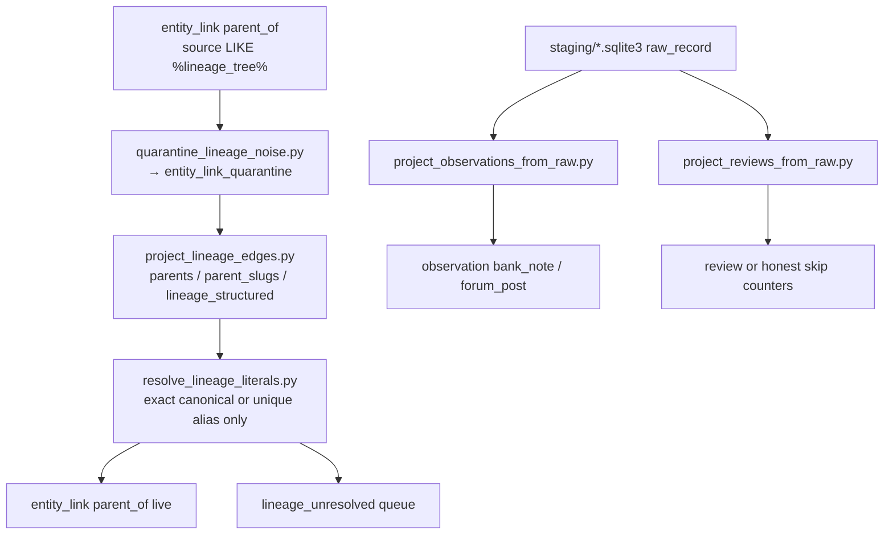

# Catalog collation contract (N-087)

**Status:** durable architecture — remember this. Merge, ingest, and schema work must align here.  
**Audience:** merge workers, importers, HA projection, future wordcloud/lineage UI.  
**Related:** [`CATALOG-RESEARCH-CORPUS.md`](CATALOG-RESEARCH-CORPUS.md), FOLLOWUPS **N-087**, `brain/dsc_brain/corpus_schema.py`.

---

## Three layers

| Layer | Role | Examples |
|---|---|---|
| **Canonical** | Shared identity + consensus evidence | `strain_canonical`; reviews / grow notes / lab chem / consensus grow traits attach here |
| **Variant** | Bank / breeder claims for a named cut | `strain_variant` (props from PDPs; not the place for forum anecdotes) |
| **Observation** | Sourced, append-only facts | review / note / edge rows keyed by `source_id`; never squash |

**Flow:** observation/review/note/edge ← sourced append-only → feed **canonical** (reviews, notes, chem, consensus grow) and **variant** (bank claims). Mermaid and wordclouds are **views**, not sources of truth.

---

## Grow notes & observations

- Grow **notes** and **observations** are **documents**, not columns on canonical.
- **Keep each note.** Never squash / merge / “best of” into a single field.
- **Hooks (required / optional):**
  - `canonical_id` (`name_norm`) — required
  - `variant_id` — optional
  - `source_record` / `source_id` — required
  - `date` (observed / posted / scraped) — when known
- **Typed extracts only when sure** (flowering days, height cm, climate, etc.) → also write `grow_trait` with the **same** `source_id`. Ambiguous prose stays note-only.
- **Forums** = note factories (long, noisy, high volume).
- **Bank PDPs** = shorter, higher-trust **variant** notes (and typed `grow_trait` when parseable).

---

## Reviews → collate → wordcloud

1. **Store raw reviews** (full text + provenance). Do not pre-summarize into canonical.
2. **Collate at read time** (by canonical / variant / source filters).
3. **Wordcloud** = derived projection only — never SoT; rebuild anytime from stored reviews.
4. **CannaReviews:** full review bodies need **medauth**; public scrape ≠ full corpus.
5. **Lab chem ≠ review vibes.** Chemistry rows and review sentiment stay separate tables/projections; do not blend into one “effects” field.

---

## Lineage in-DB

- Graph lives in SQLite via **`entity_link`** (or a future `lineage_edge` alias of the same shape).
- Predicates: **`parent_of` / `child_of`** (and related methods as needed).
- Every edge carries **`source_id`** (or `source` provenance) and may keep **unresolved literals** (parent name string not yet matched to a canonical).
- **Mermaid** (`lineage_mermaid`, exports) is a **view** of the graph — regenerate from edges; do not treat diagram text as the graph.
- Cross-ref queries (parents of X, children of Y, unresolved queue) must work against the DB, not against Mermaid strings.

---

## Practical merge order

1. **Merge contract first**
   - Match keys: `name_norm`, variant `id` / `name_norm::breeder`, chem/grow ids, `entity_link` ids.
   - Trust ladder: lab chem > bank typed PDP > directory scrape > forum note (still keep all; ladder guides UI default, not deletion).
   - Conflict = **keep both** (INSERT OR IGNORE / additive rows). Never invent a blended chem or grow range.
2. **`entity_link` on every genetics parse** — parent/child edges + unresolved literals when match fails.
3. **Observation / review ingest without `attribute_kv`** — documents in dedicated tables or `raw_record`; never explode review text or score spam into KV.
4. **Wordcloud builder later** — after raw reviews land and collate-at-read is stable.

---

## Honesty (non-negotiable)

- Never invent height / flowering / chem / lineage.
- Conflicting evidence: keep both with provenance.
- Staging holds FULL payloads; master stays matchable typed + rich `payload_json`.
- `attribute_kv` only for small bank/product overflow — never bulk scores or review bodies.

---

## Schema gaps vs this contract (as of 2026-08-10)

See FOLLOWUPS **N-087-COLLATION**.

**Landed (schema v4, additive):**
- First-class `observation` + `review` tables (append-only; provenance via `source_id` / optional `raw_record_id`).
- Helpers: `add_observation`, `add_review`, `add_lineage_edge`.
- Lineage SoT: `entity_link.method='parent_of'` with `from=parent → to=child`. Unresolved parents use `from_kind='name_literal'`. No inverse `child_of` rows (invert at read time).
- Idempotent projectors: `scripts/project_lineage_edges.py`, `project_observations_from_raw.py`, `project_reviews_from_raw.py`.
- Opt-in dual-write from `ingest_strain_row` when row carries note/review/parent fields — still keeps `raw_record` / chem / grow.

**Debt cleanup (2026-08-10, local `C:\DSC\collation\` then copy-back `*.pre_collation_debt`):**
- Quarantine table `entity_link_quarantine`: moved ~240k `seedfinder:lineage_tree` edges (`reason=lineage_tree_not_sot`). Tree/mermaid are never SoT.
- Structured-only re-project; silent `MAX_PARENTS_PER_FIELD=16` removed — oversize lists → `followup_gap` (`oversize_parent_list`), not truncate. Live `parent_of` ≈43.7k (max child degree ≤19).
- Exact literal resolve + `lineage_unresolved` queue (~10.4k distinct / ~14.6k edges). Includes `*null` suffix bug fix; junk `null` parents tagged `junk_literal_null`.
- Observations widened from staging banks/forums: ≈65.7k (`bank_note`≈64.2k, `forum_post`≈1.5k). CannaReviews descriptions → `bank_note` when present (rare in public scrape).
- `review=0` is correct: public CannaReviews + `dsc_reviews_cannareviews.json` are aggregates/`login_gated` only — no review bodies on disk. Projector skip counters: `skipped_login_gated` / `skipped_description_only` / `skipped_no_review_body`.

**Still deferred:** wordcloud / collate-at-read UI; CannaReviews full review bodies (login/medauth); requiring `grow_trait` → observation FKs.

---

## Debt-cleanup ops runbook (lineage + observations)

**Intent:** keep structured parents as lineage SoT; seat unmatched parent strings in a durable queue; project bank/forum notes into `observation` without lying about login-gated reviews.



### Script order (local SSD workset)

Prefer `C:\DSC\collation\dsc_brain.sqlite3` (+ staging copy). Always `--dry-run` first on destructive steps.

```text
# 1) Copy-out noisy tree edges (INSERT quarantine, then DELETE live)
python scripts/quarantine_lineage_noise.py --db C:\DSC\collation\dsc_brain.sqlite3 --dry-run
python scripts/quarantine_lineage_noise.py --db C:\DSC\collation\dsc_brain.sqlite3

# 2) Re-project structured parents only (never mermaid / lineage_tree)
python scripts/project_lineage_edges.py --db C:\DSC\collation\dsc_brain.sqlite3

# 3) Exact-resolve name_literal parents; rebuild lineage_unresolved
python scripts/resolve_lineage_literals.py --db C:\DSC\collation\dsc_brain.sqlite3 --dry-run
python scripts/resolve_lineage_literals.py --db C:\DSC\collation\dsc_brain.sqlite3

# 4) Widen observations from local staging (copy into observation; never move raw)
python scripts/project_observations_from_raw.py --db C:\DSC\collation\dsc_brain.sqlite3 \
  --staging-dir C:\DSC\collation\staging

# 5) Reviews only when bodies exist (expect review=0 on public CannaReviews)
python scripts/project_reviews_from_raw.py --db C:\DSC\collation\dsc_brain.sqlite3 \
  --staging-dir C:\DSC\collation\staging --source-id cannareviews
```

`connect()` applies additive DDL `SCHEMA_V4_DEBT_CLEANUP` (`entity_link_quarantine`, `lineage_unresolved`) when missing.

### Constraints (verified in scripts)

| Rule | Where |
|---|---|
| Quarantine before delete; rollback = copy quarantine rows back | `quarantine_lineage_noise.py` |
| Default match: `source LIKE '%lineage_tree%'`, reason `lineage_tree_not_sot` | same |
| Parent fields SoT: `parents`, `parent_slugs`, `lineage_structured` only | `project_lineage_edges.py` |
| Oversize parent list → `followup_gap` (`oversize_parent_list`), not truncate | same (`--oversize-bound`, default 32) |
| Resolve = exact `name_norm` or **unique** `science_alias`; never fuzzy | `resolve_lineage_literals.py`, `add_lineage_edge` |
| Ambiguous alias / no hit → stay `name_literal` + `lineage_unresolved` | same |
| `*null` suffix stripped before match; bare `null` → `junk_literal_null` | same |
| Bank/PDP text → `observation.kind=bank_note`; forums → `forum_post` | `project_observations_from_raw.py` |
| Description / `login_gated` / aggregate-only ≠ review body | `project_reviews_from_raw.py` |

### Pitfalls

- Do **not** treat `lineage_mermaid` / deep SeedFinder tree walks as SoT again.
- Do **not** invent fuzzy parent links to drain `lineage_unresolved`.
- `review=0` after the projector is success when counters show `skipped_login_gated` / `skipped_description_only` / `skipped_no_review_body` — not a broken pipeline.
- Re-run quarantine only when new `lineage_tree` edges appear; projectors are idempotent and never delete existing good edges.
