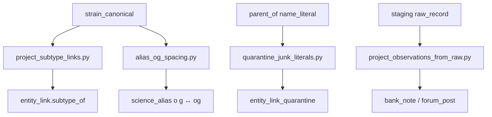
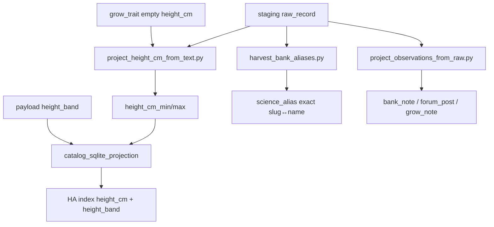

# Catalog collation contract (N-087)

**Status:** durable architecture — remember this. Merge, ingest, and schema work must align here.  
**Audience:** merge workers, importers, HA projection, future wordcloud/lineage UI.  
**Related:** [`CATALOG-RESEARCH-CORPUS.md`](CATALOG-RESEARCH-CORPUS.md), FOLLOWUPS **N-087**, `brain/dsc_brain/corpus_schema.py`.

---

## Three layers

| Layer | Role | Examples |
|---|---|---|
| **Canonical** | Shared identity + consensus evidence | `strain_canonical`; reviews / grow notes / lab chem / consensus grow traits attach here |
| **Variant** | Bank / breeder claims for a named cut | `strain_variant` (props from PDPs; not the place for forum anecdotes) |
| **Observation** | Sourced, append-only facts | review / note / edge rows keyed by `source_id`; never squash |

**Flow:** observation/review/note/edge ← sourced append-only → feed **canonical** (reviews, notes, chem, consensus grow) and **variant** (bank claims). Mermaid and wordclouds are **views**, not sources of truth.

---

## Grow notes & observations

- Grow **notes** and **observations** are **documents**, not columns on canonical.
- **Keep each note.** Never squash / merge / “best of” into a single field.
- **Hooks (required / optional):**
  - `canonical_id` (`name_norm`) — required
  - `variant_id` — optional
  - `source_record` / `source_id` — required
  - `date` (observed / posted / scraped) — when known
- **Typed extracts only when sure** (flowering days, height cm, climate, etc.) → also write `grow_trait` with the **same** `source_id`. Ambiguous prose stays note-only.
- **Forums** = note factories (long, noisy, high volume).
- **Bank PDPs** = shorter, higher-trust **variant** notes (and typed `grow_trait` when parseable).

---

## Reviews → collate → wordcloud

1. **Store raw reviews** (full text + provenance). Do not pre-summarize into canonical.
2. **Collate at read time** (by canonical / variant / source filters).
3. **Wordcloud** = derived projection only — never SoT; rebuild anytime from stored reviews.
4. **CannaReviews:** full review bodies need **medauth**; public scrape ≠ full corpus.
5. **Lab chem ≠ review vibes.** Chemistry rows and review sentiment stay separate tables/projections; do not blend into one “effects” field.

---

## Lineage in-DB

- Graph lives in SQLite via **`entity_link`** (or a future `lineage_edge` alias of the same shape).
- Predicates: **`parent_of` / `child_of`** (and related methods as needed).
- Every edge carries **`source_id`** (or `source` provenance) and may keep **unresolved literals** (parent name string not yet matched to a canonical).
- **Mermaid** (`lineage_mermaid`, exports) is a **view** of the graph — regenerate from edges; do not treat diagram text as the graph.
- Cross-ref queries (parents of X, children of Y, unresolved queue) must work against the DB, not against Mermaid strings.

---

## Practical merge order

1. **Merge contract first**
   - Match keys: `name_norm`, variant `id` / `name_norm::breeder`, chem/grow ids, `entity_link` ids.
   - Trust ladder: lab chem > bank typed PDP > directory scrape > forum note (still keep all; ladder guides UI default, not deletion).
   - Conflict = **keep both** (INSERT OR IGNORE / additive rows). Never invent a blended chem or grow range.
2. **`entity_link` on every genetics parse** — parent/child edges + unresolved literals when match fails.
3. **Observation / review ingest without `attribute_kv`** — documents in dedicated tables or `raw_record`; never explode review text or score spam into KV.
4. **Wordcloud builder later** — after raw reviews land and collate-at-read is stable.

---

## Honesty (non-negotiable)

- Never invent height / flowering / chem / lineage.
- Conflicting evidence: keep both with provenance.
- Staging holds FULL payloads; master stays matchable typed + rich `payload_json`.
- `attribute_kv` only for small bank/product overflow — never bulk scores or review bodies.

---

## Schema gaps vs this contract (as of 2026-08-10)

See FOLLOWUPS **N-087-COLLATION**.

**Landed (schema v4, additive):**
- First-class `observation` + `review` tables (append-only; provenance via `source_id` / optional `raw_record_id`).
- Helpers: `add_observation`, `add_review`, `add_lineage_edge`.
- Lineage SoT: `entity_link.method='parent_of'` with `from=parent → to=child`. Unresolved parents use `from_kind='name_literal'`. No inverse `child_of` rows (invert at read time).
- Idempotent projectors: `scripts/project_lineage_edges.py`, `project_observations_from_raw.py`, `project_reviews_from_raw.py`.
- Opt-in dual-write from `ingest_strain_row` when row carries note/review/parent fields — still keeps `raw_record` / chem / grow.

**Debt cleanup (2026-08-10, local `C:\DSC\collation\` then copy-back `*.pre_collation_debt`):**
- Quarantine table `entity_link_quarantine`: moved ~240k `seedfinder:lineage_tree` edges (`reason=lineage_tree_not_sot`). Tree/mermaid are never SoT.
- Structured-only re-project; silent `MAX_PARENTS_PER_FIELD=16` removed — oversize lists → `followup_gap` (`oversize_parent_list`), not truncate. Live `parent_of` ≈43.7k (max child degree ≤19).
- Exact literal resolve + `lineage_unresolved` queue (~10.4k distinct / ~14.6k edges). Includes `*null` suffix bug fix; junk `null` parents tagged `junk_literal_null`.
- Observations widened from staging banks/forums: ≈65.7k (`bank_note`≈64.2k, `forum_post`≈1.5k). CannaReviews descriptions → `bank_note` when present (rare in public scrape).
- `review=0` is correct: public CannaReviews + `dsc_reviews_cannareviews.json` are aggregates/`login_gated` only — no review bodies on disk. Projector skip counters: `skipped_login_gated` / `skipped_description_only` / `skipped_no_review_body`.

**Match-expand (2026-08-10, bak `*.pre_match_expand`):**
- Hard rule: `O.G.` / `F2` / `bx` / `cut` / `auto` stay in identity — never strip-to-match.
- `entity_link.method='subtype_of'` (~9.1k): subtype → base when base exact-matches (e.g. `auto blue dream` → `blue dream`).
- `o g`↔`og` exact `science_alias` hygiene (~68 pairs); junk literal quarantine (`null` / `Unknown *` / geo / marketing).
- Observations ≈71k (`bank_note`≈69.5k + forums); kind `grow_note` supported (0 rows until sources expose `grow_notes`).
- Thin-field chase list: [`CATALOG-THIN-FIELDS.md`](CATALOG-THIN-FIELDS.md).

**Catalog densify (2026-08-10, bak `*.pre_catalog_densify`):**
- Numeric height text → `grow_trait.height_cm_*` (~2% → ~12.7%); never invent cm from Short/Med/Tall.
- HA browse projection surfaces `height_band` from grow payload (ordinal; separate from `height_cm`).
- Exact bank slug↔name `science_alias` harvest (~970 → ~23.2k).
- Observations ≈78.9k (`bank_note`≈76.0k, `forum_post`≈1.5k, `grow_note`≈1.4k); Herbies/Zamnesia filtered excerpts; forums emit `grow_note` when diary fields present.
- SeedFinder merge skipped (staging journal present). StrainDB / medauth still chase-only.

**Still deferred:** wordcloud / collate-at-read UI; CannaReviews full review bodies (login/medauth); requiring `grow_trait` → observation FKs.

---

## Match-expand ops (`03a7251`)

**Intent:** widen exact identity matches without stripping genetic markers, and clean junk lineage literals that are not real parents.

**Hard rule:** `O.G.` / `F2` / `bx` / `cut` / `auto` / numbered phenos stay in `name_norm`. Markers are metadata for `subtype_of` only — never strip-to-match.



| Step | Script | What it does | Constraint |
|---|---|---|---|
| 1 | `scripts/project_subtype_links.py --db …` | Exact subtype → base when base exists (`auto blue dream` → `blue dream`) | Base must exact-match a canonical; markers kept on subtype |
| 2 | `scripts/alias_og_spacing.py --db …` | Exact `o g` ↔ `og` `science_alias` (~68 pairs) | Prefer denser canonical as target; **no** canonical deletes |
| 3 | `scripts/quarantine_junk_literals.py --db …` | Move junk `parent_of` literals (`null`, `Unknown *`, geo/marketing) | Does **not** quarantine OG/F/bx/cut names |
| 4 | `scripts/project_observations_from_raw.py --db … --staging-dir …` | Widen `bank_note` from bank descriptions | Forums → `forum_post`; `grow_note` when diary fields exist |

**Dry-run first** on each script (`--dry-run`). Workset bak: `*.pre_match_expand`.

---

## Catalog densify ops (`6e15e86`)

**Intent:** fill typed height where numeric text already exists, harvest exact bank slug aliases, and project more observation documents — **without inventing values**.

**Evidence after densify** (local `C:\DSC\collation\dsc_brain.sqlite3`): height_cm filled ~12.7% (11380/89590); `science_alias` ~23.2k; observations ≈78.9k (`grow_note` 1431); chase list in [`CATALOG-THIN-FIELDS.md`](CATALOG-THIN-FIELDS.md).



### Recommended order

```text
# Optional baseline counts (hardcoded local paths — Windows workset helper)
python scripts/_catalog_densify_baseline.py

# 1) Numeric height only — updates rows where height_cm_min IS NULL
python scripts/project_height_cm_from_text.py --db C:\DSC\collation\dsc_brain.sqlite3 \
  --staging-dir C:\DSC\collation\staging
# dry-run: add --dry-run

# 2) Exact bank slug ↔ name aliases (unique exact only; skip collisions)
python scripts/harvest_bank_aliases.py --db C:\DSC\collation\dsc_brain.sqlite3 \
  --staging-dir C:\DSC\collation\staging

# 3) Re-project observations (idempotent; copy never move)
python scripts/project_observations_from_raw.py --db C:\DSC\collation\dsc_brain.sqlite3 \
  --staging-dir C:\DSC\collation\staging

# 4) Rebuild HA browse indexes when ready to ship denser height_cm / height_band
python scripts/build_catalog_search_indexes.py
```

### Height parsing rules (verified)

| Input | Result |
|---|---|
| `"120 cm"`, `120`, `[100,150]` | → `height_cm_min/max` |
| inches / ft / `"` with no `cm` | convert ×2.54 |
| bare numbers 20–400 | accept as cm-ish |
| bare numbers 8–160 without unit | **skip** (ambiguous inches) |
| `Short` / `Medium` / `Tall` / `average` | **reject** — stay ordinal `height_band` only |
| text with short/medium/tall and **no** digits | **reject** |

HA `with_height` counts **cm only**. `with_height_band` is a separate counter (`catalog_sqlite_projection.py`). Never invent cm from bands.

### Alias harvest rules (verified)

- Sources: `bank_*.sqlite3`, `seedsman`, `seedcity`, `herbies*`, `zamnesia*` under `--staging-dir`.
- Slug from URL path (Herbies `/cannabis-seeds/{slug}`, Zamnesia `/{id}-{slug}.html`, else last path segment).
- Alias only when slug-norm ≠ name-norm, both sides exact, and **no collision** across targets.
- Accessory/SKU noise can land (cartridge/hashole) — optional later filter; do not fuzzy-merge.

### Observation densify rules (verified)

| Kind | Source | Notes |
|---|---|---|
| `grow_note` | `grow_notes` / `grow_note` fields | Forums and banks; preferred when diary field present |
| `forum_post` | forum body keys | Always attempted for forum stems |
| `bank_note` | `description`, else filtered `page_text_excerpt` | Excerpt only for Herbies/Zamnesia stems; noise filter (≥180 chars, reject nav soup) |

Payload flags may include `excerpt_filtered=1`. Bank descriptions still preferred over excerpts for chase.

### Pitfalls

- **Do not** start SeedFinder merge while `seedfinder.sqlite3-journal` / `-wal` is hot — densify skipped SF merge for this reason.
- **Do not** invent height from Leafly/ordinal bands; `project_leafly_height_bands.py` stays payload-only.
- **Do not** strip F/OG/bx/auto to force aliases or subtypes.
- StrainDB stays `DEFERRED_CF`; medauth reviews stay chase-only (`review=0` honest).
- `_catalog_densify_baseline.py` is a **local Windows helper** (hardcoded `C:\DSC\…` / `Y:\…`) — not a portable CI step.
- Workset bak before pass: `*.pre_catalog_densify`.
