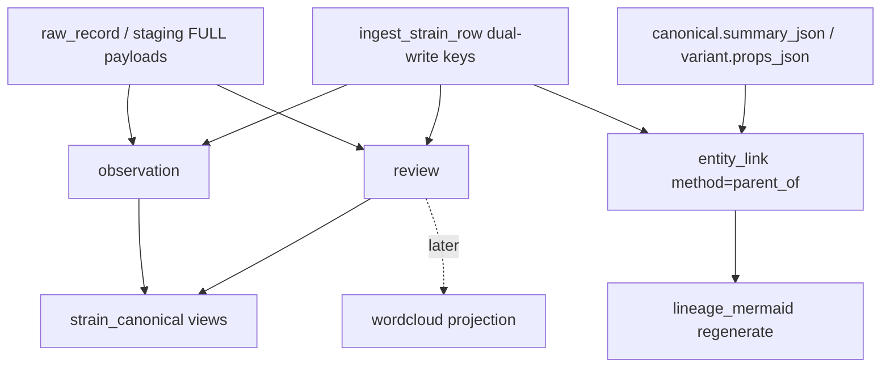

# Catalog collation contract (N-087)

**Status:** durable architecture — schema **v4** landed 2026-08-10 (additive). Merge, ingest, and projectors must align here.  
**Audience:** merge workers, importers, HA projection, future wordcloud/lineage UI.  
**Related:** [`CATALOG-RESEARCH-CORPUS.md`](CATALOG-RESEARCH-CORPUS.md), FOLLOWUPS **N-087** / **N-087-COLLATION**, `brain/dsc_brain/corpus_schema.py`, `brain/dsc_brain/corpus.py`.

---

## Three layers

| Layer | Role | Examples |
|---|---|---|
| **Canonical** | Shared identity + consensus evidence | `strain_canonical`; reviews / grow notes / lab chem / consensus grow traits attach here |
| **Variant** | Bank / breeder claims for a named cut | `strain_variant` (props from PDPs; not the place for forum anecdotes) |
| **Observation** | Sourced, append-only facts | `observation` / `review` / `entity_link` (`parent_of`) keyed by `source_id`; never squash |

**Flow:** observation/review/note/edge ← sourced append-only → feed **canonical** (reviews, notes, chem, consensus grow) and **variant** (bank claims). Mermaid and wordclouds are **views**, not sources of truth.



---

## Grow notes & observations

- Grow **notes** and **observations** are **documents**, not columns on canonical.
- **Keep each note.** Never squash / merge / “best of” into a single field.
- **Table (schema v4):** `observation` — append-only; `INSERT OR IGNORE` by stable SHA1 id.
- **Hooks (required / optional):**
  - `name_norm` (`canonical_id`) — required
  - `variant_id` — optional
  - `source_id` — required
  - `observed_at` — when known
  - `raw_record_id` — optional provenance back to staging/raw
- **Typed extracts only when sure** (flowering days, height cm, climate, etc.) → also write `grow_trait` with the **same** `source_id`. Ambiguous prose stays note-only. No FK from `grow_trait` → `observation` yet (deferred).
- **Forums** = note factories (`kind='forum_post'` via projector).
- **Bank PDPs** = shorter, higher-trust **variant** notes (and typed `grow_trait` when parseable).

---

## Reviews → collate → wordcloud

1. **Store raw reviews** in `review` (full text + provenance). Do not pre-summarize into canonical.
2. **Collate at read time** (by canonical / variant / source filters).
3. **Wordcloud** = derived projection only — never SoT; rebuild anytime from stored reviews (**not built yet**).
4. **CannaReviews:** full review bodies need **medauth**; public scrape ≠ full corpus (`description` + `review_count` only → projector writes **0** reviews until gated bodies exist).
5. **Lab chem ≠ review vibes.** Chemistry rows and review sentiment stay separate; do not blend into one “effects” field. Projector never promotes effects scores into `review`.

---

## Lineage in-DB

- Graph lives in SQLite via **`entity_link`**.
- **SoT predicate:** `method='parent_of'` with **`from` = parent → `to` = child** (`to_kind='strain_canonical'`).
- Resolved parents: `from_kind='strain_canonical'`, `from_id=<parent name_norm>`.
- Unresolved parents: `from_kind='name_literal'`, `from_id=<raw parent string>` (unresolved queue).
- **No inverse `child_of` rows** — invert at read time. Do not double-write.
- Every edge carries **`source`** provenance (`source_id` from ingest/projector).
- **Mermaid** (`lineage_mermaid`, exports) is a **view** — regenerate from edges; never treat diagram text as the graph.
- Projector / dual-write **ignore** mermaid / deep `lineage_tree` strings (`-->` / `graph` prefixes skipped).

---

## Schema v4 tables & helpers

| Piece | Role |
|---|---|
| `observation` | Append-only notes / forum docs |
| `review` | Append-only review bodies (+ optional rating/reviewer) |
| `entity_link` + `parent_of` | Lineage SoT |
| `SCHEMA_VERSION = "4"` | Written to `meta.corpus_schema_version` on connect |
| `_migrate_schema` | Additive `CREATE IF NOT EXISTS` for old DBs |
| `add_observation` / `add_review` / `add_lineage_edge` | Idempotent helpers (`INSERT OR IGNORE` / skip-if-exists) |

Indexes: `idx_obs_*`, `idx_rev_*` on `name_norm`, `source_id`, `raw_record_id`, `kind`.

---

## Practical merge order

1. **Merge contract first**
   - Match keys: `name_norm`, variant `id` / `name_norm::breeder`, chem/grow ids, `entity_link` ids.
   - Trust ladder: lab chem > bank typed PDP > directory scrape > forum note (still keep all; ladder guides UI default, not deletion).
   - Conflict = **keep both** (INSERT OR IGNORE / additive rows). Never invent a blended chem or grow range.
2. **`entity_link` on every genetics parse** — `parent_of` edges + unresolved literals when match fails.
3. **Observation / review ingest without `attribute_kv`** — documents in `observation` / `review` (or stay in `raw_record` until projected); never explode review text or score spam into KV.
4. **Wordcloud builder later** — after raw reviews land and collate-at-read is stable.

---

## Operator runbook (projectors + dual-write)

**Workset pattern (used 2026-08-10):** copy master (+ needed staging) to local SSD (`C:\DSC\collation\`), run projectors, copy-back master; keep `*.pre_collation_v4` bak. Prefer this over writing the NAS master under lock storms.

### Idempotent projectors

```text
# 1) parent_of from structured JSON fields (not mermaid)
python scripts/project_lineage_edges.py --db C:\DSC\collation\dsc_brain.sqlite3
python scripts/project_lineage_edges.py --db ... --dry-run --limit 1000

# 2) forum notes → observation (copy from staging; never move/delete raw)
python scripts/project_observations_from_raw.py \
  --db C:\DSC\collation\dsc_brain.sqlite3 \
  --staging-dir C:\DSC\collation\staging
# optional: --source-id forum_rollitup

# 3) review-shaped payloads → review (prefer cannareviews*.sqlite3)
python scripts/project_reviews_from_raw.py \
  --db C:\DSC\collation\dsc_brain.sqlite3 \
  --staging-dir C:\DSC\collation\staging \
  --source-id cannareviews
```

| Script | Reads | Writes | Caps / filters |
|---|---|---|---|
| `project_lineage_edges.py` | `strain_canonical.summary_json`, `strain_variant.props_json` fields `parents` / `parent_slugs` / `lineage_structured` | `entity_link` `parent_of` | ≤16 parents/field; skips self-edges + mermaid |
| `project_observations_from_raw.py` | staging `forum_*.sqlite3` → `raw_record` | `observation` (`kind=forum_post`) | body key heuristics; JSON excerpt fallback |
| `project_reviews_from_raw.py` | staging `cannareviews*.sqlite3` (or `--source-id*`) | `review` | list/single body fields only; no effects scores |

All three are **re-runnable** (stable ids / existing-edge skip). They do **not** delete raw sources.

### Ingest dual-write (`ingest_strain_row`)

When a typed row already carries note/review/parent fields, ingest also writes collation tables (still keeps `raw_record` / chem / grow):

| Row key(s) | Effect |
|---|---|
| `observation_body` / `grow_note` / `forum_body` | `add_observation` |
| `observation_kind` / `observation_title` / `observed_at` | optional obs metadata |
| `review_body` / `review_text` (+ `rating`, `reviewer`, `review_title`) | `add_review` |
| `parents` / `parent_slugs` / `lineage_structured` | `add_lineage_edge` per parent |

### Counts after first v4 pass (2026-08-10)

| Table / metric | Approx |
|---|---|
| `observation` | ≈1478 (from `forum_*` staging) |
| `review` | **0** (public CannaReviews payload has no bodies — login_gated) |
| `entity_link` `parent_of` | ≈285k (≈77k `from_kind=name_literal`) |

### Pitfalls

- Master often has `raw_record=0` — observation/review projectors need **staging copies**, not master alone.
- Do not invent parent edges from mermaid text or free-form lineage essays.
- Do not write `child_of` inverses.
- Do not block merges on wordcloud / medauth CannaReviews / `grow_trait`→observation FKs.
- Schema migrate is automatic on `connect()` — no wipe, no `--reset`.

---

## Honesty (non-negotiable)

- Never invent height / flowering / chem / lineage.
- Conflicting evidence: keep both with provenance.
- Staging holds FULL payloads; master stays matchable typed + rich `payload_json`.
- `attribute_kv` only for small bank/product overflow — never bulk scores or review bodies.

---

## Still deferred (as of 2026-08-10)

See FOLLOWUPS **N-087-COLLATION**.

- Wordcloud / collate-at-read UI.
- CannaReviews full review bodies (login/medauth).
- Requiring `grow_trait` → observation FKs.
- Resolving the ~77k `name_literal` parent queue into canonicals (opportunistic; not a gate).
