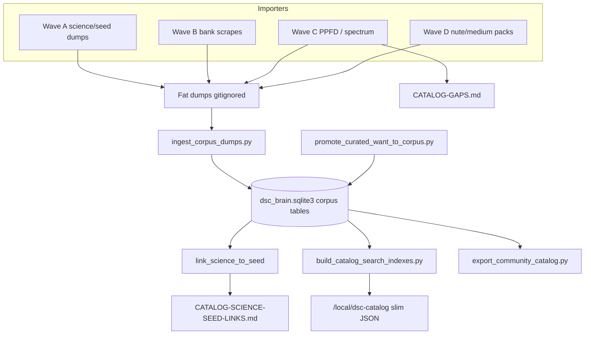

# Catalog research corpus (N-087)

Operator / developer runbook for the **research-scale archival plant catalog**
and its **slim HA projection**. Surface marker: `sensor.dsc_ha_surface_version`
**5.1.13**.

The product does **not** ship the whole DB. We still gather the whole thing so
science↔seed relationships and coverage can be researched honestly.

| Layer | Path | Job now |
|---|---|---|
| Fat dumps | `homeassistant/data/dsc_*.json`, `media/` | Wave A–D importers (**gitignored**) |
| Research SQLite | `brain/data/dsc_brain.sqlite3` | Breadth + provenance + links (**gitignored**) |
| HA slim indexes | `www/dsc-catalog/*_search_index.json` (+ `dist/`) | Product browse / typeahead (**committed**) |
| Community export | `homeassistant/data/exports/community_catalog_open/` | Open/redistributable subset only |

Same SQLite file also holds **Phase B curated packs** (`catalog.py` tables).
Do not confuse `reload-catalogs` pack counts with research `corpus-stats`.



## Schema highlights

Corpus schema version **2** (`brain/dsc_brain/corpus_schema.py`).

| Table | Role |
|---|---|
| `strain_canonical` + `strain_variant` | Parent names + breeder children |
| `chemistry_profile` | Science / lab evidence rows |
| `grow_trait` | Height / flowering / yield when stated |
| `entity_link` + `science_alias` | Provenance edges (incl. chem→seed) |
| `attribute_kv` + `schema_extension_log` | Never silently drop unfamiliar seed/product fields |
| `source_record.redistributable` | Gates community export |
| `media_asset` | Cropped PPFD / spectrum graphs |
| `followup_gap` | Missing / unparseable expected fields |
| `light_fixture` / `nutrient_product` / `medium_product` | Product rows in research DB |

CLI:

```bash
cd brain
python -m dsc_brain.cli init-db          # curated schema + corpus tables
python -m dsc_brain.cli init-corpus      # corpus tables only
python -m dsc_brain.cli corpus-stats
```

## Pipelines (verified commands)

Paths default to `homeassistant/data/` and DB `brain/data/dsc_brain.sqlite3`.

### Wave A — science / open seed

```bash
python scripts/import_strains_openthc.py
python scripts/import_strains_seedcity.py
python scripts/import_strains_wikileaf.py
python scripts/import_lab_terpenes_cannlytics.py --max-rows 50000
python scripts/import_strains_budprofiles.py   # empty shell OK if API offline
```

### Wave B — bank HTML research scrapes

```bash
python scripts/scrape_seed_banks.py --bank all --limit 80 --delay 0.8
```

`--bank` ∈ `{herbies,rqs,seedsman,ilgm,seedfinder,all,discover}`. Always writes
`dsc_bank_discovery.json`. Scrapes are `redistributable=false`.

### Wave C — PPFD / spectrum archival

```bash
python scripts/ingest_ppfd_maps.py --limit 40
# optional: --db PATH --force
```

Sources: `dsc_light_pack_photometrics.yaml` + `dsc_lights_*.json`. Crops land under
`homeassistant/data/media/ppfd/`. Regenerates [`CATALOG-GAPS.md`](CATALOG-GAPS.md).
Never invents PPFD cell grids.

### Wave D — nutrient / medium pack seeds

```bash
python scripts/import_nutrients_mediums_packs.py
```

### Merge → link → HA → export

```bash
python scripts/promote_curated_want_to_corpus.py
python scripts/ingest_corpus_dumps.py --reset --link
python scripts/report_science_seed_links.py
python scripts/build_catalog_search_indexes.py
python scripts/export_community_catalog.py
```

| Flag / default | Meaning |
|---|---|
| `ingest_corpus_dumps --reset` | Drop/recreate corpus tables before load |
| `ingest_corpus_dumps --link` (default) | Run `link_science_to_seed` after ingest |
| `ingest_corpus_dumps --no-link` | Skip linking |
| Globs ingested | `dsc_strains_*.json`, `dsc_lab_*.json`, `dsc_lights_*.json`, `dsc_nutrients_*.json`, `dsc_mediums_*.json` (skips `*checkpoint*` / `*merged*`) |
| `build_catalog_search_indexes --from-dumps` | Legacy dump fallback for strains (no SQLite) |
| Caps | strains **2500**, nutrients **1500**, mediums **800**, lights **800** |

Source inventory: [`homeassistant/data/STRAIN_SOURCES.md`](../../homeassistant/data/STRAIN_SOURCES.md).

## HA projection rules

Default index build:

1. **Strains** from SQLite via `catalog_sqlite_projection.build_strains_from_sqlite`
   (curated YAML Want first, then `ORDER BY curated DESC, name`). Cap **2500**.
2. If DB missing, or `--from-dumps`, strains fall back to dump merge path.
3. **Nutrients / mediums / lights** still come from YAML packs + dumps — **not**
   from corpus product tables (Wave D brand crawl still thin).

Strain item fields when stated: `id`, `name`, `type`, `breeder`, `source`,
`has_chemistry`, `top_terpenes` (≤3), `thc_range`, `cbd_range`, `want`,
`height_cm`, `flowering_days`, `curated`. Meta includes `schema_version: 2`,
`with_want`, `with_height`.

### Committed slim indexes (2026-08-07 N-087)

| File | count | Notes |
|---|---|---|
| `dsc_strains_search_index.json` | **2500** | `with_want=12`, `with_height=21`, chemistry on 229 |
| `dsc_nutrients_search_index.json` | **3** | pack + dump seeds |
| `dsc_mediums_search_index.json` | **5** | 1 pack + 4 builder_seed labels |
| `dsc_lights_search_index.json` | **7** | photometrics pack |

After rebuild: stage with Sync / `ha-sync.sh` / `scripts/sync-hacs-dist.sh`.

## Science ↔ seed linking

Implemented in `corpus.link_science_to_seed`:

- Exact `name_norm` → matching `strain_canonical` (`method=exact_name_norm`, conf 1.0)
- Same name → each matching `strain_variant`
- No match → `followup_gap` (`seed_link` / `no_matching_canonical`)
- Fuzzy matching is **not** implemented in code (report wording about conf &lt; 1.0
  is forward-looking only)

Regenerate snapshot: `python scripts/report_science_seed_links.py` →
[`CATALOG-SCIENCE-SEED-LINKS.md`](CATALOG-SCIENCE-SEED-LINKS.md).

Latest committed coverage: chem **38933**, seed canonical **20278**, variants
**9003**, chem→seed edges **110276**, chem gaps **0**.

## Honesty rules / pitfalls

- Never invent height / chem ranges / PPFD cell grids. UI shows missing honestly.
- Bank HTML scrapes stay `redistributable=false` until legal review.
- Unfamiliar seed/product fields → `attribute_kv` (full lab rows stay in
  `chemistry_profile.payload_json`).
- Strain HA projection is **2500 of ~20k** canonical — raise cap or page when UI
  needs more.
- SQLite strain projection is **N+1 queries per canonical** (slow on network DB);
  JOIN refactor deferred (FOLLOWUPS).
- Nutrients/mediums/lights indexes ignore corpus product tables for now.
- Dual schema in one DB: Phase B `reload-catalogs` ≠ research `corpus-stats`.
- Cannlytics `--all-states-small` is currently a no-op; full `data/all` (~2.5GB)
  not ingested this pass.
- BudProfiles / SeedFinder / some bank routes may return empty shells — intentional.
- Pi full-corpus UI is **N-095**, not N-087.
- Keep index `kind` plurals (`strains` / `lights` / …) aligned with card `INDEX_KEY`.
- Fat dumps + SQLite stay gitignored; commit importers, schema, tools, gap/link
  docs, and slim HA indexes only.

## Related

- [`CATALOG-SCIENCE-SEED-LINKS.md`](CATALOG-SCIENCE-SEED-LINKS.md) — auto coverage
- [`CATALOG-GAPS.md`](CATALOG-GAPS.md) — PPFD download/crop gaps
- [`BUILD-A-PLANT-DATA-PIPELINE.md`](BUILD-A-PLANT-DATA-PIPELINE.md) — HA/product flow
- [`LIVE-UI-PRODUCT-SHELL.md`](LIVE-UI-PRODUCT-SHELL.md) — Catalog Explorer surface
- [`brain/README.md`](../../brain/README.md) — Phase B + corpus CLI
- FOLLOWUPS **N-087**
