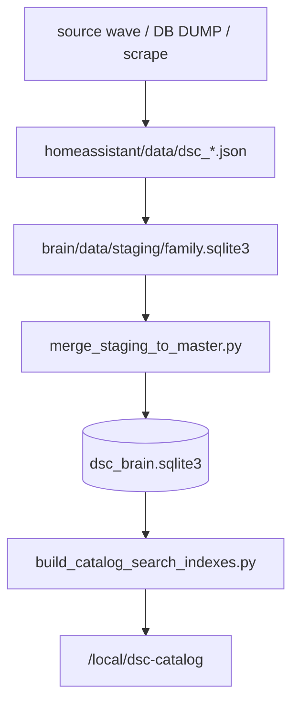

# Catalog research corpus (N-087 / N-087c)

## Mission

Build a **research-scale archival plant catalog** (science + seed + lights + nutrients + media), then **project** a slim subset into HA Catalog indexes. The product does not ship the whole DB; we still gather the whole thing so relationships and coverage can be researched honestly.

| Layer | Path | Job |
|---|---|---|
| Staging SQLite (per source) | `brain/data/staging/<family>.sqlite3` | Full source payloads in `raw_record` (multi-GB OK; NAS >1 TB) + typed projections |
| Master research SQLite | `brain/data/dsc_brain.sqlite3` | Matched canonical + variant + chem + grow + links (+ slim `payload_json`); queryable |
| Fat JSON/CSV dumps | `homeassistant/data/dsc_*.json`, `Projects/DB DUMP` | Project copies / re-import inputs (gitignored) |
| HA `/local/dsc-catalog/*.json` | Thin projection (cap ~2500 strains) | Product browse/typeahead |
| Community export | Open/redistributable subset only | Public package after legal review |

Collation layers (canonical / variant / observation, keep-both chem, lineage edges): [`CATALOG-COLLATION-CONTRACT.md`](CATALOG-COLLATION-CONTRACT.md).

## Multi-DB ingest architecture (N-087c)

**Why:** A single-DB ingest that mirrored every Leafly score into `attribute_kv` blew up to ~6 GB and lost usable research I/O on the NAS. Staging keeps **full** source rows; master stays **matchable**.



```text
  source wave / DB DUMP / scrape
           |
           v
  homeassistant/data/dsc_*.json   (gitignored project copy)
           |
           v
  brain/data/staging/<family>.sqlite3
    - typed: canonical / variant / chem / grow / links
    - FULL raw_record blobs (do not strip; multi-GB OK)
    - attribute_kv ONLY for small bank/product rows (never score spam)
           |
           |  scripts/merge_staging_to_master.py
           v
  brain/data/dsc_brain.sqlite3  (master; additive merge; never wipe from staging reset)
           |
           v
  scripts/build_catalog_search_indexes.py  -> HA indexes
```

### Staging families (examples)

| Family file | Sources |
|---|---|
| `seedcity.sqlite3` | Seed City CC0 / local CSV |
| `leafly_flat.sqlite3` / `leafly_features.sqlite3` | Leafly flat / features dumps |
| `replication_labs.sqlite3` | Replication_Data lab rows |
| `kushy.sqlite3` | Kushy MIT |
| `bank_herbies.sqlite3` | Herbies scrape |
| … | one file per source family |

Code: `brain/dsc_brain/staging.py` (`FAMILY_MAP`, `write_dump_to_staging`, `list_staging_dbs`), `brain/dsc_brain/paths.py` (`STAGING_DIR`).

### How to run

```text
# 1) Write/refresh JSON dumps (optional --write-staging)
python scripts/import_local_db_dump.py --write-staging
# or
python scripts/import_db_dump_folder.py --write-staging

# 2) Or ingest existing dumps into per-source staging (FULL raw_record)
python scripts/ingest_corpus_dumps.py --per-source-staging
python scripts/ingest_corpus_dumps.py --per-source-staging --only leafly
python scripts/ingest_corpus_dumps.py --staging-db brain/data/staging/kushy.sqlite3 --source-id kushy --only kushy

# 3) Merge staging -> master (additive; keeps both chem rows when conflicting)
python scripts/merge_staging_to_master.py
python scripts/merge_staging_to_master.py --only seedcity --only kushy
# raw_record stays in staging unless: --include-raw
# skip link/search rebuild during lock storms: --no-link --no-search

# 4) HA indexes from master
python scripts/build_catalog_search_indexes.py
```

**`--only` match:** substring against staging **filename** (case-insensitive). Prefer unique stems (`hytiva`, `phytochem_smith`) so you do not accidentally merge siblings.

**Migration of current master:** existing `dsc_brain.sqlite3` is fine to keep. Schema v3 adds `raw_record` additively on connect. Prefer new waves to staging first, then merge; do **not** `--reset` master. Optional: re-run `--per-source-staging` for sources you want full payloads archived, then merge.

**Fan-out workers:** each worker writes only its family staging file (no shared master writers). Serialize `merge_staging_to_master` + index rebuild. Discovery agents stay inventory-only.

**Durable fat backup:** local `_BACKUP_N087_*/` trees are gitignored (see `.gitignore`). Do not commit multi-GB SQLite / Cannlytics CSVs (>100 MB GitHub block).

## Schema highlights

- Collation layers / notes / reviews / lineage: [`CATALOG-COLLATION-CONTRACT.md`](CATALOG-COLLATION-CONTRACT.md)
- `strain_canonical` + `strain_variant` (breeder children)
- `chemistry_profile` (science evidence rows; conflicting chem rows kept via `INSERT OR IGNORE`)
- `grow_trait`, `entity_link`, `science_alias`
- `raw_record` (full source JSON blob; staging SoT for fat rows)
- `attribute_kv` + `schema_extension_log` (small bank/product overflow only — never bulk score columns)
- `source_record.redistributable` gates community export
- `media_asset` for cropped PPFD/spectrum graphs
- `followup_gap` for missing/unparseable expected fields
- *(gap)* first-class `observation` / `review` tables — see contract + FOLLOWUPS **N-087-COLLATION**

**Dual schema, same file:** Phase B curated tables use `meta.schema_version=1`; corpus uses `corpus_schema_version` (v3). `init-db` creates both. `reload-catalogs` ≠ `corpus-stats`.

### Merge copy set (verified in `merge_staging_to_master.py`)

Copies typed tables only: `source_record`, `strain_canonical`, `strain_variant`, `chemistry_profile`, `grow_trait`, `science_alias`, `entity_link`, light/nutrient/medium products, `media_asset`, `followup_gap`, `export_manifest`.

- **Never** copies `attribute_kv` (avoids score explosion).
- **Does not** copy `raw_record` unless `--include-raw`.
- Chemistry / grow / links / raw: `INSERT OR IGNORE` (keep both).
- Canonical soft-merges empty `summary_json` fields only — never invents values.

## Pipelines

```text
Wave A  scripts/import_strains_openthc.py
        scripts/import_strains_seedcity.py
        scripts/import_strains_wikileaf.py
        scripts/import_strains_kushy.py
        scripts/import_strains_lynch_figshare.py
        scripts/import_lab_terpenes_cannlytics.py
        scripts/import_lab_terpenes_maxvalue.py
        scripts/import_strains_budprofiles.py   # if live
Local   scripts/import_local_db_dump.py --write-staging
        scripts/import_db_dump_folder.py --write-staging
Public  scripts/import_public_datasets_discover.py
DoltHub scripts/import_dolthub_pointer.py       # WA tests mirror local Replication_Data
Inv     scripts/persist_seed_breeders_inventory.py
        scripts/build_forum_discovery.py
Wave B  scripts/scrape_seed_banks.py
        scripts/scrape_strain_directories.py
Wave C  scripts/ingest_ppfd_maps.py
Wave D  scripts/import_nutrients_mediums_packs.py (+ brand dumps)
Stage   scripts/ingest_corpus_dumps.py --per-source-staging
Merge   scripts/merge_staging_to_master.py
        # raw_record stays in staging unless --include-raw
        # legacy direct: scripts/ingest_corpus_dumps.py --db ... --link
Report  scripts/report_science_seed_links.py
HA      scripts/build_catalog_search_indexes.py
Export  scripts/export_community_catalog.py
```

Fat dumps under `homeassistant/data/dsc_*.json` and `media/` are **gitignored**. Staging + master SQLite under `brain/data/` are **gitignored**. Commit importers, schema, merge tooling, crop tools, gap/link docs, `SEED_BREEDERS.md`, and slim HA indexes.

**Capture policy (N-087):** Maximize staging capture; match later. Keep FULL raw HTML/JSON/CSV rows, reviews, prices, brands, scores, lineage text, forum excerpts — do not drop "unused" fields. Prefer over-capture in staging over premature filtering (NAS >1 TB).

**Overflow policy:** Staging `raw_record` keeps FULL source payloads (NAS capacity). Master stores typed identity + chemistry + grow + links + rich `payload_json` (+ structured extras when parseable; never invent). `attribute_kv` is for smaller bank/product rows only so master stays usable.

## Committed HA index numbers (www + dist)

Verified on master after N-087c backup (`fc8c4cc`):

| Index | `schema_version` | `count` | notes |
|---|---|---|---|
| strains | 2 | **2500** | `with_want=12`, `with_height=0` (never invent height) |
| nutrients | 2 | **3** | pack/dump projection |
| mediums | 2 | **5** | pack/dump projection |
| lights | 2 | **7** | pack/dump projection |

Caps in builder: strains **2500**, nutrients **1500**, mediums **800**, lights **800**.

## Ops pitfalls

| Symptom | Cause | Fix |
|---|---|---|
| `database is locked` / hung connect on master | Concurrent `merge_staging_to_master` (esp. over SMB/NAS) | **One** exclusive merge at a time; use `--only <family>`; optional `--no-link --no-search` then link/search once idle |
| Master `malformed` / btree errors | Overlapping writers + kill mid-txn | Stop all writers; recover from staging (master is rebuildable from staging families) |
| Master balloons / unusable I/O | Score spam in `attribute_kv` | Never bulk-mirror Leafly/effect scores into KV; keep full JSON in staging `raw_record` / master `payload_json` |
| Merge skipped unexpected families | Broad `--only` substring | Use unique stems; list `brain/data/staging/*.sqlite3` first |
| Cloudflare / captcha wall | Live scrape blocked | Stop; user authenticates in headed browser / Playwright; resume — do not invent rows |
| Git push rejected (large files) | Fat DBs / Cannlytics CSVs | Keep under `_BACKUP_N087_*/` or NAS; gitignore already covers `brain/data/**/*.sqlite3` |
| HA typeahead empty / thin chem | Slim index lag vs research DB | Rebuild indexes after successful exclusive merge; product caps stay |

## Honesty rules

- Never invent height / chem ranges / PPFD cell grids.
- Science↔seed links use exact `name_norm` (+ variant / alias) with confidence/provenance.
- Conflicting chemistry: keep both rows (provenance intact); never invent a blended chem.
- Bank HTML scrapes stay `redistributable=false` until legal review.
- Unfamiliar seed/product fields → staging `raw_record` (bulk) or `attribute_kv` (small); lab typed evidence in `payload_json`.
- Cloudflare / captcha walls (strain-database.com, Leafly live, Weedmaps, Wikileaf live): stop; user authenticates in browser, then resume scrape.

See also: [`CATALOG-COLLATION-CONTRACT.md`](CATALOG-COLLATION-CONTRACT.md), [`CATALOG-SCIENCE-SEED-LINKS.md`](CATALOG-SCIENCE-SEED-LINKS.md), [`CATALOG-GAPS.md`](CATALOG-GAPS.md), FOLLOWUPS **N-087** / **N-087c** / **N-087-COLLATION**.
