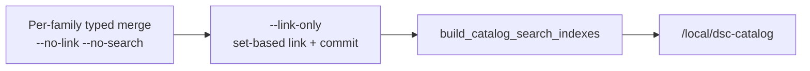
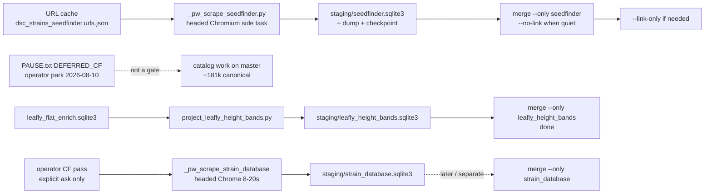
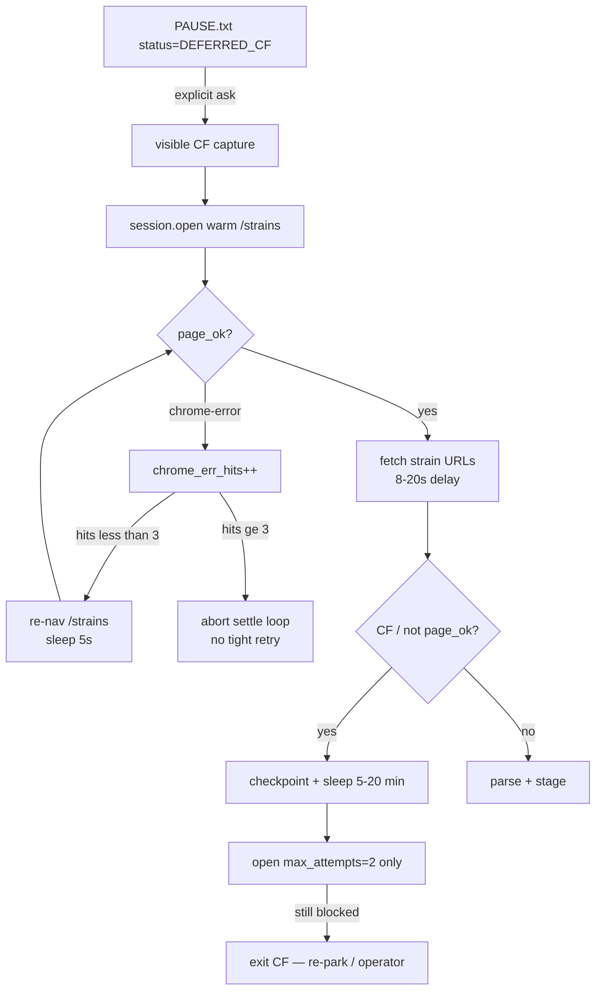

# Catalog research corpus (N-087)

## Mission

Build a **research-scale archival plant catalog** (science + seed + lights + nutrients + media), then **project** a slim subset into HA Catalog indexes. The product does not ship the whole DB; we still gather the whole thing so relationships and coverage can be researched honestly.

| Layer | Path | Job |
|---|---|---|
| Staging SQLite (per source) | `brain/data/staging/<family>.sqlite3` | Full source payloads in `raw_record` (multi-GB OK; NAS >1 TB) + typed projections |
| Master research SQLite | `brain/data/dsc_brain.sqlite3` | Matched canonical + variant + chem + grow + links (+ slim `payload_json`); queryable |
| Fat JSON/CSV dumps | `homeassistant/data/dsc_*.json`, `Projects/DB DUMP` | Project copies / re-import inputs (gitignored) |
| HA `/local/dsc-catalog/*.json` | Thin projection (cap ~2500 strains) | Product browse/typeahead |
| Community export | Open/redistributable subset only | Public package after legal review |

## Multi-DB ingest architecture (N-087c)

**Why:** A single-DB ingest that mirrored every Leafly score into `attribute_kv` blew up to ~6 GB and lost usable research I/O on the NAS. Staging keeps **full** source rows; master stays **matchable**.

```text
  source wave / DB DUMP / scrape
           |
           v
  homeassistant/data/dsc_*.json   (gitignored project copy)
           |
           v
  brain/data/staging/<family>.sqlite3
    - typed: canonical / variant / chem / grow / links
    - FULL raw_record blobs (do not strip; multi-GB OK)
    - attribute_kv ONLY for small bank/product rows (never score spam)
           |
           |  scripts/merge_staging_to_master.py
           v
  brain/data/dsc_brain.sqlite3  (master; additive merge; never wipe from staging reset)
           |
           v
  scripts/build_catalog_search_indexes.py  -> HA indexes
```

### Staging families (examples)

| Family file | Sources |
|---|---|
| `seedcity.sqlite3` | Seed City CC0 / local CSV |
| `leafly_flat.sqlite3` / `leafly_features.sqlite3` | Leafly flat / features dumps |
| `leafly_flat_enrich.sqlite3` | Leafly flat re-enrich (effects/terps/grow scores; no `attribute_kv`) |
| `leafly_height_bands.sqlite3` | Projected Short/Medium/Tall ordinals from Leafly enrich (no cm) |
| `seedfinder.sqlite3` | SeedFinder.eu Playwright scrape (`html_raw` in `raw_record`) |
| `replication_labs.sqlite3` | Replication_Data lab rows |
| `kushy.sqlite3` | Kushy MIT |
| `bank_herbies.sqlite3` | Herbies scrape |
| … | one file per source family |

### How to run

```text
# 1) Write/refresh JSON dumps (optional --write-staging)
python scripts/import_local_db_dump.py --write-staging
# or
python scripts/import_db_dump_folder.py --write-staging

# 2) Or ingest existing dumps into per-source staging (FULL raw_record)
python scripts/ingest_corpus_dumps.py --per-source-staging
python scripts/ingest_corpus_dumps.py --per-source-staging --only leafly
python scripts/ingest_corpus_dumps.py --staging-db brain/data/staging/kushy.sqlite3 --source-id kushy --only kushy

# 3) Merge staging -> master (additive; keeps both chem rows when conflicting)
# Prefer --no-link --no-search per family, then one end-link (see Merge-link ops below)
python scripts/merge_staging_to_master.py --only seedcity --no-link --no-search
python scripts/merge_staging_to_master.py --only kushy --no-link --no-search
# raw_record stays in staging unless: --include-raw

# 4) One science↔seed link pass after typed merges (set-based; commits even with --no-search)
python scripts/merge_staging_to_master.py --link-only --no-search

# 5) HA indexes from master
python scripts/build_catalog_search_indexes.py
```

**Migration of current master:** existing `dsc_brain.sqlite3` is fine to keep. Schema v3 adds `raw_record` additively on connect. Prefer new waves to staging first, then merge; do not `--reset` master. Optional: re-run `--per-source-staging` for sources you want full payloads archived, then merge.

**Fan-out workers:** each worker writes only its family staging file (no shared master writers). Serialize `merge_staging_to_master` + index rebuild. Discovery agents stay inventory-only.

## Merge-link ops (N-087-MERGE-NOLINK / local-SSD)

**Why:** `link_science_to_seed` used to walk **every** `chemistry_profile` row after each family merge. On SMB/NAS that looks like a hung small-family merge (WAL grows, CPU ~0%). Hours “stuck” after a tiny family is almost always the full-chem link, not typed INSERT.

**Default pattern (sole writer):**

```text
per family:  merge_staging_to_master.py --only <family> --no-link --no-search
once:        merge_staging_to_master.py --link-only --no-search
once:        build_catalog_search_indexes.py
```



| Flag / lever | Behavior (verified) |
|---|---|
| `--no-link` | Skip science↔seed linking for this invocation |
| `--no-search` | Skip `rebuild_search_docs`; **link path still `commit()`s** after `link_science_to_seed` |
| `--link-only` | Skip staging merge; run link (+ optional search) only |
| `N087_FORCE_NO_LINK=1` or `brain/data/_n087_force_no_link.flag` | Coerces next non-`--link-only` child to `--no-link` (live exclusive wrappers) |
| `link_science_to_seed` | Set-based `INSERT…SELECT` exact `name_norm` → canonical + variants; skip existing edges; add `followup_gap` for unmatched chem |

**Exclusive / local-SSD runners** (lab Windows paths; gitignored data under `brain/data/`):

| Script | Job |
|---|---|
| `brain/data/_n087_exclusive_merge.py` | Sole-writer over plan file; per-family `--no-link --no-search`; end `--link-only`; then indexes |
| `brain/data/_n087_exclusive_merge_resume.py` | Resume from results jsonl (skip OK families) |
| `brain/data/_n087_local_ssd_merge.py` | Copy master (+WAL) to `%TEMP%`, merge remaining plan locally, end-link + indexes, copy master back (`*.pre_local_ssd` bak) |

**2026-08-09 finish (source of truth in FOLLOWUPS):** local-SSD drained 207-family plan (`ok=205`, `fail=0`, `skipped_already_ok=2`); end-link added ~1.61M variant edges in ~164s on SSD; master approx canonical≈181473 / chem≈602737 / entity_link≈2752186 / grow≈89235. Later same day: `leafly_height_bands` `--no-link` merge raised grow≈**89590**. Committed HA strains index (`built_at` 2026-08-09T06:01:16Z): **2500** (`with_want=12`, `with_height=6` cm-only).

**Constraints / pitfalls:**

- Serialize all master writers (FOLLOWUPS **F-N087-LOCK**). Prefer local-SSD when NAS link I/O stalls.
- Do **not** kill a “stuck” merge mid-txn without checking whether it is still in typed merge vs full-chem link.
- Clear `_n087_force_no_link.flag` before `--link-only` (runners unlink it; manual runs must too).
- Staging stays SoT for fat `raw_record`; never bulk Leafly scores into master `attribute_kv`.
- Exact `name_norm` only — no fuzzy auto-links.

## Schema highlights

- Collation layers / notes / reviews / lineage: [`CATALOG-COLLATION-CONTRACT.md`](CATALOG-COLLATION-CONTRACT.md)
- `strain_canonical` + `strain_variant` (breeder children)
- `chemistry_profile` (science evidence rows; conflicting chem rows kept)
- `grow_trait`, `entity_link`, `science_alias`
- `raw_record` (full source JSON blob; staging SoT for fat rows)
- `attribute_kv` + `schema_extension_log` (small bank/product overflow only — never bulk score columns)
- `source_record.redistributable` gates community export
- `media_asset` for cropped PPFD/spectrum graphs
- `followup_gap` for missing/unparseable expected fields
- *(gap)* first-class `observation` / `review` tables — see contract + FOLLOWUPS **N-087-COLLATION**

## Pipelines

```text
Wave A  scripts/import_strains_openthc.py
        scripts/import_strains_seedcity.py
        scripts/import_strains_wikileaf.py
        scripts/import_strains_kushy.py
        scripts/import_strains_lynch_figshare.py
        scripts/import_lab_terpenes_cannlytics.py
        scripts/import_lab_terpenes_maxvalue.py
        scripts/import_strains_budprofiles.py   # if live
Local   scripts/import_local_db_dump.py --write-staging
        scripts/import_db_dump_folder.py --write-staging
Public  scripts/import_public_datasets_discover.py
DoltHub scripts/import_dolthub_pointer.py       # WA tests mirror local Replication_Data
Inv     scripts/persist_seed_breeders_inventory.py
        scripts/build_forum_discovery.py
Wave B  scripts/scrape_seed_banks.py
        scripts/scrape_strain_directories.py
        scripts/_pw_scrape_seedfinder.py          # CF-safe SeedFinder resume (headed PW)
        scripts/_pw_scrape_strain_database.py     # StrainDB headed Chrome PW (soft CF retries)
        scripts/_pw_strain_db_capture.py          # operator CF capture → storage_state
        scripts/_launch_strain_db_capture.py      # Windows console launcher for capture
        scripts/project_leafly_height_bands.py    # Short/Med/Tall → ordinal payload (no cm)
        scripts/_merge_leafly_height_bands_once.py  # verify staging + --no-link merge
Wave C  scripts/ingest_ppfd_maps.py
Wave D  scripts/import_nutrients_mediums_packs.py (+ brand dumps)
Stage   scripts/ingest_corpus_dumps.py --per-source-staging
Merge   scripts/merge_staging_to_master.py
        # raw_record stays in staging unless --include-raw
        # legacy direct: scripts/ingest_corpus_dumps.py --db ... --link
Report  scripts/report_science_seed_links.py
HA      scripts/build_catalog_search_indexes.py
Export  scripts/export_community_catalog.py
```

Fat dumps under `homeassistant/data/dsc_*.json` and `media/` are **gitignored**. Staging + master SQLite under `brain/data/` are **gitignored**. Commit importers, schema, merge tooling, crop tools, gap/link docs, `SEED_BREEDERS.md`, and slim HA indexes.

**Capture policy (N-087):** Maximize staging capture; match later. Keep FULL raw HTML/JSON/CSV rows, reviews, prices, brands, scores, lineage text, forum excerpts — do not drop "unused" fields. Prefer over-capture in staging over premature filtering (NAS >1 TB).

**Overflow policy:** Staging `raw_record` keeps FULL source payloads (NAS capacity). Master stores typed identity + chemistry + grow + links + rich `payload_json` (+ structured extras when parseable; never invent). `attribute_kv` is for smaller bank/product rows only so master stays usable.

## SeedFinder / StrainDB Playwright + Leafly height bands

**Why:** SeedFinder.eu and strain-database.com are Cloudflare-walled for plain `urllib` / `curl_cffi` even after a browser clears the homepage — clearance is TLS/profile-bound, not IP-shared. Leafly enrich heights are categorical (`Short` / `Medium` / `Tall`) only; projecting them must never invent cm ranges. HA index `with_height` still counts **numeric `height_cm` only**, so band projection alone will not raise that counter.



### SeedFinder (`S-SEEDFINDER`) — side task

| Piece | Path / value |
|---|---|
| Scraper | `scripts/_pw_scrape_seedfinder.py` (reuses parse/ingest from `scrape_seedfinder.py`) |
| Detached launch (Windows) | `brain/data/staging/_seedfinder_launch.py` → headed PW, delay 1.5–3s, ck every 25, dump every 500 |
| URL cache (required) | `homeassistant/data/dsc_strains_seedfinder.urls.json` — abort exit 3 if missing |
| Checkpoint / dump | `…seedfinder.checkpoint.json` / `…seedfinder.json` |
| Browser profile | `%LOCALAPPDATA%/Temp/dsc-pw-chromium-seedfinder` or `DSC_SF_UD`; optional `DSC_SF_CHANNEL` |
| Storage state | `homeassistant/data/dsc_strains_seedfinder.storage_state.json` |
| Heartbeat / PID / log | `brain/data/staging/seedfinder_scrape.{heartbeat,pid}` + `seedfinder_pw_scrape.log` |
| Staging family | `brain/data/staging/seedfinder.sqlite3` (`html_raw` in `raw_record`; `redistributable=false`) |
| Status (2026-08-10 ~11:23 AEST) | **side task (running)** ~**22.1k/40638**; ~1 day ETA. Catalog work proceeds on current master without waiting. |

```text
# Resume remaining queue (default: headed, off-screen window — CF-friendlier than headless)
python -u scripts/_pw_scrape_seedfinder.py --headed --delay-min=1.5 --delay-max=3.0

# Or detached (CREATE_NO_WINDOW) via launch helper on lab Windows:
python brain/data/staging/_seedfinder_launch.py

# After SeedFinder quiet — typed merge alone; do NOT wait on StrainDB
python scripts/merge_staging_to_master.py --only seedfinder --no-link --no-search
# end-link separately only if needed
```

**Constraints / pitfalls (verified against `_pw_scrape_seedfinder.py` + FOLLOWUPS `82099b6`):**

- Do **not** resume with `scrape_seedfinder.py` / urllib — still HTTP 403 after browser CF.
- Prefer **headed** (default). `--headless` often re-triggers CF; hard-stop on repeated `CF_` / “just a moment”.
- Warm visits `https://seedfinder.eu/en` and may click Turnstile widgets; fails open with exit 2 if warm never clears.
- Resume uses checkpoint `done` ∪ existing dump URLs; does not wipe staging (`open_staging(reset=False)`).
- Staging journal can be live while scrape runs — wait for quiet before merge.
- Merge gate is **SeedFinder quiet only**. StrainDB `DEFERRED_CF` is **not** a blocker for SeedFinder merge or other catalog work on master.

### Leafly height bands (`D-N087-HEIGHT-BAND`) — done 2026-08-09

| Piece | Path / value |
|---|---|
| Projector | `scripts/project_leafly_height_bands.py` |
| Source staging (default) | `brain/data/staging/leafly_flat_enrich.sqlite3` |
| Dest family | `brain/data/staging/leafly_height_bands.sqlite3` |
| Family map | `SOURCE_FAMILY_MAP["leafly_height_bands"] = "leafly_height_bands"` in `brain/dsc_brain/staging.py` — **must not** alias into `leafly_flat` |
| Grow keys (flat) | `height_band`, `height_ordinal`, `height_source`, `height_raw` on the strain row (ingest also unwraps nested `grow`) |
| Accepted labels only | `short`, `medium`/`med`, `tall` — unknown strings skipped (never parse `"120cm"` into a band) |
| One-shot merge helper | `scripts/_merge_leafly_height_bands_once.py` (verify staging counts/family meta, then `--no-link`) |
| Result | **355** Short/Med/Tall rows projected + merged; master `grow_trait` **89235→89590** |

```text
python scripts/project_leafly_height_bands.py
# optional: --source-staging PATH  |  --reset  (wipe dest family)

# Verify family meta is leafly_height_bands (not leafly_flat), then merge
python scripts/_merge_leafly_height_bands_once.py
# or:
python scripts/merge_staging_to_master.py --only leafly_height_bands --no-link --no-search
```

**Bug fixed (`96fe8d8`):** without an explicit `SOURCE_FAMILY_MAP` entry, `leafly_height_bands` fell through prefix/`leafly_*` aliasing into the `leafly_flat` family file — merge `--only leafly_height_bands` then saw the wrong staging DB. Register the family, project flat grow keys, and confirm `meta.staging_source_family` before merge.

**Honesty:** ordinals are categorical ranks for research/UI, not centimetres. Do not document or code a Short→cm table. Index `with_height` remains a **cm** count until a separate projector/UI path consumes `height_band`.

### StrainDB (`S-STRAINDB`) — DEFERRED_CF park

| Piece | Path / value |
|---|---|
| Scraper | `scripts/_pw_scrape_strain_database.py` |
| CF capture | `scripts/_pw_strain_db_capture.py` (`--wait=300`) |
| Capture launcher (Windows) | `scripts/_launch_strain_db_capture.py` — **visible** console (`CREATE_NEW_CONSOLE`); never hide the CF window |
| Pause / park file | `homeassistant/data/_pw_strain_db_PAUSE.txt` |
| Profile / channel | `DSC_SDB_UD` (default fresh Chrome UD under Temp) · `DSC_SDB_CHANNEL=chrome` |
| Storage state | `homeassistant/data/dsc_strains_straindatabase.storage_state.json` |
| Pace | default **8–20s** jitter (`--delay-min` / `--delay-max`); hard floor 5s |
| Staging | `brain/data/staging/strain_database.sqlite3` |
| Status (2026-08-10) | **DEFERRED_CF** at n≈**289**. Operator parked CF cost vs value; resume **only on explicit ask**. Not a gate for catalog work or SeedFinder merge. |

Pause file shape (operator SoT — do not invent other statuses):

```text
status=DEFERRED_CF
reason=Operator 2026-08-10: park StrainDB while SeedFinder runs as side task; work from current master (~181k canonical). Resume only on explicit ask after headed CF unlock.
n=289
cmd=python -u scripts/_pw_scrape_strain_database.py --headed --delay-min=8 --delay-max=20
updated_at=2026-08-10T11:23:10.9363172+10:00
```

```text
# Resume ONLY after explicit operator ask + headed CF unlock
python scripts/_launch_strain_db_capture.py
# or: python -u scripts/_pw_strain_db_capture.py --wait=300

set DSC_SDB_CHANNEL=chrome
python -u scripts/_pw_scrape_strain_database.py --headed --delay-min=8 --delay-max=20

# Merge StrainDB separately / later — never block SeedFinder merge on this
python scripts/merge_staging_to_master.py --only strain_database --no-link --no-search
```



**Constraints / pitfalls (verified against `_pw_scrape_strain_database.py` + pause file):**

- **Parked ≠ forgotten:** `DEFERRED_CF` means do not resume opportunistically and do not gate other catalog work on it.
- After a CF wall, **stop** — do not thrash. Warm settle aborts after **3** `chrome-error://` hits; post-challenge re-warm uses `open(max_attempts=2)` only (never a full 12-attempt hammer).
- Soft-navigating after `chrome-error://chromewebdata/` makes CF worse — catch and leave challenge HTML.
- Prefer **headed Chrome** (`DSC_SDB_CHANNEL=chrome`). Headless / urllib / curl_cffi-alone stay TLS-bound on `cf_clearance`.
- Capture launcher must stay visible so a human can pass CF; do not use `CREATE_NO_WINDOW` for capture.
- When resumed: keep 8–20s delay; checkpoint often; merge `strain_database` alone later (not bundled with SeedFinder).

## Honesty rules

- Never invent height / chem ranges / PPFD cell grids.
- Science↔seed links use exact `name_norm` (+ variant / alias) with confidence/provenance.
- Conflicting chemistry: keep both rows (provenance intact); never invent a blended chem.
- Bank HTML scrapes stay `redistributable=false` until legal review.
- Unfamiliar seed/product fields → staging `raw_record` (bulk) or `attribute_kv` (small); lab typed evidence in `payload_json`.
- Cloudflare / captcha walls (SeedFinder, strain-database.com, Leafly live, Weedmaps, Wikileaf live): stop plain HTTP; resume with headed Playwright + persistent profile (see SeedFinder / StrainDB sections). Do **not** thrash urllib or chrome-error re-nav loops.

See also: [`CATALOG-COLLATION-CONTRACT.md`](CATALOG-COLLATION-CONTRACT.md) (layers, notes, reviews→wordcloud, lineage edges, merge order), [`CATALOG-SCIENCE-SEED-LINKS.md`](CATALOG-SCIENCE-SEED-LINKS.md), [`CATALOG-GAPS.md`](CATALOG-GAPS.md), FOLLOWUPS **N-087** / **N-087-MERGE-NOLINK** / **N-087-EXCL** / **S-SEEDFINDER** (side task) / **S-STRAINDB** (`DEFERRED_CF`) / **D-N087-HEIGHT-BAND** (2026-08-10 snapshot).
