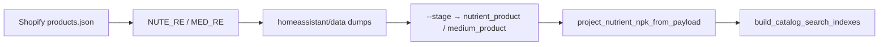
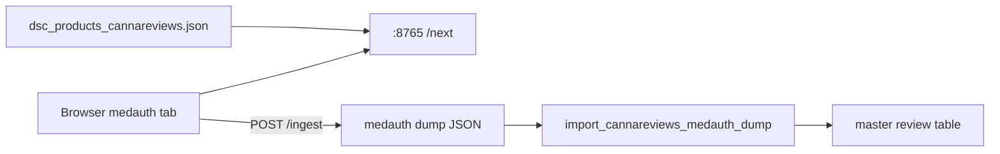

# Catalog thin fields & next-scrape chase

**Audience:** next scrape / fill pass.  
**Updated:** 2026-08-10 21:49 (densify run-2 + fill tooling `8a968eb`).  
**Workset:** `C:\DSC\collation\` (+ NAS).

## Landed (run-2)

| Deliverable | Evidence |
|---|---|
| Herbies mid-stage + obs | bank_note projected; obs **128498 → 131716**; herbies_obs **7360** |
| Height bands | payload `height_band` **~8783** (was ~5145) |
| Height cm NLP | `height_cm_*` **48752 / 102141 (~47.7%)** |
| Wave D shops | Apex Grow + TG Hydroponics (+ GK); master nutrients **867** / mediums **321** |
| NPK / dose mine | payload `body_html` → NPK **51** / dose **143** (honest patterns only) |
| Medauth reviews | **94** bodies → `review` (daily limit pause) |
| Subtype own-source chem/notes | chem **7105→7129**; bank_note **4800→4952**; no parent chem copy |
| HA strain cap | **2500 → 10000** (`STRAIN_CAP`); indexes `built_at` 2026-08-10T11:15:11Z |
| RQS descriptions | enrich running (188 need) |
| SeedSupreme descriptions | **31/31** remaining filled + staged |
| Seedsman remaining | 65 attempted, **0** extractable (no meta/JSON-LD) |
| Alias / promote | already saturated (0 new; unresolved still ~5651) |

## Snapshot

| Metric | Count |
|---|---|
| observation | ~131.7k |
| height_cm filled | 48752 / 102141 (~47.7%) |
| height_band | ~8783 |
| nutrients / mediums | 867 / 321 |
| review | 94 |
| SeedFinder | ~25.2k+ running (NAS journal live — do not merge yet) |
| Herbies desc enrich | ~3265/4142 running |
| HA browse (`8a968eb`) | strains **10000** (`with_want=12`, `with_height=238`, `with_height_band=81`), nutrients **837**, mediums **306**, lights **517** |

## Still blocked / waiting

| Priority | Field | Blocked by | Next |
|---|---|---|---|
| P0 | More `review` bodies | CannaReviews daily limit | Resume medauth after ~2026-08-11 (`:8765` ingest) |
| P0 | Remaining height (~52% empty) | No numeric text in payloads | Bank/Leafly PDPs with cm/in |
| P1 | SeedFinder remainder | Running + live journal | Let PW finish → quiet re-merge `--no-link` |
| P1 | StrainDB | `PARKED_HTTP_FAIL` (~359) | Fresh PW profile / longer cool-off; explicit unlock only |
| P1 | Subtype chem/notes gap | No honest own-source left | Targeted F2/bx/auto PDP scrapes (never copy parent) |
| P1 | Wave D NPK/dose depth | Retailer titles / thin HTML | Manufacturer PDPs; more shops if `products.json` live |
| P2 | Herbies/Zamnesia `description` | Enrich in flight | `enrich_bank_descriptions.py` |

## Operator runbooks (fill tooling `8a968eb`)

### Bank description enrich

**Intent:** re-GET bank PDPs that already have dump rows but lack `description`; update dump + optional staging. Never invents prose.

```text
python scripts/enrich_bank_descriptions.py --bank herbies --delay 0.8
python scripts/enrich_bank_descriptions.py --bank zamnesia --limit 200 --stage
```

- Choices come from `scrape_seed_banks.BANKS`.
- Extracts JSON-LD `description`/`abstract` or og/meta description (min length 40).
- Bank HTML stays `redistributable=false` until legal review.
- Seedsman often has **no** extractable meta — expect 0 fills.

### Wave D multi-shop Shopify

**Intent:** classify public Shopify `products.json` into nutrient/medium rows; stage to local + NAS when `--stage`. Does **not** invent NPK/dose.

```text
python scripts/scrape_shopify_nutrients_mediums.py --shop all --stage
python scripts/scrape_shopify_nutrients_mediums.py --shop apexgrow --stage
```

| Shop id | Notes |
|---|---|
| `growkings`, `hydrowarehouse`, `apexgrow`, `tghydroponics` | Primary Wave D set |
| `hydrocentre`, `greengrow`, `simplyhydro` | Kept for explicit retry; may 404/block |

Legacy single-shop helper `scrape_growkings_nutrients_mediums.py` still exists; prefer the multi-shop scraper for new brands.



### NPK / dose from payload HTML

**Intent:** fill empty `nutrient_product.npk` / `dose_ml_l` from existing `payload_json.body_html` (and name/tags) when a clear pattern matches.

```text
python scripts/project_nutrient_npk_from_payload.py --db C:\DSC\collation\dsc_brain.sqlite3
python scripts/project_nutrient_npk_from_payload.py --db ... --dry-run
```

- NPK: `N-P-K` / `analysis` triples; rejects values >50 (years / junk).
- Dose: `ml per L` / `mL per litre` patterns; rejects ≤0 or >200.
- Empty columns only — never overwrites stated values.

### Subtype chem / notes (own-source only)

**Intent:** fill `chemistry_profile` + `observation(kind=bank_note)` for `subtype_of` rows **only** from that subtype’s own identity (aliases / same-norm chem / staging). **Never** copies parent photoperiod chem/notes onto auto/F2/bx/OG subtypes.

```text
python scripts/project_subtype_chem_from_own_sources.py \
  --db C:\DSC\collation\dsc_brain.sqlite3 \
  --staging-dir C:\DSC\collation\staging
python scripts/project_subtype_chem_from_own_sources.py --db ... --dry-run
```

- Ran on local + NAS work-copy; summary `C:\DSC\collation\_subtype_chem_own_sources_summary.json`.
- Residual gap (chem **2574** / notes **4751**) needs new PDP scrapes — SoftAP out of scope.

### CannaReviews medauth reviews

**Intent:** harvest login-gated review bodies via in-browser scrape; HttpOnly cookies stay in the tab. Local CORS server feeds URLs and receives parsed payloads.

```text
# 1) Start ingest (127.0.0.1:8765)
python -u scripts/_cannareviews_medauth_ingest_server.py
# GET /status | /next   POST /ingest

# 2) After dump grows, import → master review table
python scripts/import_cannareviews_medauth_dump.py --db C:\DSC\collation\dsc_brain.sqlite3
python scripts/import_cannareviews_medauth_dump.py --dry-run
```

- Dump: `homeassistant/data/dsc_reviews_cannareviews_medauth.json`
- Progress: `homeassistant/data/_cannareviews_medauth_progress.json`
- Source products: `dsc_products_cannareviews.json` (sorted by review_count)
- **PAUSED_DAILY_LIMIT** after +94 bodies — resume ~2026-08-11; keep server if mid-batch
- Bodies need `body` ≥20 chars and not `login_gated`



### StrainDB unlock launcher

**Intent:** clear pause file to `RUNNING` and launch headed Playwright (delay 8–20s). Headed must stay **visible** for CF — do **not** use `CREATE_NO_WINDOW`.

```text
python scripts/_launch_strain_db_unlocked.py
```

- Pause: `homeassistant/data/_pw_strain_db_PAUSE.txt` — currently **`PARKED_HTTP_FAIL` (~359)**
- Logs: `_pw_strain_db_scrape_unlocked.log` / `.err`; PID `_pw_strain_db_scrape.pid`
- Resume **only on explicit ask** after cool-off / fresh PW profile. Not a gate for catalog work.

### HA search index rebuild (10k strain cap)

```text
python scripts/build_catalog_search_indexes.py
```

- `STRAIN_CAP = 10000` (was 2500); also `catalog_sqlite_projection.STRAIN_CAP`
- Writes both `homeassistant/www/dsc-catalog/` and `dist/dsc-catalog/`
- Cap slice ≠ research rank; never invents height/chem/PPFD

## Non-goals without unlock

- Invent cm from Short/Med/Tall; invent NPK/dose; copy parent chem onto subtypes
- Fuzzy lineage promote; strip F/OG/bx identity
- Tight-retry StrainDB CF / HTTP failure
- Merge SeedFinder while NAS staging journal is live
