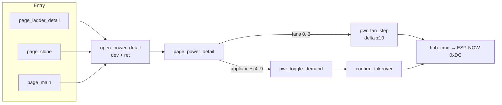

# Control power-detail + `script.execute` validate — 5.1.15+

Operator / developer runbook for DSC-CONTROL **`page_power_detail`** and the
ESPHome Validate pitfall fixed on master (`0d30178`).

Firmware QA baseline: [FIRMWARE-QA-5.1.0.md](FIRMWARE-QA-5.1.0.md).
Package body: [`firmware/v4/dsc-control-common.yaml`](../../firmware/v4/dsc-control-common.yaml).

## Intent

One shared glass page shows a single fan or appliance. Entry points are ladder
detail, Clone, and Main device rows. Fans get ±10% speed; appliances get gated
demand toggle. Commands leave over ESP-NOW (`hub_cmd`), not HA entities.

## Architecture



| Globals | Role |
|---|---|
| `power_detail_dev` | Device index **0..9** |
| `power_detail_return` | **0** ladder · **1** Clone · **2** Main |
| `ui_power_detail` | True while the page is showing (gates `refresh_ui`) |

### Device index map

| `dev` | Glass label | UI | Hub ops |
|---|---|---|---|
| 0 | 6" exhaust (out) | Speed ±10 | op **25** |
| 1 | 6" exhaust (room) | Speed ±10 | op **26** |
| 2 | 4" intake (main) | Speed ±10 | op **27** |
| 3 | 2x4 intake fan | Speed ±10 | op **28** |
| 4 | Humidifier | Toggle demand | op **12** |
| 5 | Dehumidifier | Toggle demand | op **13** |
| 6 | Heater | Toggle demand | op **14** |
| 7 | AC | Toggle demand | op **16** |
| 8 | Grow mat | Toggle demand | op **15** |
| 9 | Clone humidifier | Toggle demand | op **17** |

Fans hide demand/cooldown rows; appliances hide the speed row. Demand always
goes through the Engage confirm gate (same as Manual Takeover).

## Critical pitfall — parameterized `script.execute`

ESPHome action lists treat each mapping key as a **separate action**. For scripts
with `parameters:`, nest `id` and args under one `script.execute` mapping.

**Wrong** (Validate treats `delta` as a second action key):

```yaml
on_click:
  - script.execute: pwr_fan_step
    delta: -10
```

**Right** (as shipped after `0d30178`):

```yaml
on_click:
  - script.execute:
      id: pwr_fan_step
      delta: -10
```

Same nesting already used elsewhere in this package for `hub_cmd` / `open_power_detail`.
Bare form is fine only when there are **no** parameters:

```yaml
- script.execute: pwr_toggle_demand
- script.execute: refresh_ui
```

Symptom of the wrong shape: ESPHome **Validate** fails on Control (often “extra
keys” / unexpected action). Fix in git → push → stub `refresh: 0d` → Validate
again before Install.

## Developer checklist

- [ ] `cd firmware/v4 && esphome config dsc-control.yaml` passes
- [ ] `project.version` / text Firmware Version = **5.1.15** (or newer patch)
- [ ] Power-detail ± buttons nest `id` + `delta` under `script.execute`
- [ ] Parameterized calls (`hub_cmd`, `open_power_detail`, `pwr_fan_step`) use the nested form
- [ ] Package header changelog lines stay `#` comments (uncommented `vX.Y.Z:` breaks YAML parse)

## Glass soak (after USB/OTA flash)

1. [ ] Pulse → ladder detail → tap a fan row → power page; ± changes % (pending grey → neon)
2. [ ] Back / swipe-right returns to ladder detail (`ret: 0`)
3. [ ] Clone / Main device rows open the same page with correct title; back restores that tab
4. [ ] Appliance → Toggle demand → confirm Engage; no one-tap demand send
5. [ ] Serial: no Validate leftovers; heap INFO lines healthy after page paint

## Constraints

- Panel does **not** drive HA entities for these commands — hub is SoT over ESP-NOW.
- Do not add charts / heavy widgets on this page (CYD RAM postmortems).
- Live Control may still be **5.1.14** until flash; tree is **5.1.15** + this Validate fix.
- Sibling docs: HA sensing/learn [#23], ops debt [#22] — do not duplicate here.
