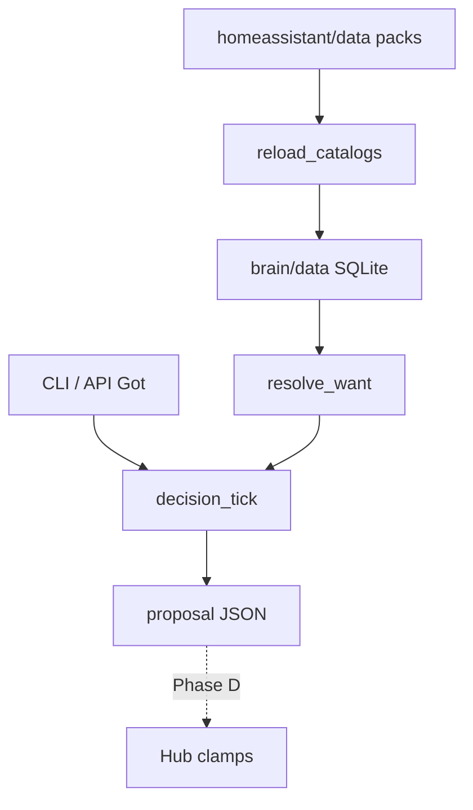
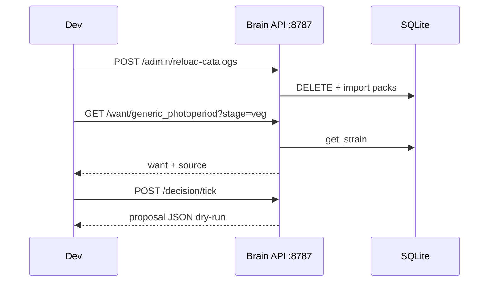

# DSC brain Phase B — developer ops

Operator / developer runbook for the **Pi offline brain** package that landed
with `53f1d31` (2026-08-07). Closes the ops gap around FOLLOWUPS **N-092**.

| Surface | Role |
|---|---|
| Package | `brain/dsc_brain/` (Python 3) |
| DB | `brain/data/dsc_brain.sqlite3` (gitignored) |
| Catalog SoT (load only) | `homeassistant/data/*.yaml` curated packs |
| HTTP | FastAPI on `0.0.0.0:8787` (`python3 -m dsc_brain.api`) |
| CLI | `python3 -m dsc_brain.cli …` |
| Product memo | [`docs/DSC-BRAIN.md`](../DSC-BRAIN.md) |
| Specs | [`docs/brain/`](../brain/) |

**Does not** require Home Assistant, Sync, or a live hub. Phase B is
**catalogs + Want + dry-run ticks**. Live hub emit is Phase D (**N-094**).

## Intent

Run grower logic offline: load curated packs into SQLite, resolve Want bands,
compare Want vs Got into Need, and emit a proposal JSON the hub would later
clamp. SoftAP + Control remain the climate kit; HA remains lab soak
([`docs/HA-SCAFFOLD.md`](../HA-SCAFFOLD.md)).



## Quick start (verified)

From repo root (or `brain/`):

```bash
cd brain
python3 -m pip install -r requirements.txt
python3 -m dsc_brain.cli init-db
python3 -m dsc_brain.cli reload-catalogs
# Expected counts on current curated packs (approx):
#   strains: 12 · nutrients: 2 · mediums: 1 · lights: 7
python3 -m dsc_brain.cli want generic_photoperiod --stage veg
python3 -m dsc_brain.cli tick --seat pot1 --strain generic_photoperiod --temp 26.1 --rh 58
python3 -m dsc_brain.api   # http://127.0.0.1:8787/docs
```

API startup also calls `init_db()` + `reload_catalogs()` — you can skip the
CLI bootstrap when only using the server, but CLI is the offline path.

## Catalog load map

`reload_catalogs()` reads from `DATA_DIR = <repo>/homeassistant/data`
([`brain/dsc_brain/paths.py`](../../brain/dsc_brain/paths.py)):

| Kind | Preferred file | Fallback | Row keys |
|---|---|---|---|
| strains | `dsc_strain_catalog.yaml` | — | `seeds` or `strains` |
| nutrients | `dsc_nutrient_pack_canna_coco.yaml` | `dsc_nutrients_canna.json` | `products` / `items` / single object |
| mediums | `dsc_medium_pack_canna_coco.yaml` | `dsc_mediums_canna.json` | same |
| lights | `dsc_light_pack_photometrics.yaml` | — | `fixtures` / `products` / `lights` / `items` |

Each reload **DELETEs** strain/nutrient/medium/light/search tables then
re-imports. Missing files → that kind stays empty (no crash). Fat merged
dumps under `homeassistant/data/` are **not** loaded here — brain uses the
curated packs only (HA Build a Plant still uses slim `/local/dsc-catalog/`
indexes for typeahead).

SQLite schema version meta key: `schema_version=1`. Counts land in
`meta.last_reload`. Search haystack is lowercase name/id/type/lineage for
strains; name-only for other kinds.

## Want resolution

Precedence in [`want.py`](../../brain/dsc_brain/want.py):

1. **Custom** bands when provided (non-empty, non `[0,0]` / `0` sentinel)
2. **Catalog** `want` for `strain_id`
3. **Stage defaults** (`seedling` / `veg` / `flower`; unknown stage → `veg`)

Catalog EC is stage-mapped: `ec_veg_us` / `ec_flower_us` / `ec_seedling_us`
→ normalized `ec_us`. Normalized output keys:
`ph`, `ec_us`, `moisture_pct`, `temp_c`, `rh_pct`.

```bash
python3 -m dsc_brain.cli want generic_photoperiod --stage flower
# source: catalog:generic_photoperiod · ec_us from ec_flower_us
```

Custom `[0, 0]` or numeric `0` is skipped (same “unset” class as HA Want
sentinel **0**). Single numeric custom (e.g. temp target) becomes a
tight `[v, v]` band.

## Decision tick

[`decision_loop.decision_tick`](../../brain/dsc_brain/decision_loop.py):

| Need status | Meaning |
|---|---|
| `ok` | Got inside Want band |
| `low` / `high` | Outside band → advisory string |
| `unknown` | Got missing or no band |

Constraints (verified):

- Default `emit=False` → `commands: []`
- `emit=True` still only appends `{type: "noop", …}` until Phase D
- `manual_takeover=True` → advisory; no emit cmds
- `safety.hub_must_clamp` is always `true`

Example out-of-band tick:

```bash
python3 -m dsc_brain.cli tick --seat pot1 --strain generic_photoperiod \
  --temp 16 --rh 80 --emit
# need.temp_c=low · need.rh_pct=high · commands=[{noop}] · advisories filled
```

CLI Got today: `--temp` → `temp_c`, `--rh` → `rh_pct` only. Chemistry Got
(`ph` / `ec_us` / `moisture_pct`) is API/`decision_tick` kwargs only.

## HTTP API (Phase B live)

OpenAPI: `http://127.0.0.1:8787/docs`

| Method | Path | Notes |
|---|---|---|
| `GET` | `/health` | `{status, version}` — version from `dsc_brain.__version__` (**0.1.0**) |
| `POST` | `/admin/reload-catalogs` | Re-import packs; returns counts |
| `GET` | `/catalogs/{kind}?q=&limit=` | `kind` accepts **singular or plural** (`strain`/`strains`, …) |
| `GET` | `/want/{strain_id}?stage=veg` | **404** if strain missing |
| `POST` | `/decision/tick` | Body: `TickBody` (seat, strain_id, stage, got, custom_want, manual_takeover, emit) |

**Not implemented yet** (Phase C web UI / Phase D hub — do not call):

- `POST /roster/...`
- `GET /decision/last`

Those appear only as aspirational rows in [`docs/brain/WEBUI.md`](../brain/WEBUI.md).



## CLI surface

| Command | Purpose |
|---|---|
| `init-db` | Create schema + `schema_version` |
| `reload-catalogs` | Import packs (implies usable DB) |
| `search <kind> [query]` | `kind` ∈ `strain\|nutrient\|medium\|light` (**singular only**) |
| `want <strain_id> [--stage]` | Resolve Want |
| `tick [--seat --strain --stage --temp --rh --emit]` | Dry-run proposal |

Kind naming pitfall: CLI search uses **singular**; API catalogs accept both.

## Pitfalls

| Symptom | Cause | Fix |
|---|---|---|
| `strains: 0` after reload | Wrong cwd / missing `homeassistant/data` | Run from repo checkout; `paths.REPO_ROOT` is two parents above `dsc_brain/` |
| `want` 404 on API | Strain id not in curated pack | `search strain` / check `dsc_strain_catalog.yaml` |
| Empty Need chemistry | CLI only passes temp/RH | Use API body `got` with `ph` / `ec_us` / `moisture_pct` |
| `--emit` “does nothing useful” | Phase B noop only | Expected until **N-094** / Phase D |
| Treating HA helpers as brain SoT | Lab scaffold habit | Promote rules into `brain/` first ([`HA-SCAFFOLD.md`](../HA-SCAFFOLD.md)) |
| Flashing `dsc-appliance-bridge.yaml` | Sketch-only stub | Wait for **N-096** BOM + protocol |
| Expecting web UI at `:8787/` | API stub only | Swagger at `/docs`; UI is Phase C (**N-095**) |
| Committing `*.sqlite3` | Local DB | Already gitignored |

## Related

- Architecture: [`docs/DSC-BRAIN.md`](../DSC-BRAIN.md)
- Decision loop: [`docs/brain/DECISION_LOOP.md`](../brain/DECISION_LOOP.md)
- Web UI spec (Phase C): [`docs/brain/WEBUI.md`](../brain/WEBUI.md)
- F-010 bridge: [`docs/brain/F010_APPLIANCE_BRIDGE.md`](../brain/F010_APPLIANCE_BRIDGE.md)
- SoftAP product unbox: [`SETUP.md`](../../SETUP.md)
- Notion: [Pi offline brain](https://app.notion.com/p/3b52b4cda370818e8b66f671689f7a57) · [Want Need Got](https://app.notion.com/p/3b52b4cda37081049ebdf0471facf50c)
