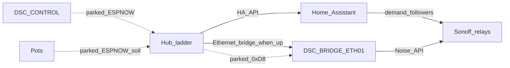

# ESP-NOW — parked as product radio (2026-08-16)

**Decision:** stop deepening ESP-NOW as the product radio until the stack is boring.
Public write-up: [ESP-NOW or Maybe Later](https://plausible-deniability.net/esp-now-or-maybe-later/).
Decision note: [`docs/FOLLOWUPS.md`](../FOLLOWUPS.md) § *2026-08-16 — ESP-NOW on the shelf*.

ESP-NOW packages remain in tree and may still run on lab glass. They are **not** a product promise and must not be the default next engineering task.

## Intent

| Owns climate | How appliances follow | Pots | Product radio |
|---|---|---|---|
| Hub ladder (failsafe, min-off, reality gates) | Path that stays up: **HA demand followers** and/or **ETH01 bridge** over Ethernet | May report soil over ESP-NOW without pretending to be a mesh | **Parked** — SoftAP/ESP-NOW deepening is not the default next task |

## Architecture (current product posture)

Solid arrows = paths to deepen and operate. Dashed = parked RF still present in firmware.

## What stays in tree (parked, not deleted)

| Package / component | Role |
|---|---|
| `firmware/v4/dsc-hub-espnow-primary.yaml` | Panel command RX + telemetry TX; included from `dsc-hub.yaml` |
| `firmware/v4/dsc-control-common.yaml` | Glass ESP-NOW primary link UI / recovery ladder |
| Pot `espnow` / `packet_transport` soil path | Soil relay to hub / panel |
| `firmware/v4/dsc-bridge-common.yaml` + `dsc_anchor_ap` / `dsc_api_client` | ETH01 SoftAP Anchor + appliance drive (Ethernet stays useful; ESP-NOW demand path is parked deepening) |
| SoftAP kit (`dsc_fleet_setup`, `SETUP.md`) | Local Wi‑Fi membership / unbox — still valid; do not treat SoftAP as a reason to deepen ESP-NOW |

Do **not** remove these packages in a docs-only pass. Park means stop investing, not yank the wire.

## Operator paths (use these)

### Climate

- Hub owns the ladder. HA never drives the >35 °C failsafe or sensor-watchdog rails.
- Prefer HA entity / React panel / glass only as UIs that write the **same** hub entities.

### Appliances (Sonoffs)

1. **Default lab path:** HA demand followers in `homeassistant/packages/dsc_v4_automations.yaml`
   - Genuine demand OFF is immediate; hub API blips debounce **25s** before follower OFF
   - Hub-offline safe-off at **30s** remains the hard rail
2. **HA-optional path:** ETH01 bridge drives relays over Noise native API when Ethernet + SoftAP Anchor are healthy ([`docs/brain/F010_APPLIANCE_BRIDGE.md`](../brain/F010_APPLIANCE_BRIDGE.md))
3. Do **not** plan new product features that require reliable hub↔bridge `0xD8` ESP-NOW demand as the only path

### Pots

- Soil reporting over ESP-NOW may still work when same-channel RF is healthy
- Do not market or schedule “mesh pots” / multi-hop RF work
- Probe NaN / cal issues are **not** radio failures (see FOLLOWUPS probe notes)

### SoftAP

- SoftAP `DSC-Anchor` remains useful as a **Wi‑Fi membership / channel home** for the fleet
- SoftAP-local membership and NAPT/OTA prove can continue as networking work
- Do **not** resume SoftAP primarily to make ESP-NOW “finally work”

## Why it was shelved (verified history)

| Pressure | Evidence |
|---|---|
| One radio, two jobs | Home mesh / Nest hops broke same-channel ESP-NOW (**F-004** / CHX) |
| Real-time cadence × node count | Hub **5.1.8** soak: ESP-NOW TX OOM + channel thrash |
| Workarounds landed, still not boring | TX cadence cap (**5.1.9** / N-037), `post_connect_roaming: false` (**5.1.10**), SoftAP pin, `WIFI_IF_AP` peer rebind, unicast vs broadcast, ETH01 bridge, probe-NaN ≠ radio fail |

Prior ops notes (still useful as history, not as a roadmap to deepen RF):

- Notion Code Library: [dsc-hub-espnow-primary.yaml](https://app.notion.com/p/3a82b4cda37081bb9861db0d9392fc53)
- SoftAP design: [`docs/superpowers/specs/2026-08-10-softap-fleet-star-design.md`](../superpowers/specs/2026-08-10-softap-fleet-star-design.md)
- Prefer open SoftAP/VERSION docs PR **#77** / **#73** for pages still absent on master

## Resume criteria

Pick ESP-NOW back up **only** when ESPHome / ESP-NOW is boring on a multi-node, same-channel, real-time fleet:

1. Multi-node soak with **zero** TX OOM and **zero** rapid 1…14 channel storms for a long window
2. Same-channel peers stay linked across SoftAP / home fallback without heroic ifidx / unicast patches as the main plot
3. Product story does not require “one radio for Wi‑Fi + ESP-NOW” to carry both jobs under Nest mesh pressure

Until then: deepen hub climate, HA followers / Ethernet bridge appliances, SoftAP networking prove, and the React `/dsc-hub` surface — not RF mesh.

## Pitfalls

- README / glass still say “ESP-NOW primary” in older strings — treat product posture from **this** page + FOLLOWUPS shelf note
- `binary_sensor` Panel Link is ESP-NOW presence, **not** HA API connectivity
- Do not schedule SoftAP/ESP-NOW deepening as the default next task after this park
- Do not delete parked packages “to clean up” without an explicit firmware change request
- Do not paste live secrets / `espnow_key` into Wiki or PR bodies
