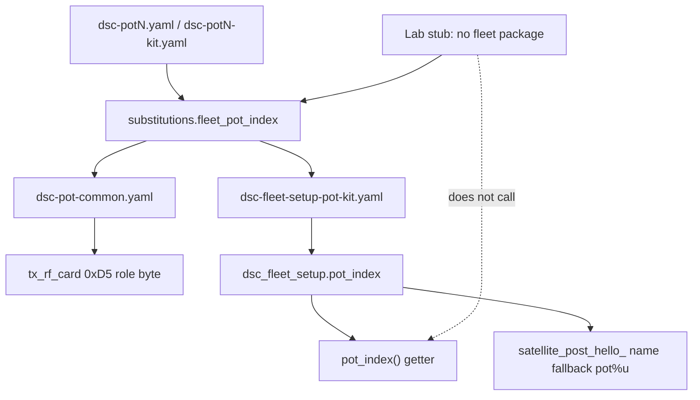

# Fleet pot identity + light-quota / self-heal closeout (5.1.9)

Developer runbook for the leftover `pot_index()` getter landed with hub
**5.1.9** glass closeout (`037f9d8`, 2026-08-05), and the dual identity path
that already drove pot **5.1.7** `0xD5` RF cards.

| Surface | Version | Role |
|---|---|---|
| Hub | **5.1.9** | Live on glass 5 Aug **18:29** AEST — pass complete |
| Control | **5.1.16** | Fleet Fix; unchanged pot identity |
| Pots | **5.1.7** | `fleet_pot_index` → `0xD5` role byte; kit SoftAP uses component slot |

**Related (prefer existing drafts until merge):** light-quota
([`HUB-LIGHT-QUOTA-5.1.7.md`](HUB-LIGHT-QUOTA-5.1.7.md)) · fleet self-heal
([`FLEET-SELF-HEAL-5.1.8.md`](FLEET-SELF-HEAL-5.1.8.md)) · REJOIN bounce
([`HUB-RF-REJOIN-LINK-BOUNCE.md`](HUB-RF-REJOIN-LINK-BOUNCE.md)) · ESP-NOW TX
([`HUB-ESPNOW-TX-CADENCE-5.1.9.md`](HUB-ESPNOW-TX-CADENCE-5.1.9.md)) · soak /
closeout in [`docs/FOLLOWUPS.md`](../FOLLOWUPS.md).

**Does not replace** those runbooks — this page covers pot slot identity +
pass closeout only.

## Pass closed (glass)

Hub **5.1.9** confirmed on glass logs: `Project digital_emotions.dsc-hub version 5.1.9`
(5 Aug 18:29 AEST). Closes the light-quota → fleet self-heal → REJOIN bounce →
ESP-NOW TX cadence train.

### Residual after closeout

| ID | Item | Notes |
|---|---|---|
| F-003 | Pot3 USB/OTA | Compile OK; upload exit 1 — device unreachable |
| N-035 | 0xD5 RX + 0xD7 TX | **Closed in tree**; confirm pot `last_peer_time` on soak |
| N-038 | Stale EVT republish | Cosmetic — identical `API_BLIP` re-publishes |
| N-039 | Pot 0xD7 calendar vs epoch | Pot RX expects u32 epoch; hub/Control pack calendar |
| — | 0xD5 layout disagree | Control 18B vs pot 11B vs hub RX — topic residual (not N-037) |

**N-037** on master = hub ESP-NOW TX cadence (**Done + live**). Do not reuse
that ID for wire-layout debt (draft #29 wording is superseded).

## Intent — pot slot identity

Each pot needs a stable **fleet slot** `1–4` for:

1. **ESP-NOW `0xD5` RF card** role byte (every 10s from `dsc-pot-common.yaml`)
2. **Kit SoftAP** hello / peer naming when `device_name` is empty

Lab and kit paths must not share one source of truth, because **lab pot stubs
do not include `dsc_fleet_setup`** (peers use `${hub_mac}` only).

## Dual path (verified)

| Path | Where | Used for |
|---|---|---|
| YAML substitution `fleet_pot_index` | Every pot stub (`"1"`…`"4"`); default `"0"` in common | Compile-time `0xD5` role in `tx_rf_card` |
| Component `pot_index` / `pot_index()` | Kit only via `dsc-fleet-setup-pot-kit.yaml` | SoftAP hello name fallback; C++ accessor |

`0xD5` TX **does not** call `id(fleet_setup).pot_index()` — it expands
`${fleet_pot_index}` at compile time so lab builds stay correct without the
component.

### Role byte (local numbering — not `FleetRole`)

| `fleet_pot_index` | `0xD5` role byte | Meaning |
|---|---|---|
| `0` / unset | `2` | Pot, slot unknown |
| `1`…`4` | `3`…`6` | Pot in that fleet slot |

`FleetRole::POT` in `dsc_fleet_setup` is enum value **3** (hub=1, control=2,
pot=3). Do **not** conflate SoftAP role with the RF-card role byte.

### Layout (pot TX — 11 bytes)

`[0]0xD5 [1]ver=1 [2]role [3]channel [4]rssi [5]assoc_ok [6..7]assoc BSSID[4..5] [8]pref_ok [9..10]pref BSSID[4..5]`

Hub RX / Control parsers may disagree on length/indices until wire unify
(residual topic; see FOLLOWUPS). Hub-local `sensor.dsc_hub_rf_status` remains
SoT for hub radio health.

## Package wiring

| Stub | Packages | Identity |
|---|---|---|
| `dsc-pot{N}.yaml` (lab) | wifi-lab + common — **no** fleet-setup | `fleet_pot_index: "N"` |
| `dsc-pot{N}-kit.yaml` | wifi-kit + common + `dsc-fleet-setup-pot-kit.yaml` | same sub → `pot_index: ${fleet_pot_index}` |
| `dsc-fleet-setup-pot-lab.yaml` | Optional disabled helper (`pot_index: 0`) | **Not** included by current lab stubs |
| Control lab | Must **not** include `dsc_fleet_setup` | CYD DRAM / `web_server_base` AUTO_LOAD OOM |

Kit SoftAP hello (`satellite_post_hello_`): prefers `device_name_`; else
`snprintf(…, "pot%u", pot_index_)` for pot role.

## Constraints / pitfalls

- Omitting `fleet_pot_index` on a new pot stub → default `"0"` → role byte `2`
  (unassigned). Hub aggregation cannot tell pots apart by slot.
- Do **not** “fix” lab RF cards by including kit fleet-setup on the CYD
  Control lab path — Control explicitly forbids it for heap reasons.
- Do not drive `0xD5` from `pot_index()` alone; lab builds have no component.
- Keep stub `fleet_pot_index` and kit `pot_index:` in lockstep (both from the
  same substitution) when editing kit YAML.
- `pot_index()` returning `0` is normal on lab helpers / unassigned kits — not
  an error by itself.

## Developer checklist

- [ ] New pot stub sets `fleet_pot_index: "1"`…`"4"`
- [ ] Kit stub includes `dsc-fleet-setup-pot-kit.yaml` with `pot_index: ${fleet_pot_index}`
- [ ] Lab stub comment still says **no** `dsc-fleet-setup` (peers = `${hub_mac}`)
- [ ] Serial / glass: hub shows **5.1.9**; pot `0xD5` role is `2+N` for slot N
- [ ] SoftAP kit hello names match expected pot slot when `device_name` empty

## Source of truth

| Topic | File |
|---|---|
| Getter + comments | `firmware/v4/components/dsc_fleet_setup/dsc_fleet_setup.h` |
| Hello name fallback | `dsc_fleet_setup.cpp` `satellite_post_hello_` |
| Schema / set_pot_index | `components/dsc_fleet_setup/__init__.py` |
| `0xD5` TX + sub default | `firmware/v4/dsc-pot-common.yaml` |
| Kit wiring | `dsc-fleet-setup-pot-kit.yaml`, `dsc-pot{N}-kit.yaml` |
| Lab stubs | `dsc-pot{N}.yaml` |
| Closeout / residuals | `docs/FOLLOWUPS.md` (2026-08-05 fleet self-heal soak) |
