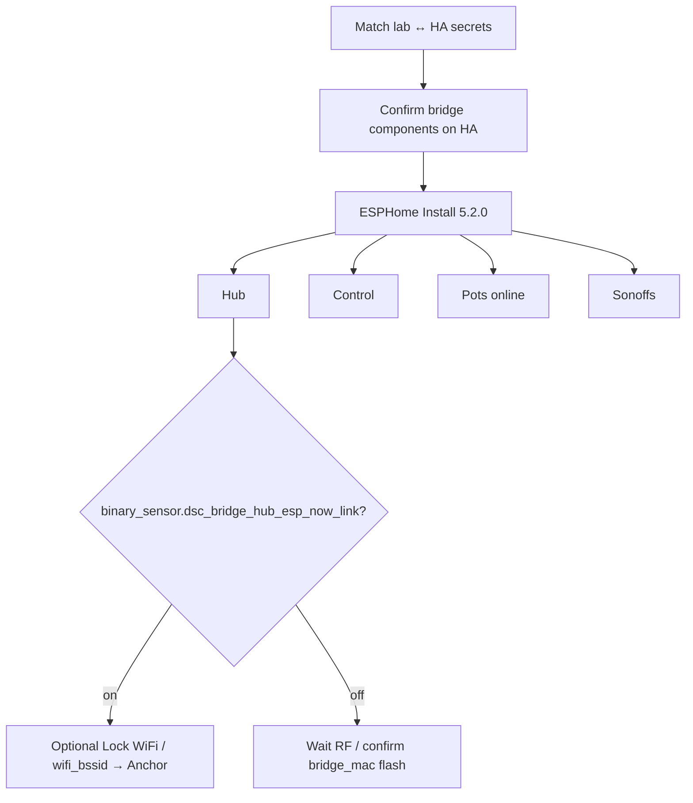

# Fleet recovery — secrets + firmware 5.2.0 OTA

**Intent:** after Bridge bring-up and the identity alignment in `4985431`, restore a
reachable lab fleet to firmware **5.2.0** without clobbering live secrets or
conflating HA surface **6.x** with the firmware train.

**Live snapshot:** [`docs/FOLLOWUPS.md`](../FOLLOWUPS.md) § *Fleet recovery
(2026-08-09)*. Architecture: [`F010_APPLIANCE_BRIDGE.md`](../brain/F010_APPLIANCE_BRIDGE.md).
Version pairing: [`homeassistant/README.md`](../../homeassistant/README.md).

## When to use this

- Hub/Control/pots were offline or on mixed version strings after ETH01 bring-up.
- Lab `secrets.yaml` and HA `/config/esphome/secrets.yaml` may have drifted.
- Bridge is already **5.2.0** online; Sonoff API links may be True while Hub
  ESP-NOW Link is still False (hub never compiled `bridge_mac` paste).

## Prerequisites (verify in source / live HA)

| Check | Why |
|---|---|
| `input_text.dsc_expected_release` = **5.2.0** | Fleet chip scores firmware only |
| `sensor.dsc_ha_surface_version` may be **6.1.0** | Independent packaging — not a flash gate |
| Hub stub `bridge_mac` = Anchor BSSID | Allow-list for SoftAP MAC (`dsc-hub.yaml`) |
| Hub stub `wifi_bssid` still `00…` | Keep Nest OTA until ESP-NOW green |
| `/config/esphome/components/{dsc_api_client,dsc_anchor_ap}` present | HA Install for bridge (F-015 manual) |

## 1. Secrets fingerprint (do not invent keys)

1. Compare lab `firmware/v4/secrets.yaml` (gitignored) with HA
   `/config/esphome/secrets.yaml` for live device keys: API / OTA / AP /
   espnow / Sonoff hosts / bridge block.
2. Append missing kit SoftAP `dsc_setup_ap_password` from lab if absent
   (generator emits it; kits need it).
3. **Do not** run [`firmware/v4/_patch_bridge_secrets.py`](../../firmware/v4/_patch_bridge_secrets.py)
   against live HA secrets. That helper writes **deterministic lab placeholders**
   (`changeme_*`, sequential base64 keys, `.101–.104` hosts) and will break a
   working fleet.

Fresh empty lab only: [`firmware/v4/generate-secrets.sh`](../../firmware/v4/generate-secrets.sh)
(emits `dsc_bridge_*`, `dsc_anchor_ap_password`, Sonoff `dsc_*_host`).

## 2. Packages before flash

- Land `homeassistant/packages/dsc_v4_version.yaml` on HA (Sync / SCP) so the
  fleet chip no longer scores HA surface against firmware.
- Confirm expected helper stays **5.2.0** (never the React **6.x** string).

## 3. OTA order (ESPHome Device Builder)

Firmware Install is always **manual**. Prefer online devices; skip offline slots.

| Order | Device | Post-flash check |
|---|---|---|
| 1 | Hub | logs / `sensor.dsc_hub_firmware_version` = **5.2.0** |
| 2 | Control | OTA OK; HA API may take **minutes** after LVGL boot |
| 3 | Pots that answer Install | `sensor.dsc_potN_firmware_version` = **5.2.0** |
| 4 | Bridge | Skip if already **5.2.0** online |
| 5 | Sonoffs | project + template **Firmware Version** = **5.2.0** |

Dual-string lockstep: `esphome.project.version` and text **Firmware Version**
must both be **5.2.0** in the flashed body (Control also paints LVGL/boot labels).

### 2026-08-09 lab result (recorded)

| Device | Outcome |
|---|---|
| Hub `.23` | **5.2.0** |
| Control `.177` | OTA OK (API settle lag expected) |
| Heater `.32` / HeatMat `.85` / Humidifier `.26` / Dehumidifier `.69` | **5.2.0** |
| Pot1 `.47` / Pot2 `.22` / Pot4 `.49` | OTA OK |
| Pot3 | **Still open** — offline, no Install path |
| Bridge | Left as-is (already **5.2.0**) |

## 4. Post-OTA verify

- [ ] `sensor.dsc_*_firmware_version` = **5.2.0** for every flashed peer
- [ ] `sensor.dsc_fleet_version_status` → **ok** (firmware major.minor; surface ignored)
- [ ] `binary_sensor.dsc_bridge_anchor_softap_up` / Anchor BSSID still sane
- [ ] `binary_sensor.dsc_bridge_hub_esp_now_link` → **on** after RF settle
      (feeds `binary_sensor.dsc_bridge_online` in `dsc_v4_bridge.yaml`)
- [ ] Sonoff API links remain True; demand path via bridge when HA off
- [ ] Only after link green: optional Lock WiFi / pin SoftAP via `wifi_bssid`

## Pitfalls

| Symptom | Likely cause |
|---|---|
| Fleet chip `warn` with surface 6.x | Stale `dsc_v4_version.yaml` still scoring surface — land `4985431` package |
| Sonoffs API True, Hub ESP-NOW Link False | Hub missing compiled `bridge_mac` paste, or channel/radio — not a Sonoff fault |
| Control “offline” minutes after OTA | LVGL boot / API settle — wait before reflash |
| Pot3 never appears | Hardware/power/USB path (FOLLOWUPS F-003) — do not block the rest of the fleet |
| Secrets suddenly `changeme_*` | Someone ran `_patch_bridge_secrets.py` on live — restore from lab fingerprint |

## Related

- Flash QC baseline: [`FIRMWARE-QA-5.1.0.md`](FIRMWARE-QA-5.1.0.md) (version strings there are historical **5.1.0** — live train is **5.2.0**)
- Install verify: [`INSTALL.md`](../../INSTALL.md)
- Living status: [`FOLLOWUPS.md`](../FOLLOWUPS.md)
