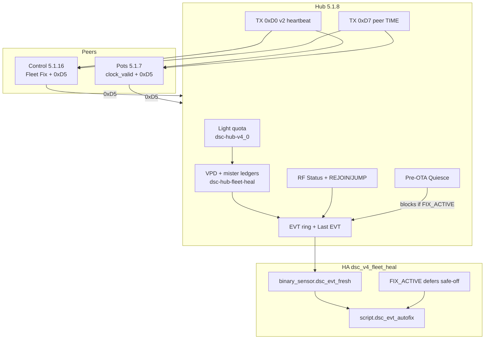
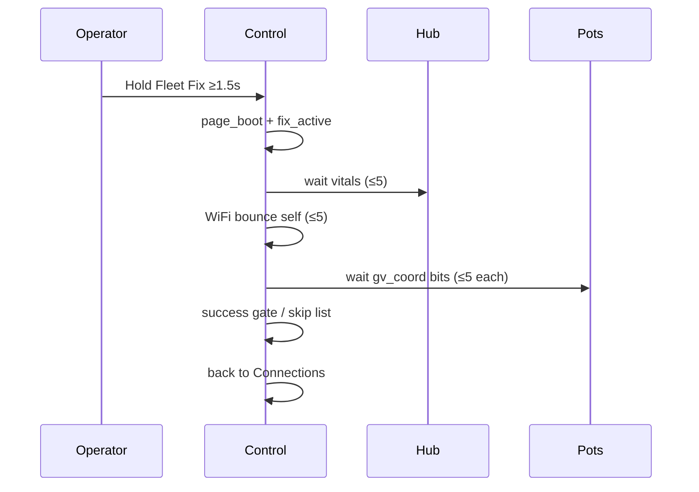

# Fleet self-heal train — Hub 5.1.8 / Control 5.1.16 / Pots 5.1.7

Operator / developer runbook for the **fleet self-heal** train shipped in
`19e42ad` (2026-08-05): lateral VPD/mister ledgers, settings coherence,
ESP-NOW RF cards + peer TIME, EVT bus + HA autofix, Sydney `clock_valid`,
Control **Fleet Fix**, and pre-flash sim gates.

| Surface | Version | Role |
|---|---|---|
| Hub | **5.1.8** | Ledgers + EVT + RF heal hooks + Pre-OTA Quiesce |
| Control | **5.1.16** | Fleet Fix (hold) + 0xD5 TX + 0xD7 note + Starting chrome |
| Pots | **5.1.7** | SNTP + `clock_valid` + 0xD0v2 soft-adopt + 0xD5 TX + 0xD7 RX diag |
| HA package | `dsc_v4_fleet_heal.yaml` | EVT freshness TTL, autofix map, FIX_ACTIVE defer, CHX cue |
| Sim gates | `scripts/run_sim_gates.sh` | Glyph / layout / fleet_fix_sim (20 asserts) |

**Related:** light-quota ledger stays in hub body
([`HUB-LIGHT-QUOTA-5.1.7.md`](HUB-LIGHT-QUOTA-5.1.7.md) when merged; FOLLOWUPS
N-030). Firmware QA baseline: [FIRMWARE-QA-5.1.0.md](FIRMWARE-QA-5.1.0.md).

**Does not replace:** Sync www guards (#19), Dash black-canvas (#28), Control
power-detail Validate (#24).

## Intent

HA flaps and Nest channel hops keep stealing mid-cycle light/climate trust.
This train keeps **plant-critical meters and heal orchestration on ESP**
(hub + peers), while HA only remediates HA-side followers / notifies.

- Light-quota (5.1.6/5.1.7) remains the photon ledger in `dsc-hub-v4_0.yaml`.
- New package `dsc-hub-fleet-heal.yaml` adds **lateral** ledgers (VPD band,
  mister duty), a **coherence receipt** (detect+flag only), **EVT** ring,
  **FIX_ACTIVE** / OTA block, and RF REJOIN / FLEET_JUMP hooks.
- Wire packets live in `dsc-hub-espnow-primary.yaml` (hub) + peer commons.
- Control **Fleet Fix** is soft heal only: wait / self WiFi bounce; **never**
  reboots the hub from glass.

## Architecture



### Package wiring (verified)

| Layer | File |
|---|---|
| Hub stub include | `firmware/v4/dsc-hub.yaml` → `fleet_heal: !include dsc-hub-fleet-heal.yaml` |
| Hub ESP-NOW | `firmware/v4/dsc-hub-espnow-primary.yaml` (`tx_fleet_heartbeat`, `tx_peer_time`, 0xD5 RX) |
| Control | `firmware/v4/dsc-control-common.yaml` (`fleet_fix_run`, `tx_rf_card`) |
| Pots | `firmware/v4/dsc-pot-common.yaml` (+ `fleet_pot_index` on stubs) |
| HA | `homeassistant/packages/dsc_v4_fleet_heal.yaml` (dir-named packages auto-load) |
| Lighting UI | `homeassistant/dashboards/modules/view_lighting.yaml` (VPD/mister delivered chips) |

## Lateral ledgers (hub)

Same cycle cadence as light-quota tick (`tick_lateral_ledgers`, 15s). Requires
`clock_valid` (SNTP or HA `grow_time`).

| Ledger | Globals / entities | Notes |
|---|---|---|
| VPD band | `vpd_main_delivered_s`, `vpd_clone_delivered_s`, `number.dsc_hub_vpd_band_target_hours` | Hours in-band vs target (default 18h) |
| Mister duty | `mister_delivered_s`, `mister_target_h` (0 = disabled), `mister_catchup_active` | Catch-up under min-off floor when target > 0 |
| Coherence | `coherence_hash`, `coherence_epoch`, `binary_sensor.dsc_hub_coherence_mismatch` | FNV-style mix of mode/photo/VPD/ledger fields; **detect+flag only** — never auto-applies HA setpoints |

## ESP-NOW wire contract

### 0xD0 fleet heartbeat (hub → peers) — aligned

| Ver | Layout |
|---|---|
| v1 | `{0xD0,0x01,ch,bssid[6]}` |
| v2 | `{0xD0,0x02,ch,bssid[6],rssi_u8,flags}` — flags: bit0 `clock_valid`, bit1 `fix_active`, bit2 `ota_blocked` |

Pots: v2 soft-adopts preferred BSSID **only when none set**; settled v1 preferred is not overridden. Control tolerates v2.

Hub broadcasts every **5s** with `tx_peer_time`.

### 0xD5 RF card — **three layouts in tree (gap)**

Verified against source — do **not** assume peer RF cards drive hub EVT yet.

| Sender | Size | Layout (source comment) |
|---|---|---|
| Control | 18 | `{0xD5,0x01,role=1,assoc[6],pref[6],ch,|rssi|,status_bits}` |
| Pot | 11 | `{0xD5,0x01,role,ch,rssi,assoc_ok,assoc[4..5],pref_ok,pref[4..5]}` |
| Hub RX | expects ≥12 | Comment: `{0xD5,ver,role,assoc3[3],pref3[3],ch,rssi,status}` then `st==1` WRB / `st==2` CHX |

Consequences (honest):

- Pot cards are **dropped** (`size < 12`).
- Control cards pass the length gate but byte indices do **not** match the
  hub’s WRB/CHX status enum (Control uses bitflags; hub compares `st == 1/2`
  at `data[11]`). Treat peer-driven REJOIN/CHX from 0xD5 as **unreliable**
  until one layout is chosen and both ends flash together.
- Hub-local `sensor.dsc_hub_rf_status` (`RF|H|…|CODE`) is still trustworthy:
  WRB / CHX / FAR / WEAK / OK from the hub STA (FAR before WEAK — sim-caught).

### 0xD7 peer TIME — Control aligned; pots mismatched

| End | Format |
|---|---|
| Hub TX / Control RX | `{0xD7,0x01,y-2000,m,d,h,min,s,valid}` |
| Pot RX | Expects **u32 LE epoch** at `data[2..5]` + publishes `last_peer_time` only |

Control notes hub TIME when local clock weak; does **not** inject into SNTP/HA.
Pots cannot set `clock_valid` from 0xD7 (no public ESPTime inject) — even after
format alignment, 0xD7 remains diagnostic unless a custom time component lands.

**Follow-up ID:** **N-037** (wire unify 0xD5 + 0xD7). Supersedes the
fleet-heal section’s older “hub has no 0xD5 RX / 0xD7 TX” note — TX/RX exist;
formats disagree.

## EVT bus + HA autofix

Hub publishes `sensor.dsc_hub_last_evt` as `EVT|H|<CODE>|<epoch>|<detail>`.

| Code | HA autofix (`script.dsc_evt_autofix`) |
|---|---|
| `API_BLIP` | Refresh hub link entity + notify |
| `FOLLOWER_DRIFT` | Force-trigger heater/dehum/hum/clone-hum follower automations |
| `COHERENCE` / `CHX` / `REJOIN` / `FLEET_JUMP` | Notify only (no setpoint invent) |
| `FAILSAFE` | Notify |
| `FIX_ACTIVE` / `FIX_DONE` / `OTA_*` | Hub-emitted; HA defers safe-off while Fix active |

Freshness: `binary_sensor.dsc_evt_fresh` requires EVT age &lt;
`input_number.dsc_evt_freshness_ttl_s` (default **300s**). Stale EVT must not
act. Dedup stamp: `input_text.dsc_evt_autofix_last` per code+minute.

`binary_sensor.dsc_hub_fix_active` → HA notifies and **defers** sticky
safe-off paths; hub sets `ota_blocked` + `learning_paused`.

CHX hygiene: `binary_sensor.dsc_nest_channel_split` ON for 10 min → persistent
notification (F-004 — router lock; software cannot pin Nest channel).

## Control Fleet Fix (5.1.16)

Trigger: hold **Fleet Fix** on Connections ≥**1.5s**, or HA button
`button.dsc_control_fleet_fix` (entity name **Fleet Fix**).

Behavior (verified in `fleet_fix_run`):

1. Pins glass on **`page_boot`** (Starting chrome); `refresh_ui` bails while
   `fix_active`.
2. Walks **Hub → Control(self) → Pot1–4**; each device ≤**5** tries then skip
   bit in `fix_skip_mask`.
3. Soft only: hub/pots = wait for vitals; Control = WiFi bounce between tries.
4. **Never** reboots hub from glass.
5. Success gate: preferred-AP match (if known) + fresh hub beat (&lt;30s) +
   clock valid + non-skipped pots still linked + **zero skips**.
6. Returns to Connections; ASCII status strings only (`…`/`–` glyphs reserved).



## Sim gates (pre-flash)

```bash
bash scripts/run_sim_gates.sh
# or: powershell -ExecutionPolicy Bypass -File scripts/run_sim_gates.ps1
```

| Script | Gate |
|---|---|
| `cyd_glyph_audit.py` | Non-ASCII in Control UI must be MDI escape or `cyd_glyphs.yaml` |
| `cyd_layout_check.py` | Sibling label overlap; hard-fail boot/Connections exact dupes |
| `fleet_fix_sim.py` | Light-quota budget, first-ledger seed, RF FAR≺WEAK, EVT TTL, 5-strike skip |

Run before changing Control strings, fleet-heal math, or packet comments that
the sim models. Gates are **models**, not a substitute for Validate/flash.

## Flash / soak checklist

| Step | Check |
|---|---|
| 0 | `bash scripts/run_sim_gates.sh` → OK |
| 1 | Sync HA → confirm `dsc_v4_fleet_heal.yaml` + Lighting chips; Core restart if helpers missing |
| 2 | Flash **hub 5.1.8** — `sensor.dsc_hub_firmware_version`, `binary_sensor.dsc_hub_clock_valid`, `sensor.dsc_hub_rf_status`, `sensor.dsc_hub_last_evt` |
| 3 | Flash **Control 5.1.16** — Starting → Pulse; Connections shows Fleet Fix (not Bluetooth stub) |
| 4 | Flash **pots 5.1.7** — `binary_sensor.dsc_pot_N_clock_valid`; prefer SNTP over HA-only |
| 5 | Pre-OTA Quiesce: with Fix idle + WiFi + clock + panel → `OTA_READY`; with Fix active → `OTA_BLOCK` |
| 6 | Hold Fleet Fix once: Starting progress, skip list honest, glass returns to Connections |
| 7 | Force a fresh EVT (or wait for real blip): `dsc_evt_fresh` ON → autofix path; stale EVT ignored |
| 8 | Coherence: mismatch notifies only — no silent HA setpoint rewrite |

### Pitfalls

- **Do not flash** Control UI / fleet-heal packet changes without sim gates.
- **0xD5/0xD7 mismatch** — serial may show Control/pot TX; hub aggregation/EVT
  from peer cards is not a green check until N-037.
- Fleet Fix “Success” requires **all** devices; skipped pots still report
  `Done - skipped …` even if the gate would otherwise pass.
- `learning_paused` is true when Fix active **or** `!clock_valid` — do not
  soak learn while clocks are invalid.
- Mister ledger target **0** disables duty tracking (default).
- Nest CHX for 10+ min is an **ops/router** cue (F-004), not a software fix.
- Light-quota still owns SF1000 catch-up — lateral VPD/mister do not replace it.

## Sign-off

| Operator | Host | Date | Result |
|---|---|---|---|
| | | | |
