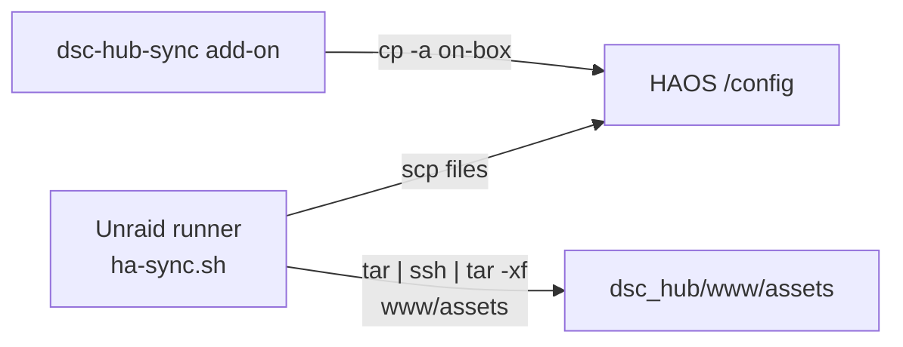

# HA sync — panel assets over OpenSSH 9+

Ops note for the Unraid → HAOS path (`scripts/ha-sync.sh` / workflow **HA sync**).

**Trigger:** `4428621` — *Fix HA sync asset copy for OpenSSH 9+ scp.*

## Intent

`ha-sync.sh` deploys the React panel integration from
`homeassistant/custom_components/dsc_hub/` to live HAOS `/config/custom_components/dsc_hub/`.
Single files (Python, `dsc-hub-panel.js`) still use `scp`. The **`www/assets/` tree**
(brand, gauges, icons, …) must land as a directory — that path is where OpenSSH 9+
broke older syncs.

## Architecture



| Channel | How panel assets copy | OpenSSH 9+ risk |
|---|---|---|
| **`ha-sync.sh`** (LAN SSH) | `tar -C … -cf - . \| ssh … tar -xf -` | Fixed — do **not** use `scp -r dir/.` |
| **dsc-hub-sync** add-on | `cp -a` inside HAOS after git pull | None (no scp) |

## Failure mode (pre-fix)

OpenSSH 9+ defaults `scp` to the SFTP backend. A source of `www/assets/.`
fails with:

```text
scp: unexpected filename: .
```

Symptom: packages / dashboard / single panel JS may update, but
`/config/custom_components/dsc_hub/www/assets/` is empty or stale → missing
panel icons / brand / gauge art after hard-reload.

## Current copy path (verified)

After remote `rm -rf` + `mkdir -p` of the assets dir:

```bash
tar -C "${cc_src}/www/assets" -cf - . | ssh … \
  "tar -C '/config/custom_components/dsc_hub/www/assets' -xf -"
```

`DRY_RUN=1` logs the intent without transferring.

Do **not** reintroduce:

```bash
# BROKEN on OpenSSH 9+ SFTP scp
scp -r "${cc_src}/www/assets/." "${remote}:…/www/assets/"
```

## Operator checks

1. Actions → **HA sync** green on `master` pushes that touch `homeassistant/**` or `scripts/ha-sync.sh`.
2. On HAOS: `ls /config/custom_components/dsc_hub/www/assets/` shows `brand/`, `gauges/`, `icons/` (not empty).
3. Hard-reload `/dsc-hub` — chrome icons/gauges render.
4. Manual dry run from a machine that can SSH:

```bash
export HA_HOST=… HA_TOKEN=… HA_SSH_KEY=… DRY_RUN=1
./scripts/ha-sync.sh
# expect: DRY_RUN sync dsc_hub www/assets
```

## Constraints

- Requires `tar` on both Unraid runner and HAOS SSH add-on (standard on both).
- Still never syncs `secrets.yaml` or `.storage/`.
- Add-on path remains preferred on HAOS; this note is for the self-hosted runner / lab SSH alternate.
- Vite does **not** run on sync — build panel locally (`scripts/build-dsc-hub-panel.ps1`) before expecting fresh `dsc-hub-panel.js`.

## Related

- Bootstrap: [`scripts/HA-SYNC-BOOTSTRAP.md`](../../scripts/HA-SYNC-BOOTSTRAP.md)
- Add-on (on-box `cp -a`): [`dsc-hub-sync/DOCS.md`](../../dsc-hub-sync/DOCS.md) · [`scripts/ADDON.md`](../../scripts/ADDON.md)
- Panel build: [`docs/qa/LIVE-UI-CUSTOM-PANEL.md`](LIVE-UI-CUSTOM-PANEL.md)
