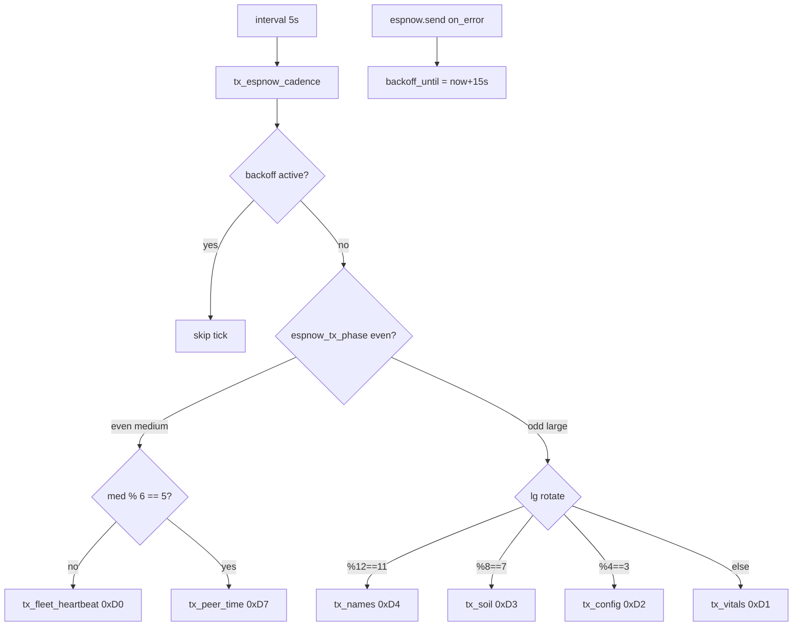

# Hub ESP-NOW TX cadence — 5.1.9 (N-037)

Operator / developer runbook for the hub **ESP-NOW OOM + channel-sweep** fix
shipped in `458b2e0` (2026-08-05): one outbound frame every 5s, broadcast peer
registered, 15s TX backoff on send fail.

| Surface | Version | Role |
|---|---|---|
| Hub | **5.1.9** | `tx_espnow_cadence` + peers + backoff in `dsc-hub-espnow-primary.yaml` |
| Control | **5.1.16** | Unchanged RX; expects sparser vitals/config/soil |
| Pots | **5.1.7** | Still hear 0xD0 / 0xD7 on broadcast (sparser TIME) |

**Related:** fleet self-heal train ([`FLEET-SELF-HEAL-5.1.8.md`](FLEET-SELF-HEAL-5.1.8.md)
when merged) · REJOIN bounce ([`HUB-RF-REJOIN-LINK-BOUNCE.md`](HUB-RF-REJOIN-LINK-BOUNCE.md)
when merged) · soak log in [`docs/FOLLOWUPS.md`](../FOLLOWUPS.md).

**Does not replace:** light-quota (#27), Dash black-canvas (#28), full self-heal
wire walkthrough (#29).

## Intent

Hub **5.1.8** added fleet heartbeats (`0xD0` / `0xD7` every 5s) on top of the
legacy **2s vitals + 10s config/soil/names** schedule. Soak logs showed ~178
`espnow: Failed to send … Our of memory` in an hour and rapid
`Wifi Channel is changed from 11 → N → 11` for N=1…14 — ESPHome sweeping for
the unregistered broadcast peer while STA was on Nest ch11.

**5.1.9** caps periodic TX to **exactly one** outbound frame per 5s tick,
registers `FF:FF:FF:FF:FF:FF`, and backs off 15s after any send fail.

## Architecture

### Package wiring (verified)

| Piece | File / id |
|---|---|
| Peers | `espnow.peers`: panel MAC + `FF:FF:FF:FF:FF:FF` |
| Cadence | `script.tx_espnow_cadence` · `interval: 5s` |
| Globals | `espnow_tx_backoff_until`, `espnow_tx_phase` |
| HA→panel | `tx_panel_sync` → **vitals only** (150 ms coalesce) |
| Cmd echo | `on_receive` still bursts vitals+config; hello adds soil+names |

## Cadence math (periodic only)

Medium and large each fire every **10 s** (alternate on the 5 s tick).

| Slot | Packet | Period |
|---|---|---|
| Medium default | `0xD0` v2 fleet heartbeat (broadcast) | ~10 s |
| Medium sparse | `0xD7` peer TIME (broadcast) | every 6th medium ≈ **60 s** |
| Large default | `0xD1` vitals → panel | ~10 s |
| Large sparse | `0xD2` config | every 4th large ≈ **40 s** |
| Large sparse | `0xD3` soil | every 8th large ≈ **80 s** |
| Large sparse | `0xD4` names | every 12th large ≈ **120 s** |

**Before (5.1.8):** 2 s vitals + concurrent 5 s `0xD0` **and** `0xD7` + 10 s
config+soil+names — multiple frames per window, no broadcast peer, no backoff.

## Constraints

- `auto_add_peer` stays **false** on the hub base config — broadcast must be
  listed explicitly or ESPHome channel-sweeps looking for `FF:FF…`.
- Periodic path uses `wait_for_sent: false` + `continue_on_error: true`; every
  TX script sets a **15 s** shared backoff on `on_error`.
- Event-driven command echo can still send **several** frames in one apply
  (vitals+config; hello +soil+names). That is intentional for glass snappiness;
  if OOM returns under heavy glass traffic, coalesce that path next — do not
  reopen a 2 s vitals interval.
- Nest **channel lock** (FOLLOWUPS **F-004**) is separate: 5.1.8 soak thrash was
  hub-local sweep, not Nest hopping (`RF|…|11|…|OK` between storms).

## Flash / soak checklist

- [ ] Hub `project.version` **and** text Firmware Version = **5.1.9**
- [ ] Flash hub (manual Install). Control/pots not required for this delta.
- [ ] Serial: no rapid `Wifi Channel is changed from 11 → 1…14 → 11` loops
- [ ] Serial: `Failed to send` / `Our of memory` near-zero; if present, expect
      `… TX fail — backoff 15s` then quiet cadence
- [ ] `binary_sensor.dsc_hub_panel_link` still tracks glass (updated on RX + each
      successful cadence tick)
- [ ] Panel UI still live for setpoints (cmd echo + ~10 s vitals)
- [ ] RF Status stays on Nest channel when reported (`…|11|…|OK` site-typical)
- [ ] Optional: pot `last_peer_time` / Control clock backup still move (0xD7 ≈60 s)

## Pitfalls

| Symptom | Likely cause | Action |
|---|---|---|
| Channel thrash returns after flash | Hub not on 5.1.9, or broadcast peer dropped from YAML merge | Confirm FW text sensor; peers list must include `FF:FF:FF:FF:FF:FF` |
| Panel setpoints feel laggy | Expecting 2 s vitals; config now ≤40 s unless cmd echo | Cmd path still echoes config; HA slider path is vitals-only |
| Pot TIME never updates | **N-039** wire: pot 0xD7 parser expects u32 epoch; hub packs calendar fields | Firmware unify — not fixed by cadence |
| Peer RF card EVT looks wrong | 0xD5 layouts still disagree Control/pot/hub (#29 / wire debt) | Trust hub-local `sensor.dsc_hub_rf_status` until unify |
| Docs ID clash | Draft #29 called wire debt **N-037**; soak closeout reused **N-037** for TX | Prefer master FOLLOWUPS: **N-037** = TX cadence (Done); **N-039** = pot 0xD7 layout |

## ID note

| ID | Meaning on master after `458b2e0` |
|---|---|
| **N-037** | Hub ESP-NOW TX cap / no sweep / backoff — **Done in 5.1.9** |
| **N-038** | EVT last-per-code freshness (stale `API_BLIP` spam) — open |
| **N-039** | Pot 0xD7 epoch vs calendar pack — open |
| Draft #29 “N-037 wire layouts” | Superseded ID — treat 0xD5 disagree + N-039 as residual wire debt |

## Source anchors

- `firmware/v4/dsc-hub-espnow-primary.yaml` — peers, `tx_espnow_cadence`, TX scripts, interval
- `firmware/v4/dsc-hub-v4_0.yaml` — `project.version` / `fw_version` **5.1.9**
- `CHANGELOG.md` — Hub 5.1.9 section
- `docs/FOLLOWUPS.md` — “Hub 5.1.8 soak log: ESP-NOW OOM + channel sweep”
