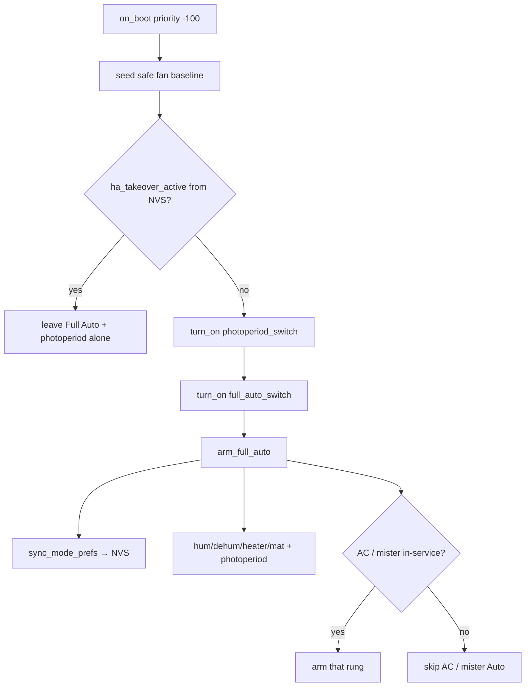

# Hub Full Auto default startup — 5.1.11

Operator / developer runbook for hub **boot policy**: every start forces
**Full Auto ON** + `arm_full_auto` unless **Manual Takeover** was restored.
Shipped in `d017032` (2026-08-07). Closes FOLLOWUPS **N-006**.

| Surface | Version | Role |
|---|---|---|
| Hub | **5.1.11** | Boot forces Full Auto + ladder Auto defaults |
| Control | **5.1.17** | Unchanged (panel UI only) |
| Pots | **5.1.8** | Unchanged |
| HA surface | **5.1.10** | Fleet chip still major.minor `5.1` |

**Related:** photoperiod / light-quota ([`HUB-LIGHT-QUOTA-5.1.7.md`](HUB-LIGHT-QUOTA-5.1.7.md)
when merged) · overnight drop probe in [`docs/FOLLOWUPS.md`](../FOLLOWUPS.md) ·
mode NVS flush (`sync_mode_prefs`, hub 5.1.4+).

**Does not replace:** F-006 link-flap root cause, light-quota catch-up (#27),
or post-connect roaming (#33). This closes **stale Full Auto OFF after
recovery reboot** — the plant-idle class from the 5 Aug overnight drop.

## Intent

Before 5.1.11, boot respected NVS `full_auto_mode`:

- Full Auto **ON** → re-run `arm_full_auto`
- Full Auto **OFF** → stay OFF (photoperiod still re-armed since 5.1.5)

A recovery reboot with stale NVS OFF left fans on the safe baseline but
**ladder / curve / stack idle** until an operator re-armed. That matched the
5 Aug probe: API-recovery ~02:59 → Full Auto OFF mid-photoperiod window.

**5.1.11** fails into automation on **every** boot when Takeover is clear.
Mid-session Full Auto OFF still works until the next reboot. Manual Takeover
restored from NVS still wins and leaves Full Auto / photoperiod alone.

## Architecture

### What changed vs 5.1.10

| Path | 5.1.10 | 5.1.11 |
|---|---|---|
| `on_boot` Full Auto turn-on | `!Takeover && full_auto_mode` | `!Takeover` (force) |
| Resume-gate timeout (legacy) | re-arm only if NVS Full Auto ON | `full_auto_switch.turn_on()` unless Takeover |
| Ladder Auto globals (fresh NVS) | hum/dehum/heater/mat **false** | those four **true** |
| AC / clone mister Auto defaults | false (in-service gated) | unchanged |

`arm_full_auto` still sets AC / mister Auto from `*_in_service` only — reduced
kit stays honest.

## Constraints

- **Takeover wins.** If `ha_takeover_active` restores true, boot must **not**
  force Full Auto or photoperiod.
- **Mid-session OFF is temporary.** Turning Full Auto OFF flushes NVS via
  `sync_mode_prefs`, but the next reboot forces ON again (unless Takeover).
- **Photoperiod ≠ Full Auto.** Since 5.1.5, photoperiod re-arms whenever
  Takeover is clear even if Full Auto was OFF. 5.1.11 additionally forces
  Full Auto so the climate stack is not idle.
- **Version lockstep.** `esphome.project.version` and text **Firmware Version**
  (`fw_version`) must both read **5.1.11** in the same flash. Fleet chip reads
  the text sensor.
- **Flash required.** In-tree YAML does not change live behavior until Install.
- F-006 link flaps can still reboot the hub; 5.1.11 makes those reboots plant-safe
  for mode state, not a substitute for fixing the flap storm.

## Flash / soak checklist

- [ ] Hub `project.version` **and** text Firmware Version = **5.1.11**
- [ ] Serial / logs on boot (Takeover clear): `Startup -> forcing Full Auto + arming stack`
- [ ] After boot: `switch.dsc_hub_tent_full_auto_mode` **on**
- [ ] Ladder Autos on: humidifier / dehumidifier / heater / grow mat
- [ ] AC Auto / clone mister Auto match in-service (OOS → off)
- [ ] Auto Photoperiod **on** when Takeover clear
- [ ] With Takeover restored ON: boot leaves Full Auto/photoperiod alone (warn log)
- [ ] Mid-session: turn Full Auto OFF → stays OFF until reboot; reboot → ON again
- [ ] After recovery-style reboot: stack armed without manual re-arm (N-006 closed)

## Pitfalls

| Symptom | Likely cause | Action |
|---|---|---|
| HA shows Full Auto ON, hub idle after reboot | Pre-5.1.11 firmware, or only `project.version` bumped | Confirm `sensor.dsc_hub_firmware_version` == **5.1.11** |
| Full Auto OFF after reboot with Takeover ON | Expected — Takeover owns the wheel | Clear Takeover to return to forced Full Auto on next boot |
| Operator wants Full Auto OFF across reboots | Policy removed in 5.1.11 | Use Manual Takeover for persistent manual ownership, or accept reboot re-arm |
| AC/mister Auto ON with hardware OOS | Regression in `arm_full_auto` in-service gate | Check `*_in_service`; Auto must follow in-service |
| Fresh NVS still looks “disarmed” | Looking at AC/mister only | Hum/dehum/heater/mat default true; AC/mister stay gated |
| Docs say 5.1.11, fleet chip says 5.1.10 | Text `fw_version` not lockstepped | Fix template sensor + reflash (same class as 2026-08-03 lockstep incident) |

## Source anchors

- `firmware/v4/dsc-hub-v4_0.yaml` — `on_boot` Full Auto force; ladder Auto
  `initial_value: true`; resume-gate belt-and-suspenders; `arm_full_auto` /
  `sync_mode_prefs` / `full_auto_switch`
- `CHANGELOG.md` — Hub 5.1.11 section
- `docs/FOLLOWUPS.md` — N-006 closed; “2026-08-05 — Full Auto overnight drop”
