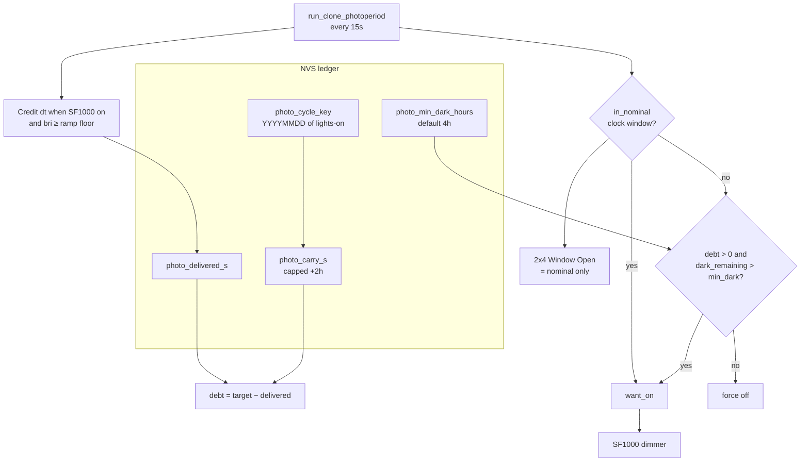
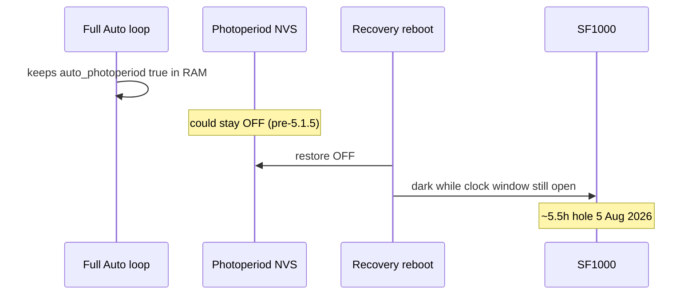

# Hub light-quota ledger + debt catch-up — 5.1.6

Operator / developer runbook for hub **photoperiod quota** (NVS ledger) and
**post-window debt catch-up**, shipped on master as hub **5.1.6** (`c0e16f8`)
on top of photoperiod NVS survival **5.1.5** (`edb2bfd`).

Firmware QA baseline: [FIRMWARE-QA-5.1.0.md](FIRMWARE-QA-5.1.0.md).
Hub body: [`firmware/v4/dsc-hub-v4_0.yaml`](../../firmware/v4/dsc-hub-v4_0.yaml)
(`run_clone_photoperiod`). HA: [`dsc_v4_light_helpers.yaml`](../../homeassistant/packages/dsc_v4_light_helpers.yaml),
[`view_lighting.yaml`](../../homeassistant/dashboards/modules/view_lighting.yaml),
guards in [`dsc_v4_automations.yaml`](../../homeassistant/packages/dsc_v4_automations.yaml).

**Does not replace:** Control Validate (#24), HA sensing/learn (#23), Sync
www guards (#19). Use those for their subsystems.

| Surface | Expect |
|---|---|
| Hub FW | **5.1.6** (`sensor.dsc_hub_firmware_version` / project string) |
| HA packages | Light helpers + Lighting view + dark-violation exempt catch-up |
| Sync | **5.1.3** (unchanged; packages land on push poll) |
| Plant ops | Flash hub **before** trusting mid-window dark recovery |

## Intent

Clock-window photoperiod alone never repaid mid-window dark. Jul–Aug 2026
history (HA flaps / recovery reboots, including the 5 Aug ~5.5h hole) left
configured light hours unpaid because HA `unavailable` cannot meter photons.

Hub **5.1.6** makes photoperiod a **quota ledger**: credit actual SF1000
output into NVS `delivered_s`, compute debt vs cycle target, and after
nominal off keep the light on (catch-up) while debt remains and remaining
dark stays above **Min Dark Hours** (default 4h). Leftover debt folds into
the next cycle capped at **+2h**.

Hub **5.1.5** remains required context: Auto Photoperiod must survive
recovery reboot (NVS flush + on_boot re-arm when Takeover clear). Quota
cannot repay a schedule that stays disarmed.

## Architecture

### Cycle math (verified in `run_clone_photoperiod`)

| Term | Definition |
|---|---|
| Cycle key | Local calendar date of the lights-on boundary (`YYYYMMDD`) |
| Target | `dur_hours × 3600 + photo_carry_s` |
| Credit | When dimmer ON and brightness ≥ `sf_ramp_floor − 0.5%`, add clamped `dt` (1–30s) |
| Debt | `max(0, target − delivered)` |
| Catch-up | Auto Photoperiod armed, not in nominal window, debt > 0, `dark_remaining > min_dark` |
| Carry | On cycle rollover, unpaid debt folded in, capped at **7200s (2h)** |

`binary_sensor.dsc_hub_2x4_window_open` stays **nominal-window only** — catch-up
does not fake “window open”. That keeps flowering dark-period accounting honest.

### Published entities (hub → HA)

| Entity | Role |
|---|---|
| `sensor.dsc_hub_light_delivered_hours` | Cycle delivered (`photo_delivered_s / 3600`) |
| `sensor.dsc_hub_light_debt_hours` | Remaining debt incl. carry |
| `binary_sensor.dsc_hub_light_catchup_active` | Post-window repayment (`device_class: running`) |
| `number.dsc_hub_min_dark_hours` | Floor 2–12h, step 0.5 (NVS) |

### HA helpers / UI

| Piece | Behavior |
|---|---|
| `binary_sensor.dsc_clone_dark_period_violation` | ON only if SF1000 on **and** window shut **and** catch-up **off** |
| `sensor.dsc_lights_deviation_today` | Prefers hub delivered vs plan; falls back to midnight `history_stats` |
| Lighting view | Cycle quota card + catch-up chip; calendar `history_stats` demoted to cross-check |

Midnight-anchored `sensor.dsc_lights_on_today_2x4` undercounts a 17:00→11:00
cycle. Trust the hub ledger when they disagree.

## Why 5.1.5 alone was not enough

5.1.5 flushes NVS after `arm_full_auto` / photoperiod switch and re-arms on
boot when Takeover is clear. HA still guards: re-arm if photoperiod OFF >45s
without Takeover; alert + force-arm if light missing in window >2min.

5.1.6 addresses the **other** failure: even with schedule armed, mid-window
dark (flaps, holds, outages) must be **repaid** under a plant-safe dark floor.

## Operator flash + sync (N-030)

Plant-critical — do not wait on unrelated soak.

1. [ ] Sync add-on has pulled packages / Lighting view / light helpers
2. [ ] Validate + flash hub stub → FW **5.1.6**
3. [ ] Entities present: Delivered / Debt / Catch-up / Min Dark Hours
4. [ ] Lighting → Cycle quota shows delivered vs plan; catch-up chip idle
5. [ ] Min Dark Hours at a sane floor (default **4h**; do not set 0)
6. [ ] Confirm dark-period alert stays quiet during intentional catch-up

### Soak scenarios

| Scenario | Expect |
|---|---|
| Healthy cycle, no outage | Delivered ≈ plan by nominal off; catch-up idle; sunset ramp may run |
| Mid-window dark (reboot / hold / flap) | Debt rises; after nominal off catch-up ON until debt clears or min-dark floor |
| Debt > remaining dark − min dark | Catch-up stops; leftover ≤2h carries into next cycle |
| Manual Takeover / Clone Off | Catch-up cleared; device does not drive schedule |
| Manual Light Hold | Ledger still credits actual-on; hold self-heals when `want_on` clears |
| Expect catch-up at end of window | Sunset dim skipped so light does not dip to 0 then snap back |

## Developer constraints

- Credit path uses **hub dimmer remote values**, not HA history — by design.
- `photo_catchup_active` is **not** NVS-restored (runtime only).
- Carry cap is hard-coded **7200s** in `run_clone_photoperiod`.
- Delivered clamp rejects absurd wrap (`delivered_s < 200000` before credit).
- Interval is **15s** (`run_photoperiod` + `run_clone_photoperiod`).
- Emergency failsafe / `boot_resume_pending` / Takeover short-circuit the script.
- HA alert copy still says “flash 5.1.5+”; tree SoT for quota is **5.1.6**.

## Pitfalls

| Symptom | Likely cause | Check |
|---|---|---|
| Catch-up never fires after outage | Hub still below 5.1.6, or photoperiod/Takeover/Clone Off | FW string; Auto Photoperiod ON |
| Dark-period alert during catch-up | Stale HA helpers (pre-exempt package) | Sync `dsc_v4_light_helpers`; entity `dsc_hub_light_catchup_active` |
| Calendar hours ≠ Delivered | Midnight history_stats vs cycle ledger | Prefer hub Delivered; calendar is cross-check |
| Debt sticks overnight | Floor hit; carry capped at +2h | Debt next cycle ≤ prior leftover + 2h |
| Window Open off while light on | Normal during catch-up | Catch-up chip amber; not a flowering violation |
| Schedule OFF after recovery reboot | Pre-5.1.5 NVS path or Takeover | Flash ≥5.1.5; HA GUARD should re-arm without Takeover |

## Related FOLLOWUPS

| ID | Item |
|---|---|
| N-030 | Flash hub **5.1.6** + sync HA light helpers / Lighting view |
| F-006 | HA-link flap / recovery reboot storm (upstream driver) |

Sibling draft docs (#19–#24) cover other subsystems — keep this file focused
on light quota + photoperiod survival.
