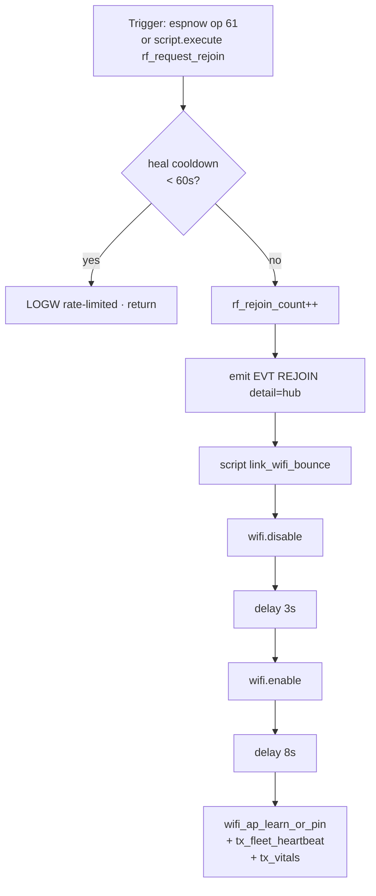

# Hub RF REJOIN → `link_wifi_bounce` (compile + ops)

Focused amendment after master `a1f5d76` (2026-08-05): hub REJOIN must bounce
WiFi through the existing recovery script — ESPHome’s `WiFiComponent` has **no**
`reset()`. Complements the fleet self-heal train runbook
([`FLEET-SELF-HEAL-5.1.8.md`](FLEET-SELF-HEAL-5.1.8.md) when #29 merges).

| Surface | File | Role |
|---|---|---|
| Hub heal script | `firmware/v4/dsc-hub-fleet-heal.yaml` | `rf_request_rejoin` |
| Hub ESP-NOW op map | `firmware/v4/dsc-hub-espnow-primary.yaml` | opcode **61** → REJOIN |
| Hub bounce body | `firmware/v4/dsc-hub-v4_0.yaml` | `link_wifi_bounce` |
| HA EVT map | `homeassistant/packages/dsc_v4_fleet_heal.yaml` | `REJOIN` = notify only |

## Intent

REJOIN is the hub’s soft RF heal: emit an EVT, then force WiFi disable/enable so
STA rebinds HA API and can re-associate onto the preferred Nest BSSID (same
path as API-recovery bounce). Do **not** invent a second WiFi reset API.

## What REJOIN does (verified)



| Step | Behavior |
|---|---|
| Rate limit | Shared `rf_heal_last_ms` — skip if last heal &lt; **60s** |
| EVT | `sensor.dsc_hub_last_evt` → `EVT|H|REJOIN|<epoch>|hub` |
| Bounce | `link_wifi_bounce`: `wifi.disable` → 3s → `wifi.enable` → 8s → learn/pin + fleet TX |
| HA | `script.dsc_evt_autofix` maps `REJOIN` to **notify only** (no setpoint invent) |

### Compile pitfall (`a1f5d76`)

Broken (does not compile against current ESPHome):

```cpp
wifi::global_wifi_component->reset();  // WiFiComponent has no reset()
```

Correct (in tree):

```yaml
- id: rf_request_rejoin
  then:
    - lambda: |-
        // … rate limit + EVT …
        id(link_wifi_bounce).execute();
```

`link_wifi_bounce` already lives in `dsc-hub-v4_0.yaml` for API-recovery and
preferred-AP mismatch. Fleet-heal must reuse it — do not call private WiFi
internals from the heal package.

## Two different “REJOIN” paths (do not conflate)

| Path | Source | Side effect |
|---|---|---|
| **Hub REJOIN heal** | `rf_request_rejoin` / espnow **op 61** | EVT + **hub** `link_wifi_bounce` |
| **Peer RF card WRB** | 0xD5 RX `st == 1` in `dsc-hub-espnow-primary.yaml` | EVT `REJOIN` detail `peerN` + refresh `tx_fleet_heartbeat` only — **no** hub WiFi bounce |

Peer-card WRB/CHX remains unreliable until wire unify (**N-037** in FOLLOWUPS /
fleet-heal runbook): pot cards are short; Control layout ≠ hub status enum.

## Entry points today

| Entry | Wired? | Notes |
|---|---|---|
| ESP-NOW opcode **61** | Hub RX yes | Hub executes `rf_request_rejoin` |
| Control Fleet Fix | **Does not send op 61** | Fleet Fix waits on hub vitals; bounces **Control self** WiFi only; never reboots hub |
| Opcode **62** | Hub RX yes | `rf_fleet_jump_arm` — EVT `FLEET_JUMP` / `CLK_HOLD`; separate from bounce |

If a future glass/HA control should force hub Nest rejoin, send op **61** (or
expose a hub button that runs `rf_request_rejoin`) — do not reintroduce
`WiFiComponent::reset()`.

## Operator / developer checklist

| Step | Check |
|---|---|
| 1 | Hub Validate includes `dsc-hub-fleet-heal.yaml` — must compile without `reset()` |
| 2 | After REJOIN EVT: expect brief WiFi drop, then `link: WiFi bounce complete` + fresh 0xD0 |
| 3 | Preferred AP: packages use `fast_connect: false` so bounce can scan Nest BSSID |
| 4 | Safety mode (emergency / sensor fault) still defers **API-recovery** bounce/reboot — REJOIN script itself does not re-check that gate (same as direct `link_wifi_bounce` callers) |
| 5 | Do not treat peer `REJOIN` EVT alone as proof the hub bounced |

## Related docs

- Fleet train overview: [`FLEET-SELF-HEAL-5.1.8.md`](FLEET-SELF-HEAL-5.1.8.md) (docs PR #29 until merge)
- Link-recovery ladder / Lock WiFi AP: [`firmware/v4/README.md`](../../firmware/v4/README.md), Notion Engineering Ops
- FOLLOWUPS: **N-037** wire debt; **F-006** link-flap storm upstream
