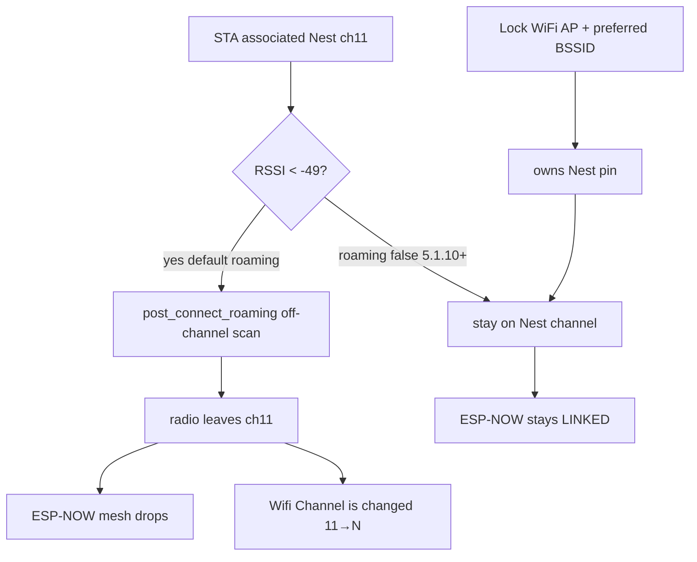

# Hub WiFi post-connect roaming off — 5.1.10

Operator / developer runbook for killing ESPHome **post-connect roam scans**
so ESP-NOW stays on the Nest AP channel. Shipped in `4257209` (2026-08-06).

| Surface | Version | Role |
|---|---|---|
| Hub | **5.1.10** | `post_connect_roaming: false` in lab+kit WiFi packages |
| Control | **5.1.17** | Same WiFi flag (shared radio with ESP-NOW) |
| Pots | **5.1.8** | Same WiFi flag |
| HA surface | **5.1.10** | Version bookkeeping + `wifi_roam` attribute note |

**Related:** ESP-NOW TX cadence ([`HUB-ESPNOW-TX-CADENCE-5.1.9.md`](HUB-ESPNOW-TX-CADENCE-5.1.9.md)
when merged) · REJOIN bounce ([`HUB-RF-REJOIN-LINK-BOUNCE.md`](HUB-RF-REJOIN-LINK-BOUNCE.md)
when merged) · soak / flap notes in [`docs/FOLLOWUPS.md`](../FOLLOWUPS.md).

**Does not replace:** N-037 TX cadence (#31), fleet self-heal (#29), pot identity
(#32), or light-quota (#27). This closes the **residual** `11→1…14→11` channel
storms still seen on hub **5.1.9** after OOM was fixed.

## Intent

ESPHome WiFi defaults `post_connect_roaming: true`. When STA RSSI is below
**−49 dBm**, the component runs off-channel roam scans about every **5 minutes**
while the association stays “connected”. Hub lab RSSI sits around **−70**, so
the gate always fires.

The ESP32 has **one radio**. Leaving Nest **ch11** for a scan kills ESP-NOW even
though WiFi still reports connected. Logs show `Wifi Channel is changed from 11 → N`
(N=1…14) — that is the STA observer, **not** an ESP-NOW peer hunt and **not**
Link Recovery (`Link Recovery Bounces=0` in the 5.1.9 flap probe).

**5.1.10** sets `post_connect_roaming: false` on every hub / Control / pot
lab+kit WiFi package. Preferred-BSSID **Lock WiFi AP** already pins the Nest
point; roam scans fought that pin.

## Architecture



### Why 5.1.9 still thrashed

| Hypothesis | Verdict (FOLLOWUPS 2026-08-06) |
|---|---|
| N-037 peer-hunt / OOM channel sweep | **OOM rejected** (0 in log5); TX cadence already live |
| Link Recovery bounce amplifying flaps | **Rejected** — bounces=0, reason=none |
| Nest router channel hop (F-004) | Not indicated — RF stays `E2A/ch11` between storms |
| ESPHome `post_connect_roaming` | **Confirmed** — default true, RSSI~−70 &lt; −49 |

## Package wiring (verified)

| Device | Lab | Kit |
|---|---|---|
| Hub | `firmware/v4/dsc-hub-wifi-lab.yaml` | `dsc-hub-wifi-kit.yaml` |
| Control | `dsc-control-wifi-lab.yaml` | `dsc-control-wifi-kit.yaml` |
| Pots | `dsc-pot-wifi-lab.yaml` | `dsc-pot-wifi-kit.yaml` |

Each sets:

```yaml
wifi:
  fast_connect: false          # Lock / preferred BSSID needs scan after bounce
  post_connect_roaming: false  # 5.1.10+ — no periodic off-channel roam
```

Version lockstep (same commit):

| File | Strings |
|---|---|
| `dsc-hub-v4_0.yaml` | `project.version` + text Firmware Version **5.1.10** |
| `dsc-control-common.yaml` | **5.1.17** |
| `dsc-pot-common.yaml` | **5.1.8** |
| `homeassistant/packages/dsc_v4_version.yaml` | HA surface + expected helper **5.1.10** |

## Constraints

- **Do not** re-enable `post_connect_roaming` on fleet nodes that share WiFi +
  ESP-NOW on one radio. Prefer Lock + preferred BSSID (and Nest channel lock
  ops, F-004) for AP selection.
- `fast_connect: false` stays required so bounce can **scan onto** the learned
  preferred BSSID. That is a connect-time scan, not a periodic roam while
  associated.
- Channel lines in logs after 5.1.10 should be rare (real Nest hop / reconnect),
  not a 1…14 storm every ~5 min.
- Hub API wedge / ListEntities hang (FOLLOWUPS N-040) is a **separate** fault —
  power-cycle still applies if the native API cannot finish entity list.
- Flash **hub 5.1.10 first**, then Control / pots. In-tree YAML alone does not
  stop live flaps until devices are Installed.

## Flash / soak checklist

- [ ] Hub `project.version` **and** text Firmware Version = **5.1.10**
- [ ] Control **5.1.17**, pots **5.1.8** (same `post_connect_roaming: false`)
- [ ] HA: `sensor.dsc_ha_surface_version` = **5.1.10** after Sync + reload
- [ ] Flash hub (OTA when `:3232` up; else N-040 power-cycle then OTA)
- [ ] Soak hub logs ≥**15 min** with **zero** rapid `Wifi Channel is changed`
      1…14 storms
- [ ] Panel ESP-NOW stays LINKED; pot soil / hello still live
- [ ] ICMP / API flap rate down vs pre-fix probe (FOLLOWUPS flap section)
- [ ] `Lock WiFi AP` still learns/pins preferred BSSID; RF Status stays Nest ch

## Pitfalls

| Symptom | Likely cause | Action |
|---|---|---|
| Channel thrash after “5.1.10” push | Hub not flashed yet, or only lab YAML updated | Confirm `sensor.dsc_hub_firmware_version` == **5.1.10** |
| Thrash returns, OOM also returns | TX cadence regress (broadcast peer missing / 2s vitals) | See [`HUB-ESPNOW-TX-CADENCE-5.1.9.md`](HUB-ESPNOW-TX-CADENCE-5.1.9.md) — do not “fix” by re-enabling roaming |
| Panel drops while hub WiFi “connected” | Shared radio left Nest channel | Check hub channel logs + Control link; confirm roaming false on **both** |
| Bounce cannot leave sticky Nest point | Someone set `fast_connect: true` | Keep `fast_connect: false`; Lock owns pin |
| Dash HUB OFFLINE / ListEntities hang | API wedge (N-040), not roam scans | Physical power-cycle hub; do not chase dashboard stubs |
| Docs blame N-037 for every `11→N` line | Two different thrash causes | 5.1.8 OOM/peer-hunt vs 5.1.9+ roam scans — separate fixes |

## Source anchors

- `firmware/v4/dsc-hub-wifi-lab.yaml` / `dsc-hub-wifi-kit.yaml` — flag + comments
- `firmware/v4/dsc-control-wifi-{lab,kit}.yaml`, `dsc-pot-wifi-{lab,kit}.yaml`
- `firmware/v4/dsc-hub-v4_0.yaml`, `dsc-control-common.yaml`, `dsc-pot-common.yaml`
- `homeassistant/packages/dsc_v4_version.yaml` — surface **5.1.10**, `wifi_roam` attr
- `CHANGELOG.md` — Hub 5.1.10 section
- `docs/FOLLOWUPS.md` — “2026-08-06 — Hub / ESP-NOW flap investigation”
