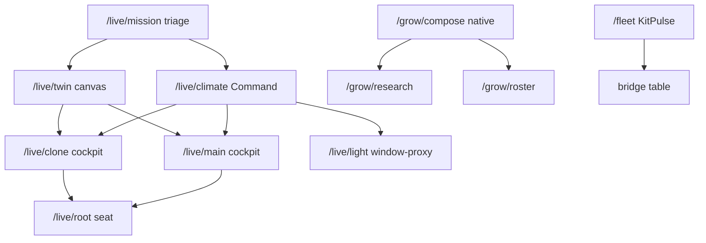

# LIVE-UI — Waves 1–8 bar close (native Grow · Climate command · neon Twin)

Operator / developer runbook for the React panel raise in `c3137aa`
(“Raise the DSC-HUB panel to native Grow, climate command, and neon Twin”).
Operator path is **`/dsc-hub`**. Lovelace IIFE cards remain fallback / cinema hosts —
do not treat Build-a-Plant or Catalog Lovelace cards as the primary compose path.

Related: [`LIVE-UI-CUSTOM-PANEL.md`](LIVE-UI-CUSTOM-PANEL.md) · FOLLOWUPS
**2026-08-16 — Waves 1–8 bar close** · drafts soak
([`LIVE-UI-PANEL-DRAFTS.md`](LIVE-UI-PANEL-DRAFTS.md) when merged from docs PR #80).

## Intent

| Wave | What operators get | Honesty constraint |
|---|---|---|
| 2 | CoupledMix Σ=100; CFM provenance badge; ResultChip / GotWantBars; Light schedule Confirm | Printed CFM must show allocated vs nameplate |
| 3 | Mission = triage; Climate **Command** + demands + efficacy; Light window-proxy; Root Soil °C / NPK / trust | No act glow when pot trust is untrusted |
| 4 | Native Compose / Research | Catalog empty = honesty; IIFE Compose stays Lovelace-only |
| 5 | Neon glass vessels via Twin `setPots`; HUD off on Twin/Main/Clone | Twin is still the Dash IIFE, **not** R3F |
| 6 | LungLoop allocated vs nameplate; KitPulse holes (incl. tank); TankCutaway | Airflow-map / system-map **not** hosted in the panel |
| 7 | History ghost; LearningWizard Phase A/B; Analytics in-service pots | No cultivar mesh / narrator |
| 8 | Documented leftovers only | Assist opt-in; empty `main_light`; Cannalib LIKE; R3F parked |

## Surface strings (tip drift — document, do not invent lockstep)

| Source | Value | Role |
|---|---|---|
| `packages/dsc_v4_version.yaml` → `sensor.dsc_ha_surface_version` | **7.1.3** | Operator SoT |
| `custom_components/dsc_hub/const.py` → `SURFACE_VERSION` | **7.1.4** | Bookkeeping / chrome fallback |
| App chrome `SURFACE 7.1.4` | **7.1.4** | UI label |
| `ensureLocalCards.ts` → `BUNDLE_V` | **`7.1.7-bar-raise`** | Cache-bust for `/local` + HACS scripts |

Package sensor wins for “what is live after Sync.” Bundle tag is independent.

## Route map (React)



| Path | Job |
|---|---|
| `#/live/mission` | Next / faults / seats / KitPulse glance — **no** command toggles |
| `#/live/climate` | Full Auto · takeover · fan override · demands · Want · traces · LungLoop · efficacy |
| `#/live/twin` | Canvas only (`hideHud`); pick pot → Root seat |
| `#/live/main` · `#/live/clone` | Cockpit + Twin focus; HUD off; fans locked until Fan override |
| `#/live/light` | SF1000 + 4×8 **window proxy** until GPIO lamp |
| `#/grow/compose` | Native CatalogPicker / vessel / CoupledMix / DecisionLayer commits |
| `#/grow/research` | Compare fields from prior IIFE Research |
| `#/fleet` | KitPulse constellation + bridge table |

## Climate Command

Verified in `LivePages.tsx` → `LiveClimatePage`:

- **Modes:** `switch.dsc_hub_tent_full_auto_mode`, `switch.dsc_hub_manual_takeover`,
  `switch.dsc_hub_tent_manual_override`, humidifier intake routing, RECIRC de-strat
- **Selects:** `select.dsc_hub_control_strategy`, `select.dsc_hub_priority_tent`
- **Demands:** heater / AC / humidifier / dehumidifier / grow mat / clone humidifier
- **Targets:** TentTargetPanel + `GotWantBars` for Main/Clone T+RH
- **Airflow:** `resolveCfm(allocated, nameplate)` — prefer `*_allocated` when available;
  LungLoop is mass-balance, not a second isometric tent
- Fan sliders on Main/Clone stay locked until Fan override is on

## Native Grow

Verified in `ComposePlant.tsx` / `CatalogPicker.tsx` / `CatalogResearch.tsx`:

- Catalog search limit **100** (`searchCatalog(..., 100)`); placeholder says options are not culled
- Sprout date · up to **8** nutrient slots · vessel glyph from `input_select.dsc_build_vessel`
- CoupledMix remainder always Σ=100
- DecisionLayer gates commit / assign / mix / Want (same pattern as drafts bar-raise)
- Vessel helpers live in `packages/dsc_v4_vessel.yaml` — reload packages if selects missing
- Empty catalog hits stay empty (never invent height / chem / PPFD)

## Neon Twin soft APIs

React owns HA SoT; Dash IIFE hosts the scene. Contract in `dsc-twin-api.ts`:

| Method | Behavior |
|---|---|
| `pause(bool)` | Cancel rAF when keepalive inactive or tab hidden |
| `setFocusTent(mode)` | Camera + tent visibility — **never** `setConfig` for focus |
| `setHeld(bool)` | Freeze wisps / fans / shafts when hub link dark |
| `setPots(VesselLive[])` | Moisture column · EC slab · dryback · soilT · Need rim · silhouette |
| `setUiChrome({hideHud})` | HUD off on `/live/twin`, `/live/main`, `/live/clone`, `/ops/dash` |

`TwinKeepAlive` prefers dedicated `/local/dsc-the-dash-card.js` before umbrella/HACS
(`BUNDLE_V=7.1.7-bar-raise`).

4×8 fixture glow follows photoperiod **window** (`binary_sensor.dsc_hub_4x8_window_open`)
until `entities.main_light` / a real lamp entity exists — do not point Main light at SF1000.

## Wave 8 leftovers (documented, not faked)

| Item | Status |
|---|---|
| Assist / MCP | Opt-in only — [`docs/ASSIST-MCP.md`](../ASSIST-MCP.md) |
| GPIO 4×8 lamp | `entities.main_light` empty; window proxy stays dashed |
| Cannalib typeahead | Still LIKE/prefix in cannalib `db.py` (not FTS5) |
| R3F extract | Parked until neon soft APIs soak |
| Tank firmware | Bind via `dsc_v4_tank_dummies.yaml` until real ids exist |

## Soak checklist (operator)

- [ ] Hard-reload `/dsc-hub` after Sync / HACS Redownload
- [ ] Type / select / Compose nickname while climate ticks (drafts must hold — see #80)
- [ ] Mission has no Full Auto toggles; Climate Command does
- [ ] `/live/twin` is canvas-only; tab-away pauses rAF (no GPU spin)
- [ ] Light Independent unlocks clone start/hours via DecisionLayer confirm
- [ ] CFM badges show Allocated when `*_allocated` sensors exist
- [ ] Reload packages so `input_select.dsc_build_vessel` + tank dummies exist
- [ ] Confirm `/local/dsc-the-dash-card.js` registers before umbrella

## Build / deploy

```powershell
powershell -ExecutionPolicy Bypass -File scripts/build-dsc-hub-panel.ps1
```

Then Sync / `ha-sync.sh` / HACS Redownload for www cards. Panel Vite build is **not**
the HACS umbrella — Twin IIFE still needs `homeassistant/www/dsc-the-dash-card.js`
synced to `/local` (and into `dist/` via `scripts/sync-hacs-dist.sh`).
